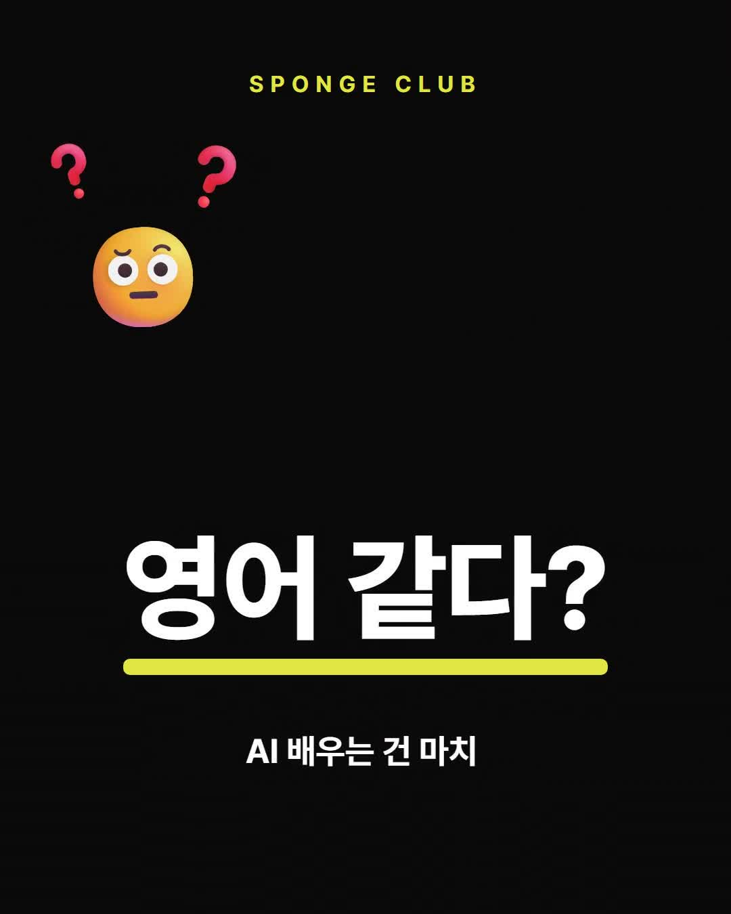
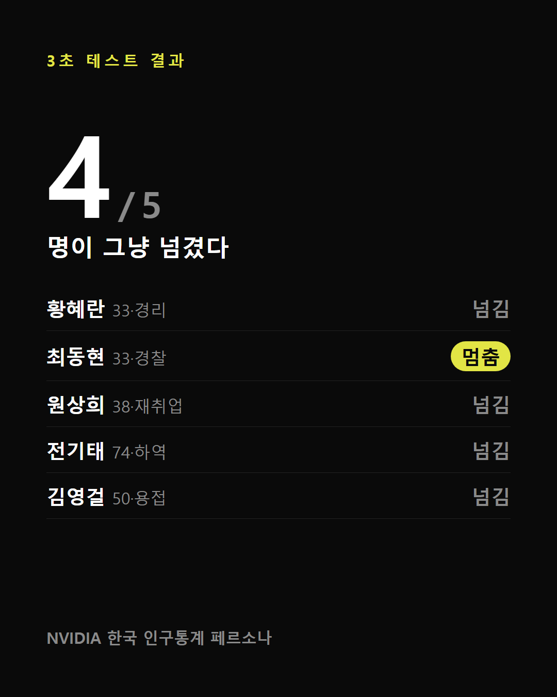

# 4주차 — 기획·구현 → 검증 → 기록 🧪

> 과제를 진행하며 과정과 결과를 기록해주세요. (다 못 채워도 OK, 한 것 위주로!)

## 🎯 과제 1. PRD 기획 및 구현
> 주요 가치 · 페르소나 · 소구 방식을 담은 PRD → 구현까지

이번 주는 4주간 굴러온 **영상편집 OS**(강의 → 쇼츠)를 뒤늦게 **PRD로 정리**했다(회고형 — 원래 있었어야 할 기획서를 지금 쓴 셈). 그리고 PRD를 쓰다 보인 구멍 하나를 이번 주 구현거리로 잡아 만들었다.

- **주요 가치:**
  1. **초보 비개발자도 클로드코드로 진짜 굴러가는 걸 만들 수 있다** — 가능성 증명 자체가 가치.
  2. **AI가 후보 잔뜩 / 사람은 고르기만** — 5시간 강의를 다 안 봐도 된다.
  3. **언제든 다시 뽑고, 뭘 바꿨는지 다 남는다** — 매니페스트(설계도 JSON)로 재빌드 + 버전 자동 스택.
  4. **같은 실수 2번이면 규칙으로 박제** — OS가 매주 조금씩 똑똑해진다(쌓인 규칙 30개+).

- **페르소나:** 지금은 **나(양세) — 개발 못 하는 비개발자.** "번호·전문용어" 말고 실물을 보여주며 쉽게 설명해줘야 이해한다. 다음 방향은 "누구든 쓰게"(유닛 통합OS)지만, **순서는 분명하다 — 내 것부터 잘 돌아가는 게 먼저.**

- **소구 방식:** ①**"초보가 해냈다" 서사**(기능 자랑❌ / 시도→실패→발전⭕) ②**실물 before/after만**(AI 생성 이미지·미사여구 금지) ③**어그로 금지, 가치 우선** — 목표는 조회수 자랑이 아니라 **크루 유입.**

- **구현한 것:** PRD를 쓰다 보니 "열심히 만든 영상이 조회수가 형편없이 나오면 진짜 기운 빠진다"는 게 걸렸다. 그래서 **발행 전에 '이거 팔릴까'를 미리 보는 게이트**를 만들었다.
  `python scripts/10_viewertest.py clip_16` 한 줄이면 완성본에서 **첫 3초(0.25초 간격 컨택트시트 + 안정 프레임)와 훅 문장**을 자동으로 뽑아온다. 그다음 "시청자 테스트 해줘" 하면 Claude가 가상 시청자로 빙의해 3초 판정한다.
  **귀찮은 기계 작업은 코드가, 사람 같은 판정은 AI가** — 이 OS의 "AI가 준비, 사람은 고르기" 원칙 그대로다. (가상 시청자 데이터는 NVIDIA가 공개한 **한국 인구통계 합성 페르소나**를 쓰는 「시청자테스트」 스킬. 발행분 7편으로 백테스트해서 "성과 예측기가 아니라 **구조 결함 발견기**"로 성격을 확정했다.)

## 🗣 과제 2. 유저 피드백 받기
> 실제 2명 이상 + 플러스 알파로 가상 페르소나

- **실제 유저 피드백 (2명 이상): 
예전동료 1 - 영상이 너무 빠르다, 머리에 내용이 들어오기전에 다음이야기를 한다. ai잘 모르는 사람은 관심이 안생겨서 넘길것 같다. 영상 순서가 딸깍이 먼저 나오면 더 후킹이 될것 같다.
예전동료 2 - 1과 비슷한 내용인데 재미 위주면 조금 빠른게 좋겠지만 정보성이면 원래 배속으로 하는게 더 좋은것 같다. 재미용은 좀 모자라도 웃고 넘길수 있지만 강의 광고등 나한테 뭔가 팔려고 하는순간부터는 꼼꼼하게 확인하게 된다.

- **가상 페르소나 피드백:** 구현한 게이트를 실제로 돌렸다. 발행 대기 중인 **clip_16**(훅 "영어 같다?")을 가상 시청자 5명(타깃 3 + 대조군 2)에게 **3초** 보여줬다. 결과: **5명 중 4명이 그냥 넘겼다.**

- **피드백에서 알게 된 것:** 이유가 정확했다 — **가장 큰 자리에 "영어 같다?"(비유)만 있고, 정작 주어인 'AI 배우는 건'은 작게 묻혀 있었다.** 그래서 타깃도 "뭐가 영어 같다는 거지?" 하고 넘긴다(= **크기 위계 뒤집힘**). **나 혼자 봤으면 절대 몰랐다.** 고칠 방향도 하나 나왔다: 큰 글자에 'AI'를 넣기 →「AI, 영어 같지 않아?」. 다만 이건 **진단**이고, 처방이 실제로 먹히는지는 발행해서 성과로 확인해야 한다.
AI의 피드백과 사람의 피드백은 확실히 달랐다 사람의 피드백은 내가 이걸 왜 봐야되지 라는곳의 이유를 알려주고 훅이 부족하면 방법을 제시해줬다 AI역시 방법을 제시해줬지만 사람만큼 크게 와닿는 피드백은 아니였고 순서까지 바꾸는 방법을 제시한 사람 그리고 이걸 강의영상이라 보지 않고 나에게 상품을 파는 광고라고 보기때문에 더 꼼꼼하게 봐주었다.

## 📣 과제 3. SNS 기록 남기기
> 기획 · 구현 · 피드백의 전 과정과 소회를 기록으로

- **기록 내용 (소회):**
  4주 전엔 클로드코드를 처음 만졌다. **"비개발자인 내가 이걸 진짜 할 수 있을까?"**가 시작이었다. 지금은 5시간 강의를 60초 쇼츠로 바꾸고, 그걸 **올리기 전에 가상 시청자한테 먼저 부딪혀 보는 도구**까지 쓰고 있다. 특별히 잘해서가 아니라 매주 계속 하니까 조금씩 더 된다.
  이번 주 제일 크게 배운 것 — **내가 만든 걸 나 혼자 보면 결함이 안 보인다.** AI 시청자한테라도 먼저 넘겨보니 내 반복 습관(중요한 말을 작게 두는 것)이 드러났다. 이 과정을 인스타 캐러셀 4장으로 정리해 올렸다 (아래 링크).

- **SNS 인증 링크:** https://www.instagram.com/p/DbGAZS-AV79/?utm_source=ig_web_copy_link&igsh=MzRlODBiNWFlZA==
