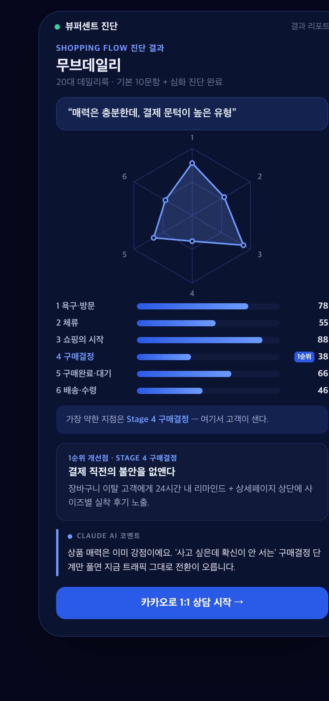
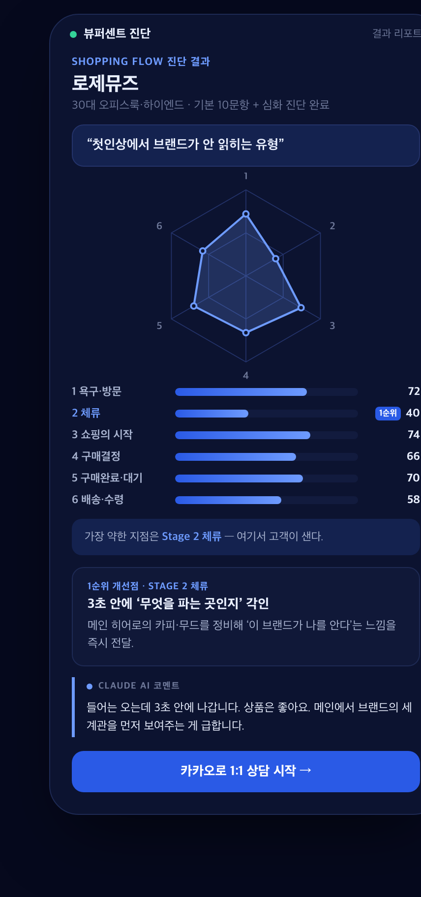
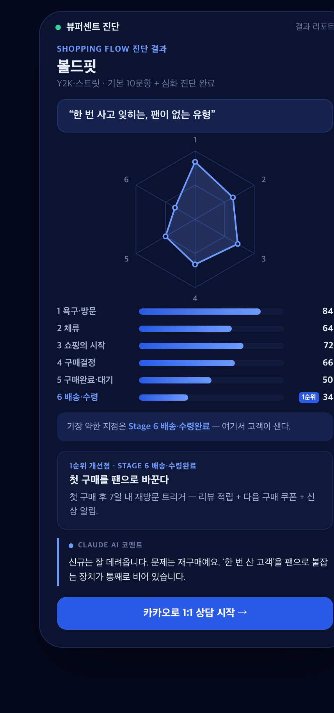
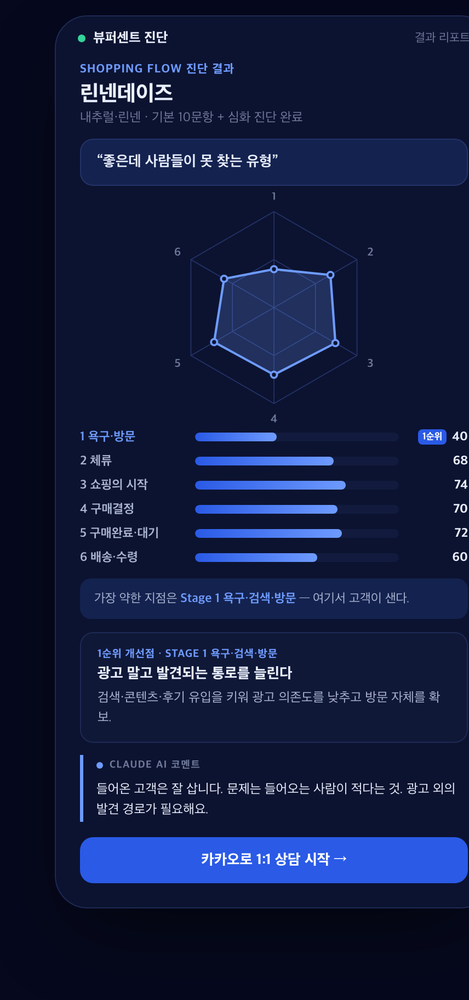
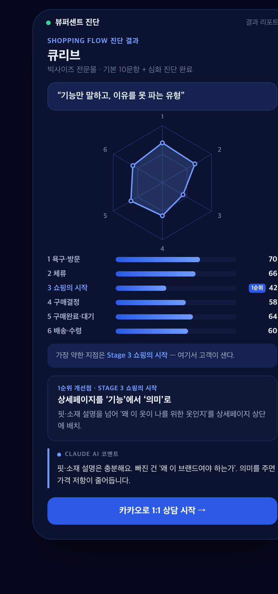
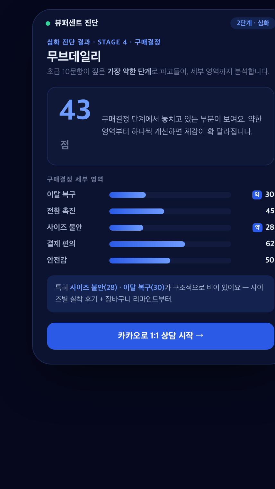

# 2주차 — 내 OS 구현하기 🚀

> 미션을 진행하며 **기획 → 구현 → 삽질 → 결과물 → 인사이트** 를 상세히 기록해주세요.

## 🎯 미션 1. 내 OS 만들기

**✅ 선택:** 콘텐츠 OS

> **한 줄 정의** — 여성의류 이커머스 대표가 자기 쇼핑몰의 **새는 지점을 스스로 진단**하고, **카카오 상담 → 코칭**으로 넘어오게 만드는 셀프 진단 OS.
>
> 🔗 **라이브:** https://viewpercent-diagnostic.vercel.app
> 📎 **발표·시연 자료(PDF):** [viewpercent-os.pdf](viewpercent-os.pdf)

### 📐 기획
내 본업은 여성의류 이커머스 광고대행·코칭이다. 대표님들을 만나면 늘 같은 말로 시작한다 — *"광고비 올렸는데 매출이 안 따라와요."* 나는 매번 그 진단을 처음부터 말로 반복하고 있었다.

그래서 **내 머릿속 진단 노하우를 무인 시스템으로 옮기기로** 했다. 대표가 몇 개의 질문에 답만 하면 자기 쇼핑몰의 어디가 새는지 그림이 나오고 → 자연스럽게 상담으로 이어지는 도구.

- **무엇을:** 쇼핑 여정 6단계 자가진단 웹앱
- **왜:** 반복되는 1:1 진단을 자동화하고, 코칭의 **리드 진입점**을 만들려고
- **어떻게:** 막연한 "매출이 안 나와요"를 **인지 → 팬까지 6단계**로 쪼개, 각 단계를 대표의 실제 언어로 질문

### ⚙️ 구현
- **기술 스택:** Next.js 14 + TypeScript + Tailwind · 결과 AI 코멘트 = Claude(Haiku 4.5) · **데이터 = Supabase 저장** · **Vercel 자동 배포**(GitHub push) + Analytics
- **구성:** 기본 10문항 + 적응형 심화 28문항 → 스코어링·빈틈 진단 → 6각 레이더 + 단계별 점수 + 액션 카드 + AI 코멘트 → **카카오 상담 CTA** → (동시에) 응답 Supabase 저장 → 어드민에서 상담 전환율 추적
- **작동 화면 — 5개 몰 시연:** 서로 다른 5개 여성의류몰이 같은 진단을 돌리면 **각자 다른 약점·다른 처방**이 나온다.

| 몰 | 약점 단계 | 진단 유형 |
|---|---|---|
| 무브데일리 | 구매결정 | 매력은 충분한데 결제 문턱이 높은 유형 |
| 로제뮤즈 | 체류 | 첫인상에서 브랜드가 안 읽히는 유형 |
| 볼드핏 | 배송·수령(재구매) | 한 번 사고 잊히는, 팬이 없는 유형 |
| 린넨데이즈 | 욕구·검색·방문 | 좋은데 사람들이 못 찾는 유형 |
| 큐리브 | 쇼핑의 시작 | 기능만 말하고 이유를 못 파는 유형 |

**🔍 초급 10문항으로 끝나지 않는다 — 2단계 심화 진단**

기본 진단이 가장 약한 단계를 찾으면, 앱은 그 단계를 **세부 영역으로 다시 쪼개** 심화 분석한다. 예: 무브데일리 → 구매결정(Stage 4)을 **이탈 복구 · 전환 촉진 · 사이즈 불안 · 결제 편의 · 안전감** 5개 영역으로 재분석 → "구매결정이 약하다"에서 멈추지 않고 "**무엇이** 비었는지(사이즈 불안 28 · 이탈 복구 30)"까지 짚어 상담에서 바로 처방한다. (앱에 이미 구현·라이브, 심화 응답은 Supabase에 별도 레코드로 저장)

### 🧗 과정에서의 삽질
- **"설문"인 줄 알았는데 "전환 설계"였다.** 결과 화면만 예쁘게 만들면 되는 줄 알았는데, 진단을 끝낸 사람이 상담으로 안 넘어가면 의미가 없었다. 결과 페이지를 CRO 관점(6개 각도 리서치 → 51개 발견 → 8개 개선)으로 다시 팠다.
- **첫 문항이 자책형이라 이탈을 부른다.** 첫 질문 "광고비 올렸는데 매출이 안 따라온 적 있나요?"가 '예=부정'이라, 시작부터 대표를 자책하게 만들었다(foot-in-the-door 위반). 쉬운 정방향 문항을 앞에 두도록 순서를 조정.
- **AI 코멘트가 배포본에서 안 떴다(503).** 환경변수(ANTHROPIC_API_KEY) 세팅 전엔 코멘트가 비어서, 키 세팅 + 폴백 처리로 해결.

### ✅ 결과물
- **라이브(HTTP 200 확인):** https://viewpercent-diagnostic.vercel.app
- **DB 연동:** Supabase에 진단 응답 저장 + 어드민에서 상담 CTA 전환율 조회
- **배포:** Vercel 자동 배포(GitHub push → 배포)
- 전체 개요·5개 시연 캡처는 첨부 PDF 참고 → [viewpercent-os.pdf](viewpercent-os.pdf)

### 💡 알게 된 인사이트 & 공유하고 싶은 내용
- **"대화를 시스템으로."** 매번 반복하던 진단을 한 번 시스템으로 만들어두니, 나는 진단을 반복하지 않고 **"결과를 보고 온 사람"과 상담부터** 시작하게 됐다.
- **진단 도구는 설문이 아니라 퍼널이다.** 완료율·상담 전환율 두 지표만 북극성으로 잡고 나머지는 안 건드리는 규율이 오히려 완성도를 높였다.
- 크루들과 나누고 싶은 것: 내 노하우를 '콘텐츠'로만 두지 말고 **답 몇 개로 결과가 나오는 도구로 캡슐화**하면, 리드 자체가 자동으로 걸러진다.

## 📣 미션 2. 유닛 활동 참여 & SNS 공유
> ⚠️ **(잭 님 직접 작성 필요 — 제가 알 수 없는 내용입니다. 이 PR에서 아래 3줄만 채워 주세요.)**

- **참여한 유닛 / 활동:**
- **무엇을 했나 (경험):**
- **SNS 인증 링크:**
