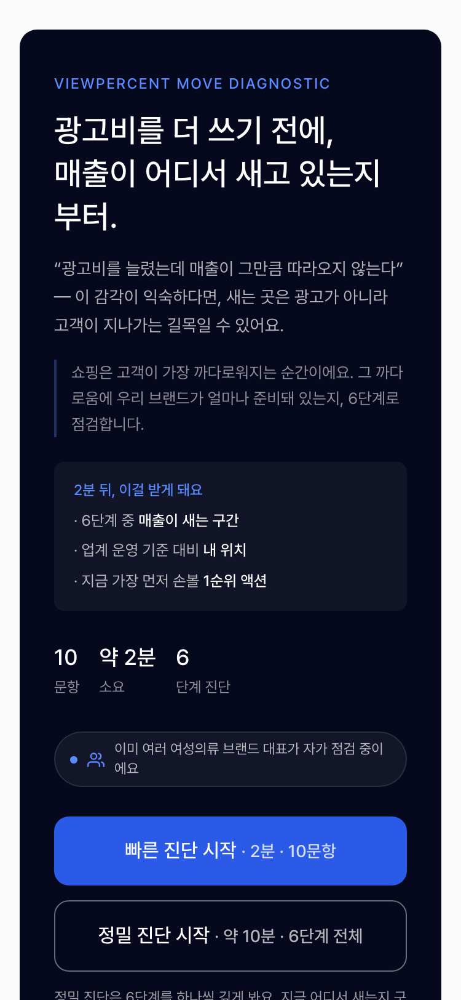
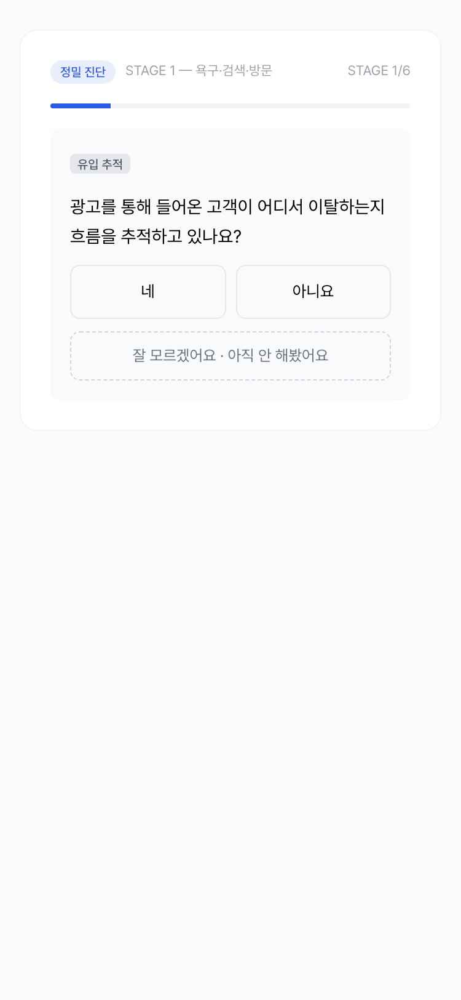
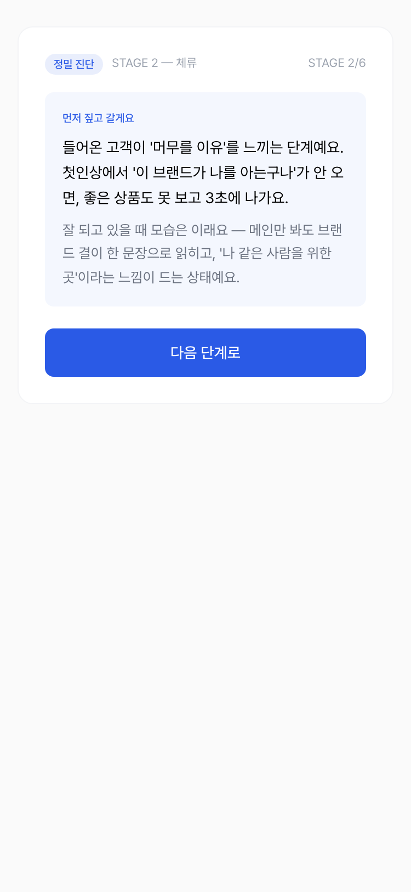
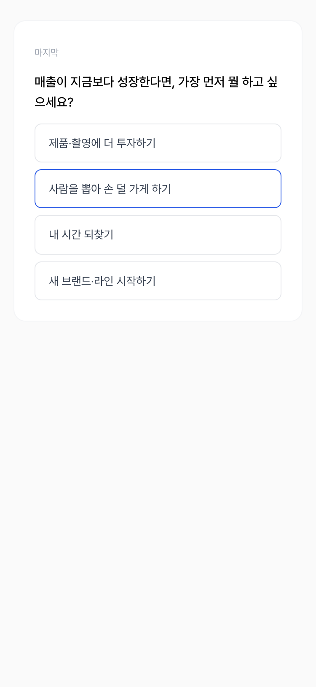
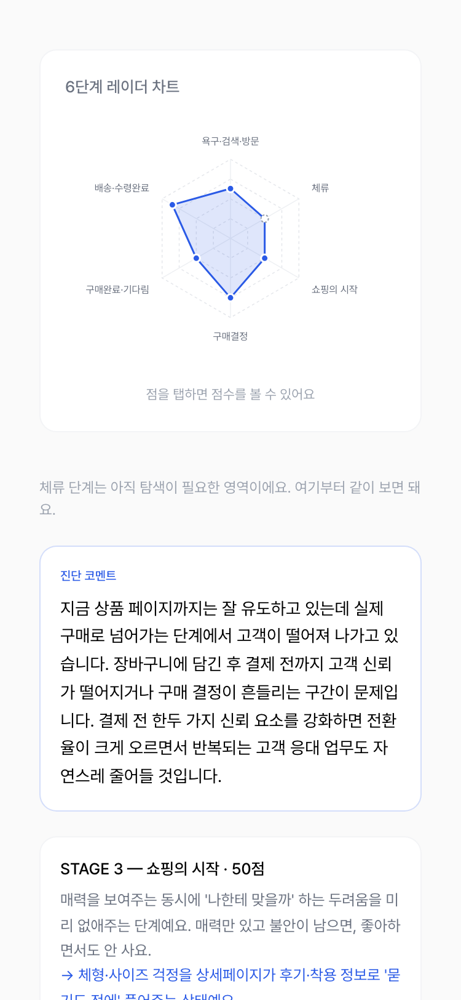
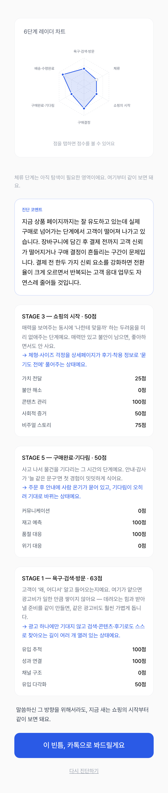
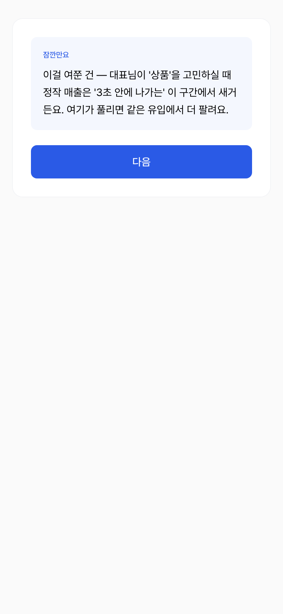

# 3주차 — 내 OS 최종 완성 🏁

## 🎯 미션 1. 내 삶을 돕는 OS 최종 완성

- **완성한 것 (무엇을):**
2주차에 만든 여성의류 쇼핑몰 진단 OS(viewpercent-diagnostic)에 **정밀 진단(풀 심화) 모드**를 추가해 최종 완성했다. 빠른 진단(10문항)은 그대로 두고, 진지한 예비고객 — 콘텐츠로 고객을 쌓다가 정체기에 온 대표 — 을 위해 6단계 전체를 도는 심화 진단을 새로 열었다. 결과는 점수판이 아니라 "너는 지금 이렇게만 하고 있지 → 그래서 여기가 막혀 → X만 해도 이만큼 달라져"라는 **인과+트리거 개인화 문장**으로 나온다.
그리고 진단 OS를 입구로 하는 운영 체인도 이번 주에 완성했다: 매일 아침 광고 성과를 "판단"으로 바꿔주는 브리핑 OS(맥미니 자동 운영), 주간 트렌드를 콘텐츠 앵글로 바꾸는 리서치 스킬, 만든 콘텐츠를 검수하는 소재 진단 스킬(클럽 skills/ 폴더에 PR로 기여). **진단 → 처방 → 운영**이 하나의 퍼널로 이어진다.

- **피드백 반영한 점:**
가장 큰 재료는 사람의 피드백이었다 — 내가 코칭받은 **성희님 세션 속기록**(노션 이야기 자본 DB)을 다시 꺼내 원문 그대로 읽고, 진단 OS 설계에 이식했다:
  - "패턴 조언은 씨만 뿌리고 물 안 주는 것" → 판정문 대신 응답자 입력을 되받는 개인화 문장 구조
  - "질문했으면 왜 물었는지 바로 알려줘라" → 결과 섹션마다 질문 의도 + 할 행동을 두괄식으로
  - "거르더라도 워딩은 리프레이징" → 필터(행동 증거로 내부 판정)와 깔때기(탈락 구간도 긍정 워딩)의 분리
  - "인터랙션 없으면 이해받았다는 느낌을 못 받는다" → 비전 질문 1개를 넣고 결과에서 그 답을 되비추는 공감 장치
  - 그리고 내 반론("질문해도 모른다만 남기는 사람은 계속 설명하게 된다")도 설계에 넣었다 → '모름' 2연속이면 더 파지 않고 설명 먼저 주는 fallback
검수 피드백도 반영했다: 스펙과 구현 계획을 **독립 검수 에이전트가 반증 지향으로 리뷰**하게 해서, 자체 리뷰가 "갭 없음"이라던 계획에서 결함 6건(ICP 데이터 미수집, 벤치마크 분포 오염, 빠른 진단 회귀 2건 등)을 잡아 수정 후 구현했다.

- **결과물 (링크·스크린샷):**
  - 라이브: https://viewpercent-diagnostic.vercel.app
  - 정밀 모드 시연 (프로덕션 라이브 · viewpercent-diagnostic.vercel.app):

  - 설계 문서·구현 계획: 저장소 docs/superpowers/ (스펙 → 독립 검수 → 결함 수정 → TDD 구현 흐름 그대로 기록)

- **알게 된 인사이트:**
  - **자기검증은 검증이 아니다.** 만든 쪽이 "갭 없음"이라 자평한 계획에서 신선한 컨텍스트의 검수자가 결함 6건을 찾았다. maker와 checker를 분리하는 것만으로 결과물의 급이 달라진다.
  - **코칭받은 대화도 데이터다.** 성희님 세션을 "좋은 기억"으로 두지 않고 속기록 원문을 다시 읽으니, 진단 OS의 설계 원칙이 그 안에 이미 다 있었다. 기록해둔 대화는 두 번째 쓸 때 진짜 자산이 된다.
  - **필터와 깔때기는 싸울 필요가 없다.** 판정은 데이터로 냉정하게, 표현은 따뜻하게 — 분리하면 리드도 잃지 않고 될 사람도 알아볼 수 있다.

## 📣 미션 2. 스폰지 토크데이 SNS 후기
- **후기 내용:**
- **SNS 인증 링크:**
