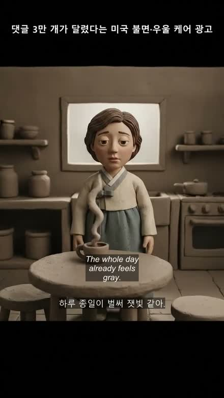
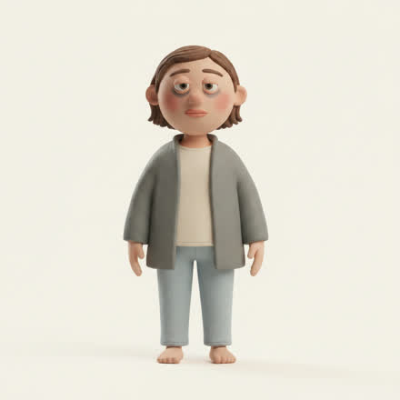
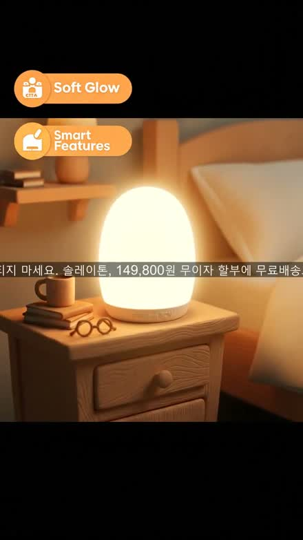
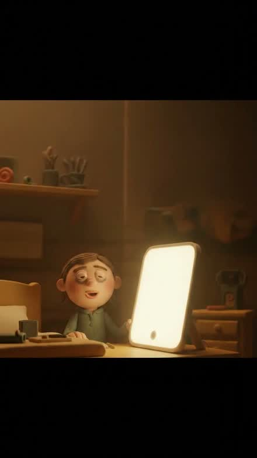
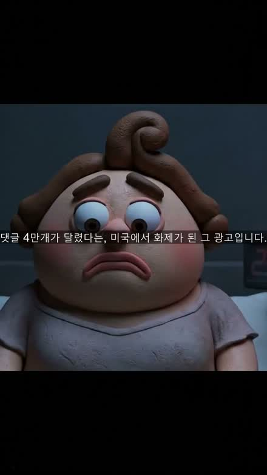
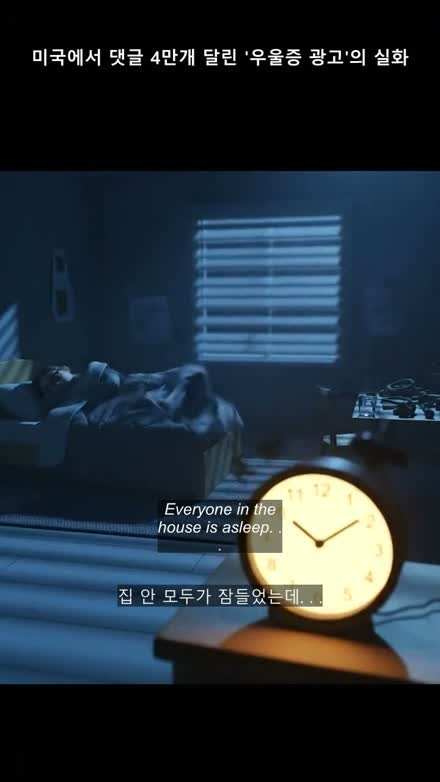

# 2주차 — 내 OS 구현하기 🚀

> 미션을 진행하며 **기획 → 구현 → 삽질 → 결과물 → 인사이트** 를 상세히 기록해주세요.

## 🎯 미션 1. 내 OS 만들기

**✅ 선택: 콘텐츠 OS — "광고영상 자동 공장"**

> 1주차엔 *업무*를 자동화하는 OS(장기렌트 DB 납품)를 만들었다면, 2주차는 *콘텐츠*를 자동화하는 OS를 만들었습니다.
> 1인 CPA 마케터로 살면서 매일 부딪히는 두 번째 지옥 — **"광고 소재(영상) 계속 뽑아내기"** 를 겨냥했습니다.
>
> **코딩을 몰라도 됩니다.** 잘나가는 경쟁사 광고 링크 하나를 넣으면 **내 제품 광고 영상이 나오는 기계**를, Claude Code와 **대화만으로** 약 4일간 만든 실제 기록입니다.

### 📐 기획
> 무엇을, 왜, 어떻게 만들지

- **한 줄 정의**
  > **경쟁사 광고 링크 하나를 넣으면 → 왜 잘 팔리는지 해부하고 → 그 전략만 내 제품으로 이식해 → 세로형 1분 광고영상을 자동으로 뽑아주는 기계.** 베끼기가 아니라 **이식**입니다.

- **왜 (문제)** — CPA 마케터의 실력 = "잘 터지는 광고를 보고 → 왜 터지는지 분석해서 → 내 제품에 맞게 이식하는" 능력인데, 이걸 **매번 머리로, 손으로** 반나절~하루씩 하고 있었음. 그 반복 노동이 병목.

  ```
  🟣 콘텐츠 OS · 재료 카드

  · 영역      : 콘텐츠 (숏폼 광고영상 소재 제작)
  · 걸리는 지점 : 잘 터지는 경쟁 광고 → 분석 → 내 제품에 이식 → 영상화, 전부 수작업
  · OS가 된다면 : 링크 1개 → 역공학 → 소구점 이식 → 씬 설계 → 그림·목소리·영상 자동 조립
  · 한 문장   : "터지는 광고 링크만 던지면, 내 제품 버전 광고가 만들어져 있다"
  · 첫 한 걸음 : '역공학 → 소구점 이식'이라는 전략 두뇌부터 (영상 렌더는 그다음)
  ```

- **어떻게 (전체 흐름)** — 넣는 것 → AI 분석 → 대본 → 제작 → 완성

  | 넣는 것 | → AI 분석 | → 대본 | → 제작 | → 완성 |
  |---|---|---|---|---|
  | 경쟁 광고 링크<br>+ 내 제품 소개 | 왜 잘 팔리는지 해부<br>(후킹·감정 흐름·화풍) | 내 제품 버전으로<br>스토리 다시 쓰기 | 그림·목소리·영상을<br>자동 생성·조립 | 세로형 1분 내외<br>광고영상 파일 |

  > **사람이 누르는 버튼은 딱 3번. 나머지는 기계가 합니다.**

### ⚙️ 구현
> 실제로 만든 것

**핵심 설계 1 — 역할을 셋으로 나눴습니다** (`"AI야 알아서 다 해줘"는 실패 공식`)

| 담당 | 하는 일 |
|---|---|
| 🖥️ **프로그램** | 영상 내려받기·자르기·붙이기·재시도 — 정답이 정해진 반복 작업 |
| 🤖 **AI** | 광고 분석·카피 쓰기·장면 상상 — 감각/창의가 필요한 일 |
| 🙋 **나** | "이 방향으로 갈까?" — 전략과 취향의 최종 결정 |

> **AI는 유능한 직원, 나는 결재권자.**

**핵심 설계 2 — 돈 나가기 직전엔 반드시 멈추는 문 3개** (완전 무인이 목표가 아님)

- **결재 1** — 내 제품의 어떤 강점으로 광고할지 고르기
- **결재 2** — 대본 후보 중 최종안 고르기
- **결재 3** — **비용 발생 직전** 대본·비용 최종 확인 후 제작 시작

> 자동화가 지갑을 태우는 사고는 의지가 아니라 **구조**로 막습니다.

**핵심 설계 3 — 설계도부터 확정하고 대본을 씀** (집 지을 때 인테리어부터 안 하듯이)

- 예전: AI에게 바로 대본 → 장면 수·구조가 그때그때 운. 어디서 틀렸는지 모름.
- 지금: **뼈대(설계도) 먼저** — 시선 잡기 → 공감 → 바닥 → 원리 → 해결 → 사용 → 변화 → 마무리. 장면 수·초 배분까지 정한 뒤 대본.
- 보너스: **장면 수 = 제작비**라서, 비용이 설계 단계에서 확정됨.

### 🧗 과정에서의 삽질
> 막혔던 지점, 시도한 방법, 어떻게 풀었는지 솔직하게

**삽질 1 — "한복 사건": AI는 부탁을 까먹습니다**

| | |
|---|---|
|  |  |
| **사고.** "미국 광고" 콘셉트인데 주인공이 **한복**을 입고 등장 😵 | **해결.** 주인공 **설정 그림 한 장**을 모든 장면에 배부 |

- 원인: AI는 장면을 하나하나 새로 그리면서 **앞 장면 설정을 기억하지 못함** → 매 장면 주인공을 새로 캐스팅.
- 해결: "미국인 여성으로 그려줘"라고 **매번 부탁하는 건 부족**(부탁은 잊힘). → ①주인공 나이·머리·옷·분위기를 **설정집 한 문단**으로 고정 ②모든 장면에 **같은 설정집 + 캐릭터 그림 배부** ③AI가 깜빡해도 **프로그램이 자동으로 바로잡는** 이중 안전장치.

> **프롬프트(부탁)는 잊히지만, 시스템(규칙)은 잊히지 않습니다.**

**삽질 2 — 연습 문제 127개 다 맞아도, 실전 첫 판에서 터집니다**

| 사고 | 내용 |
|---|---|
| 사고 1 | 한글 윈도우에서만 나는 **글자 깨짐** — 긴 줄표(—) 하나에 전체 중단 |
| 사고 2 | 영상 생성 서비스가 **4·6·8초만** 허용 — 7초를 보냈더니 거절 |
| 사고 3 | **하루 사용량 한도 초과**로 한밤중에 작업 중단 |
| 사고 4 | AI가 **자기가 사는 폴더를 "제품"으로 착각**하고 자기소개서를 씀 |

> 그래서 핵심은 **"끊겨도 이어하기"** 설계 — 이미 만든 장면은 저장해두고 다음 날 이어 만들면 **돈도 다시 안 나갑니다.**

**삽질 3 — "눈검사": 비싼 버튼 누르기 전에 눈으로 확인**

| | |
|---|---|
|  |  |
| **실격.** 실제 제품(사각 패널)과 전혀 다른 **계란 모양 무드등** + 정체불명 영문 배지 | **합격.** 실물 사진을 참고로 넣자 제품이 제대로 — 단, 실사가 아니라 **영상 화풍(클레이)으로 재해석** |

> 본 제작 전에 기준 그림 1~2장을 먼저 뽑아 검사하는 습관 덕분에, 오염된 결과를 **비용 0원 단계에서** 두 번 잡아냈습니다.

### ✅ 결과물
> 완성한 것 / 작동 화면

**1차 시안 → 4차 시안** (이 사이의 시행착오가 오늘 내용의 전부입니다)

| | |
|---|---|
|  |  |
| **1차 — 아쉬움 ❌** | **4차 — 합격 ✅** |
| 자막이 얼굴을 가리고, 아나운서 같은 목소리, 하고 싶은 말만 하다 끝나는 56초 | 첫 화면부터 **"새벽 3시" 시계**로 시선을 잡고, 진짜 사람 같은 고백체 서사, 자막은 아래쪽에 얌전히 |

- **제품:** 솔라이톤 SCN 광치료기 (우울증/불면 케어, 4050 중년여성 타겟)
- **레퍼런스:** 중년여성 다이어트알약 광고(3D 클레이메이션, 다이렉트 리스폰스) → 화풍·메타 후크·변신 모티프만 이식
- **최종본:** 세로형(720×1280 · 9:16) · **59초** · 8씬 · 클레이메이션 · 영어 더빙 + **한/영 이중자막** · 상단 고정 타이틀 ("미국에서 댓글 4만개 달린 '우울증 광고'의 실화")

### 💡 알게 된 인사이트 & 공유하고 싶은 내용
> 하면서 깨달은 것, 크루들과 나누고 싶은 것

**① 피드백은 수정사항이 아니라 "헌법"으로 승격시켜라** (지적은 한 번만, 규칙은 영원히)

- 결과물 피드백을 그때그때 말로 고치면 다음 영상에서 또 틀림. 피드백을 받을 때마다 **"제작 헌법" 문서에 규칙으로 승격**.
- 예: *"말이 뚝뚝 끊기고 급하게 끝나"* (지적 1회) → *"속도감은 말 빠르기로, 분량은 이야기가 결정한다"* (규칙 승격) → 다음 영상부터 같은 지적 안 나옴.
- 이렇게 쌓인 **헌법 8조:** 말 빠르기 · 가격 언급 금지 · 제품 생김새 지키기 · 자막 위치 · 레퍼런스 따라가기 · 상단 고정 제목 · 시원한 화면 구도 · 군더더기 금지

**② 월 구독만으로 "AI 두뇌"를 돌릴 수 있습니다**

- 분석·대본을 쓰는 AI 두뇌는 **추가 결제 없이 클로드 구독으로** 해결. (Claude Code는 화면 없이 뒤에서 호출 가능 → 프로그램이 필요할 때마다 직원 부르듯)
- 돈 드는 건 그림·목소리·영상을 실제로 만드는 마지막 단계뿐.

| 0원 | ~1만원 | 10개 |
|---|---|---|
| 분석·대본 단계 추가 비용<br>(구독으로 해결) | 영상 1편 재료비<br>(그림+목소리+영상 생성) | 영상 생성 하루 한도<br>→ 장면 수 관리 = 예산 관리 |

**📊 숫자로 보는 3일**

| 4차 | 127개 | 7건 | 3번 | 8조 | 59초 |
|---|---|---|---|---|---|
| 시안 반복 | 자동 검사 항목 | 실전에서만 나온 사고<br>(전부 재발 방지) | 영상 1편당 사람 결재 | 쌓인 제작 헌법 | 최종 길이<br>(설계대로) |

**🎁 마지막 다섯 줄 요약**

1. AI에게 다 맡기지 말고, **역할을 나눠라**
2. 프롬프트는 부탁이고, **시스템은 계약이다**
3. 실전 1회가 연습 100회보다 낫다 — 대신 **끊겨도 이어하게** 만들어라
4. 피드백은 수정사항이 아니라 **헌법**으로 승격시켜라
5. 사람은 결재에, **AI는 결재 사이에**

> **완벽한 무인 자동화보다, 내가 결재하는 자동화가 오래 갑니다.**

## 📣 미션 2. 유닛 활동 참여 & SNS 공유
> 유닛 활동에 적극 참여(유닛원으로서 or 참가자로서)한 뒤, 그 경험을 SNS에 올리기

- **참여한 유닛 / 활동:** (작성 예정)
- **무엇을 했나 (경험):** (작성 예정)
- **SNS 인증 링크:** (작성 예정)
