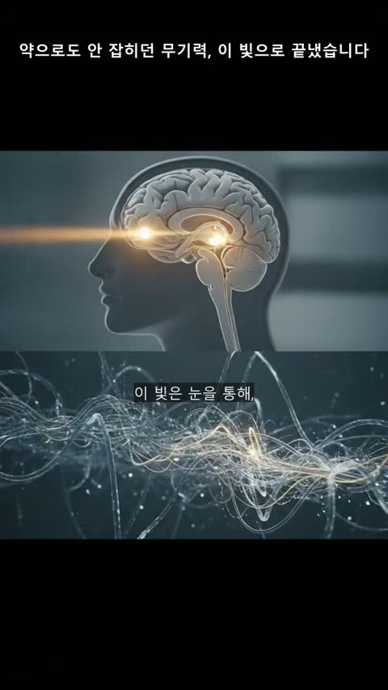

# 3주차 — 내 OS 최종 완성 🏁

> 부제: **공장을 돌렸더니, 공장이 다시 만들어졌다**
> 발표자료: [광고영상OS_3주차_발표.html](발표자료/광고영상OS_3주차_발표.html) (다운로드 후 더블클릭하면 열립니다)

> 2주차에 "광고영상 자동 공장"을 **만들었다면**, 3주차는 그 공장을 **실제로 돌린** 주였습니다.
> 그리고 배웠습니다 — **공장은 세우는 날이 아니라 돌리는 날 완성된다**는 걸.
> 버튼을 누를 때마다 설계가 몰랐던 구멍이 튀어나왔고, 그 구멍을 메우다 보니 공장의 뼈대가 세 번 바뀌었습니다.

## 🎯 미션 1. 내 삶을 돕는 OS 최종 완성

### ✅ 완성한 것

**📊 숫자로 보는 일주일**

| 완성 영상 | 발견한 오류 | 공정 재설계 | 제작 헌법 | 자동 검사 |
|---|---|---|---|---|
| 2편 (8·11호) | 12건 (전부 실사용에서) | 3회 | 8조 → **15조** | 127개 → **470개** |

**완성 영상 2편** — [완성영상 (48초, 첨부)](이미지첨부/완성영상_solaiton11.mp4)

- **8호**: 채팅 없이 **브라우저 대시보드만으로** 뽑은 첫 완주작 (레퍼런스 투입 → 분석 → 대본 → 검수 → 영상까지 클릭만으로)
- **11호**: 이번 주 재설계된 **신공정의 첫 작품** — 아래의 무드 팔레트·3컷 스토리보드·보이스 캐스팅이 전부 적용된 영상

**공장의 새 조립 라인** — 이번 주의 진짜 결과물은 영상이 아니라 **바뀐 공정 그 자체**입니다.

```
레퍼런스 분석 → 구조 설계도(비트시트) → 구조에 맞는 강점 선택[결재]
→ 대본 + 씬별 연출 선언 → 대본 검수[결재] → 무드별 기준 이미지(앵커)
→ 씬마다 시작·중간·끝 3컷[검수] → 목소리 캐스팅[결재] → 영상 생성[과금] → 완성
```

### 🔁 피드백 반영한 점

> 이번 주 피드백 제공자는 남이 아니라 **실사용자가 된 나 자신**이었습니다. 쓰다가 발견한 12건 — 전부 만들 때는 몰랐던 것들입니다. 굵직한 6개 사건만 추리면:

**사건 1 — "아무것도 안 했는데 혼자 일하는 중이야" (유령 소동)**

어느 날 대시보드를 열었더니 "제품 분석 중... 5초 경과"가 떠 있고 빨간 오류까지 보였습니다. 놀라서 물었죠. *"이거 어떻게 멈춰?"* — 조사해 보니 **아무것도 돌고 있지 않았습니다.** 예전에 죽은 작업이 장부에 "시작"만 남기고 사라져서, 화면이 유령을 보여주고 있던 겁니다.

이런 유령이 세 종류나 나왔습니다:
- **유령 진행 표시**: 죽은 작업이 영원히 "작업 중"으로 표시
- **유령 폴더**: 프로젝트 이름을 타이핑하는 동안 글자 하나하나가 폴더로 생성됨 (조회 기능이 몰래 폴더를 만들고 있었음)
- **유령 입력칸**: "화면 자막"이라고 편집까지 되는 칸이 있는데, 알고 보니 **영상에 전혀 반영되지 않는** 장식품

→ 셋 다 제거하고 원칙을 세웠습니다: **화면에 보이는 것 = 실제로 일어나는 것.** 이게 깨지는 순간 도구를 못 믿게 됩니다.

**사건 2 — "이미지 다시 눌렀는데 영상까지 다시 되는데?"**

장면 이미지가 마음에 안 들어 [이미지 다시]를 눌렀더니 영상까지 다시 만들어지는 것처럼 보였습니다. 파 보니 더 황당했습니다. ①재생성된 새 이미지를 **확인할 방법 자체가 없었고** ②장면마다 이미지를 2~3장씩 만들면서 **정작 영상에는 첫 장만 쓰고 나머지는 돈만 내고 버리고** 있었습니다.

→ 여기서 공장 재설계 1탄이 나왔습니다: 어차피 여러 장 만들 거면 **시작·중간·끝 3컷 스토리보드**로 만들어서, 대본을 그림 단계에서 검수하고, 영상 AI에게 시작·끝을 고정값으로 넘기자. **낭비가 설계로 바뀐 순간**입니다.

**사건 3 — 뷰티 광고를 베꼈더니 우울증 광고가 화사해졌다**

레퍼런스(밝고 화사한 뷰티 광고)에 충실하게 만들었더니, **우울함을 그려야 할 초반부까지 밝고 경쾌하게** 나왔습니다. 캐릭터 시트는 실사 레퍼런스인데 애니메이션풍으로 그려지고, 심지어 레퍼런스 영상의 **워터마크까지 그대로 복제**해 그려 넣었습니다.

→ 여기서 이번 주 가장 중요한 원칙이 나왔습니다. **"레퍼런스에 충실하라 = 외형을 복제하라가 아니다. 왜 그 스타일이 나왔는지 역설계해서, 같은 논리로 내 제품의 스타일을 다시 그려라."** 매체·기법(실사+3D CG)만 가져오고, 무드는 내 제품의 감정 곡선(어둠→반전)으로 다시 설계. 이게 아래의 무드 팔레트가 된 겁니다.

**사건 4 — "그 답, 이 빛 하나에 있었습니다" (규칙이 서사를 이기면 안 된다)**

시스템엔 "문제 구간엔 제품 금지, 무조건 어둡게"라는 규칙이 있었습니다. 그런데 이번 레퍼런스의 훅은 첫 장면에서 전체 스토리를 **압축 예고**하는 유형 — "그 답, 이 빛 하나에 있었습니다"라고 첫 씬부터 해결책을 암시합니다. 규칙(어둡게+제품 금지)과 대사(빛과 제품)가 정면 충돌했죠.

→ 재설계 2탄: 역할에 따라 연출을 **강제하던 코드를 폐기**하고, **AI가 대본을 쓰면서 장면마다 연출(무드·제품 노출·포커스)을 선언**하게 했습니다. 광고 구조는 수백 가지인데 규칙을 열거해서는 못 따라갑니다. 대신 구조가 어떻든 "장면별 선언"이라는 하나의 원리로 표현되게 한 거죠. 최종 구조: **AI가 선언 → 프로그램이 집행 → 내가 결재.**

**사건 5 — 파일은 멀쩡한데 장부만 거짓말을 한다**

조립 버튼을 눌렀더니 `NoneType` 어쩌고 하는 외계어 오류. 조사해 보니 장면 5의 더빙 **파일은 멀쩡히 있는데 장부에만 "없음"으로 기록**돼 있었습니다. 원인은 동시 작업 경합 — 버튼 여러 개가 백그라운드에서 겹치면 각자 장부 사본을 읽고 통째로 저장하다가, **늦게 저장한 쪽이 먼저 끝난 작업의 기록을 덮어쓰는** 고전적인 사고였습니다.

→ 장부 기록에 잠금을 걸어 원천 차단 + 같은 사고가 나도 조립이 디스크와 장부를 대조해 **스스로 치유**하고 진행하게 했습니다. 그리고 오류 문구도 바꿨습니다: "NoneType"이 아니라 **"씬 5의 더빙이 없습니다 — [더빙만 다시] 후 조립하세요"**. 오류는 정보가 아니라 다음 행동이어야 합니다.

**사건 6 — 로봇이 낭독하는 광고**

들어보니 대사가 전부 "~다. ~다."로 끝나서 로봇 낭독 같았고, 한 장면의 두 문장을 한 호흡에 합성하다 보니 **쉬어야 할 곳에서 이어지고 이어질 곳에서 끊겼습니다.**

→ 대본 규칙에 **구어체 강제**(공적 톤이 아니면 해요체·종결 다양화 — 친근함≠기쁨, 톤은 무드가 정하고 여기선 '사람다움'만 요구)를 넣고, 더빙은 **문장 단위로 따로 합성해 0.3초 호흡으로 연결**하도록 바꿨습니다. 목소리 선택도 "598개 목록에서 골라보세요"가 아니라, **AI가 대본·무드·화자 프로필을 보고 4명을 캐스팅 추천 → 실제 첫 대사로 샘플을 들어보고 확정**하는 오디션 방식으로 바꿨습니다.

**그 외 잡은 것들 (요약)**

| 발견 | 조치 |
|---|---|
| AI 로그인 만료가 "빈 오류"로만 표시 (원인이 출력의 엉뚱한 곳에 숨어 있었음) | 진짜 원인을 꺼내 보여주기 + 재로그인 안내 |
| 대시보드가 API 열쇠 파일을 안 읽고 있었음 (유료 기능 전부 먹통 직전) | 열쇠 로딩 공용화 |
| 같은 제품을 영상 만들 때마다 몇 분씩 재분석 | 제품 프로필 등록제 (한 번 분석, 계속 재사용) |
| 프로젝트 이름 재사용으로 옛 산출물과 뒤섞임 | 재사용 감지 시 차단 + 안내 |
| 비싼 단계(영상)로 너무 쉽게 진입 | 싼 단계(이미지) 전량 검수 후에만 영상 [결재] |

### 📸 결과물

**무드 팔레트** — AI가 대본을 쓰면서 "이 영상은 3가지 무드로 간다"고 스스로 선언하고, 무드마다 기준 이미지를 만들어 각 장면이 자기 무드를 따라가게 했습니다. 우울(어둠) → 전환(빛의 실마리) → 회복(햇살)이 한눈에 보이죠:


**씬마다 3컷 스토리보드** — 장면 하나당 그림 한 장이 아니라 **시작·중간·끝 3컷**을 먼저 뽑아 대본대로 흘러가는지 검수하고, 영상 AI에게는 시작·끝 프레임을 고정값으로 넘겨 중간에 튀는 걸 막았습니다. 3컷 내내 같은 인물이 유지되는 것도 포인트:


**무드 반전** — 문제 구간(어두운 침실)과 해결 구간(밝은 아침)이 같은 영상 안에서 이렇게 갈립니다:




### 💡 알게 된 인사이트

**한 줄: OS는 만드는 게 아니라, 돌리면서 길들이는 것이다.**

이번 주 발견 12건 중 **설계 단계에서 예측한 건 0건**입니다. 전부 실제로 쓰다가 나왔습니다. 자동 검사 470개가 통과한 상태에서도요. 그래서 OS를 만들고 있는 크루들에게 — 이번 주 삽질에서 증류한 **7계명**을 공유합니다:

1. **만들었으면 네가 제일 헤비유저가 돼라.** 실사용 1시간이 설계 회의 10시간보다 많은 결함을 찾는다.
2. **AI의 선의에 기대지 말고 시스템으로 강제하라.** "프롬프트에 잘 써놨으니 되겠지"는 반드시 배신당한다. 화풍·금지어·호흡 같은 건 코드가 기계적으로 붙여야 한다.
3. **구조는 3권 분립 — AI가 선언, 프로그램이 집행, 사람이 결재.** 규칙을 코드에 못 박으면 예외 구조에서 반드시 깨진다. AI가 상황마다 선언하게 하고, 사람이 게이트에서 승인하라.
4. **돈 나가는 단계 앞엔 반드시 싼 검수 게이트를 세워라.** 이미지(원 단위)로 전부 확인한 뒤에야 영상(천 원 단위)을 돌린다. 게이트 설계가 곧 예산 관리다.
5. **화면에 보이는 것과 실제로 일어나는 것을 일치시켜라.** 반영 안 되는 입력칸, 돌지도 않는데 도는 척하는 진행바 — 유령 하나가 도구 전체의 신뢰를 무너뜨린다. 발견 즉시 없애라.
6. **벤치마킹은 복제가 아니라 번역이다.** 위닝 소재에서 가져올 것은 구조·매체·기법이고, 무드와 내용은 내 제품의 이야기에서 다시 그려야 한다. (이건 시스템 설계이자 마케팅 원칙)
7. **오류 문구에는 '다음 행동'을 담아라.** "NoneType"은 오류가 아니라 소음이다. "씬 5의 더빙이 없습니다 — 이 버튼을 누르세요"가 오류다.

> 2주차 마지막 줄에 이렇게 썼습니다 — "완벽한 무인 자동화보다, 내가 결재하는 자동화가 오래 갑니다."
> 3주차를 마친 지금은 한 줄이 더 생겼습니다.
> **"공장의 도면은 책상에서 그려지지만, 공장의 완성은 라인 위에서 이루어진다."**

## 📣 미션 2. 스폰지 토크데이 SNS 후기
> 오늘 토크데이 후기를 SNS에 올리기 (**#스폰지클럽 필수 · 셀 3개 지급!**)
- **후기 내용:** (작성 예정)
- **SNS 인증 링크:** (작성 예정)
