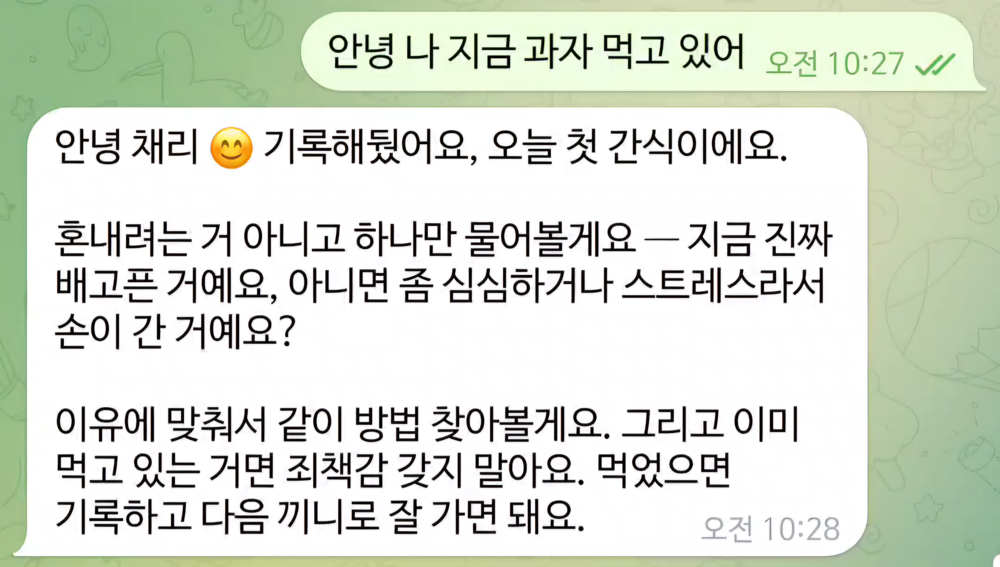
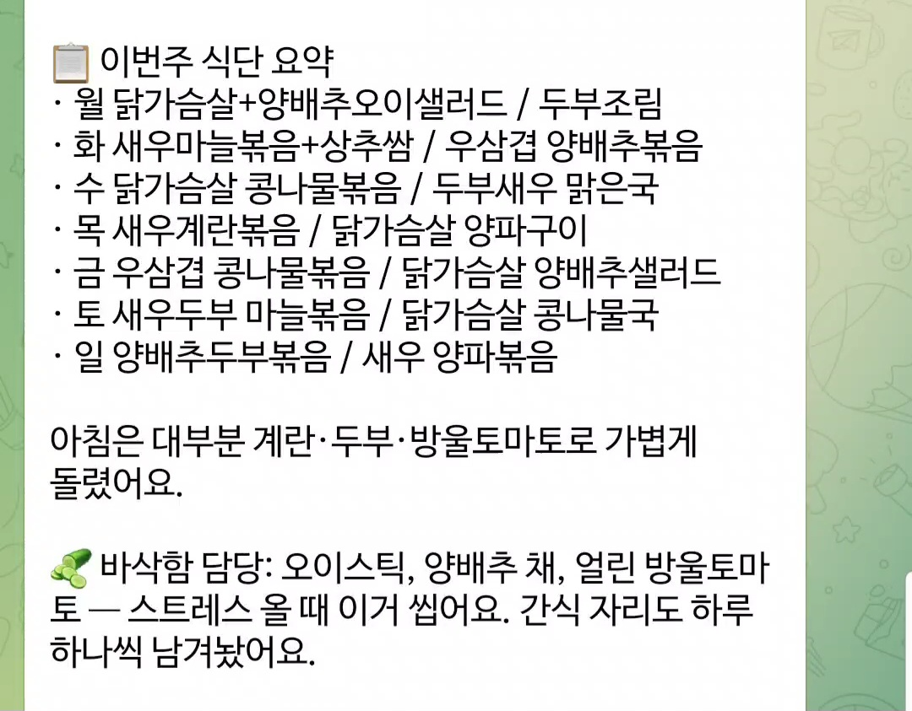
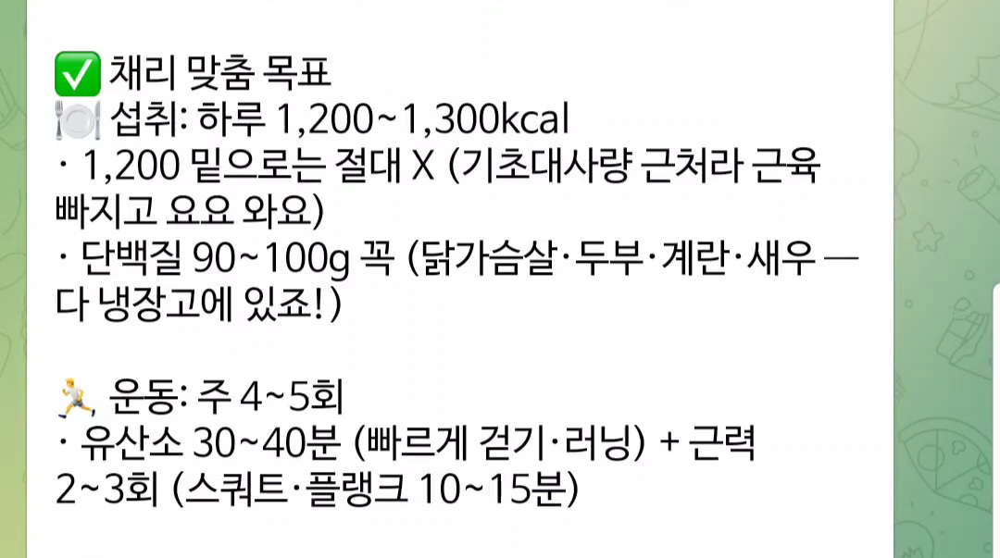

# 1주차 — 나만의 OS 만들기 🛠️

> 미션을 진행하며 **과정과 결과물**을 기록해주세요. (다 못 채워도 OK, 한 것 위주로!)

## 🎯 미션 1. 내 OS 재료 찾기
> 인터뷰 스킬(아이데이션)로 "내 삶에 필요한 게 뭔지" 찾기

- **과정 (어떻게 찾았나):**
  클로드코드 인터뷰 스킬로 하루를 되짚었다. 처음엔 일(콘텐츠 기획·레퍼런스 찾기)이
  떠올랐지만, 그건 이미 만들어둔 챗지피티로 급한 불은 꺼져 있었다. 질문을 "일 밖"으로
  돌리자 진짜 매일 씨름하는 게 드러났다 — **8월 21일까지 체중 감량(목표 -4.7kg)** 인데
  운동은 되지만 **식단에서 자꾸 무너진다**는 것. 식욕이 넘치고 간식을 많이 먹게 된다는
  게 진짜 걸리는 지점이었다. 게다가 이번 주 과제 주제가 "내 삶을 돕는 OS"이고 텔레그램
  연동이 핵심이라, **하루 종일 핸드폰으로 옆에 있어야 하는 삶의 문제**와 딱 맞아떨어졌다.

- **결과:** 아래 '내 OS 재료 카드'로 정리됨.

  ```
  🟡 내 삶을 돕는 OS · 재료 카드

  · 이름      : 다이어트 AI 코치 (텔레그램에 사는)
  · 영역      : 삶 — 건강 / 체중 감량 (8월 21일까지)
  · 걸리는 지점 : 운동은 하는데 식단 관리가 어려움. 식욕이 넘치고
                간식을 많이 먹게 됨
  · 지금은    : 운동+식단으로 해보려 하지만 식단은 머릿속으로만.
                식욕·간식 앞에서 매번 무너짐 (기록도, 잡아줄 사람도 없음)
  · OS가 된다면 : 텔레그램 안에 사는 다이어트 AI 코치
                ⓪ 목표 입력 → 나에게 맞는 계획  ① 먹은 거 기록·패턴
                ② 간식 코치  ③ 저녁 체크인·응원
                ④ 재료 말하면 일주일 식단+동기부여  ⑤ 오전 7시 운동 알림
  · 한 문장   : "혼자 참지 않아도 되는 다이어트 —
                텔레그램에 내 코치가 산다"
  · 첫 한 걸음 : 텔레그램 봇 하나 만들어, 내 목표에 맞게
                기록·코칭해주는 코치부터
  ```

- **느낀 점:**
  처음 떠올린 게(일) 정답이 아니었다. 질문을 삶 쪽으로 한 번 돌리니 지금 나에게 진짜
  중요한 게 튀어나왔다. "홍보를 어떻게 하지" 같은 일 문제보다, **매일 저녁 간식 앞에서
  무너지는 나**를 도와주는 게 훨씬 절실했다. OS는 멋진 자동화 도구가 아니라 **내 하루가
  실제로 통과하는 길**이라는 걸 체감했다.

## 🧩 미션 2. 내 OS 기획
> 인터뷰 결과 + 세션 내용(흐민·배짱·키노) 활용해 기획

- **기획 내용:**
  재료 카드를 3단계로 쪼갰다. 이번 주에 3단계까지 다 만드는 걸 목표로 잡았다.

  **[1단계 — 코치의 몸통]** 텔레그램 봇을 클로드코드에 연결하고, 목표(감량 kg·기간)를
  입력받아 기준점을 세운다. 먹은 것·간식을 보내면 기록하고 하루 패턴을 정리한다.

  **[2단계 — 코치가 먼저 말 걸기]** 오전 7시 운동 동기부여, 저녁 체크인·응원, 간식이
  땡길 때 멈춰주고 이유를 묻는 코칭. 내가 안 물어봐도 알아서 챙겨주는 단계.

  **[3단계 — 코치가 계획 짜주기]** 냉장고 재료를 말하면 목표에 맞춰 일주일치 식단표와
  동기부여 문구를 만들어준다. "뭐 먹지" 고민 자체를 없앤다.

- **막혔던 점 / 어떻게 풀었나:**
  처음엔 문제를 "홍보/일"로 좁게 잡아 막막했다. 인터뷰에서 "일 밖에서 놓치는 것"을
  물으니 체중 감량이라는, 마감(8/21)까지 있는 진짜 문제가 드러났다. 그래서 방향을
  일 자동화가 아니라 **삶을 돕는 코치**로 바꿔 1~3단계를 정의했다.

## ⚙️ 미션 3. 내 OS 구현
> 실제로 만들어본 것 (클로드코드 '채널' 기능 활용 OK)

- **결과물:** 텔레그램에 사는 **다이어트 AI 코치**를 실제로 만들어 작동까지 확인했다.
  코드 한 줄 없이, 자연어(md 파일)로 "이렇게 행동해줘"를 적어서 만든 나만의 OS.
  - `CLAUDE.md` — 코치의 뇌(페르소나·행동 규칙 ⓪~⑤)
  - `목표.md` — 목표 체중·기간(8/21) (모든 코칭의 기준점)
  - `기록.md` — 날짜별 식단·간식·운동·체중 기록
  - `dashboard/index.html` — **레트로 진행 대시보드** (체중 그래프·D-day·진행률
    ·이번 주 기록 / 식사·간식·운동 칸을 탭하면 사진 등록)
  - **텔레그램 봇 연결 완료** → 핸드폰에서 "오늘 사과 먹었어" 보내면 코치가 답하고 기록,
    "간식 땡겨" 하면 이유를 묻고 잡아줌, "냉장고에 ○○ 있어" 하면 일주일 식단을 짜줌.
  - 만든 방법: 인터뷰 스킬로 재료 찾기 → 자연어로 코치 규칙 정의 → 텔레그램 채널로 연결
    → 진행 상황을 보여주는 대시보드까지.
  - 다음(더 붙일 것): ⑤ 오전 7시 운동 알림·③ 저녁 체크인 같은 "먼저 말 거는" 스케줄
    기능 (노트북이 켜져 있어야 도는 방식이라 세팅 예정).

- **링크 / 스크린샷:** 실제 코치와 개인 기록(체중 원본)은 개인정보라 로컬에만 두고,
  구현 결과를 스크린샷으로 첨부한다.

  **① 텔레그램 코치 — 실제 작동**

  간식이 땡길 때 잡아주는 코치 (혼내지 않고 이유부터 물어봄):

  

  냉장고 재료로 짜준 일주일 식단표 + 나에게 맞춘 목표:

  

  

  **② 레트로 진행 대시보드** (체중 숫자는 가림 처리)

  

  이번 주 기록 — 식사·간식·운동 칸을 탭하면 사진 등록:

  

  
  

## 📱 미션 4. SNS 1주차 소감
> AI 도움 없이 직접 작성! (인증하면 셀 지급)

- **인증 링크:** https://www.instagram.com/p/DaWr8EbksGY/