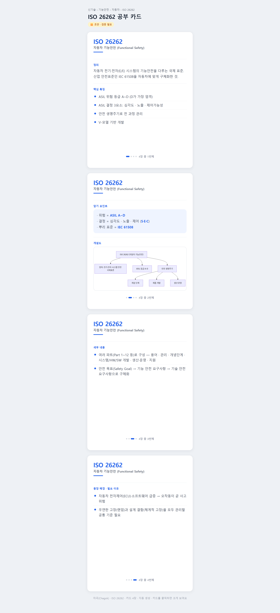
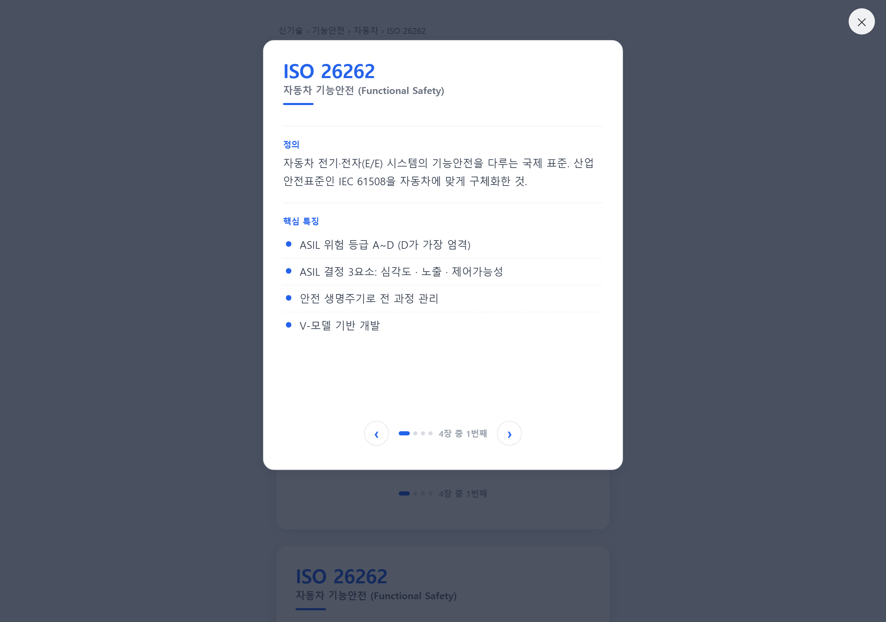
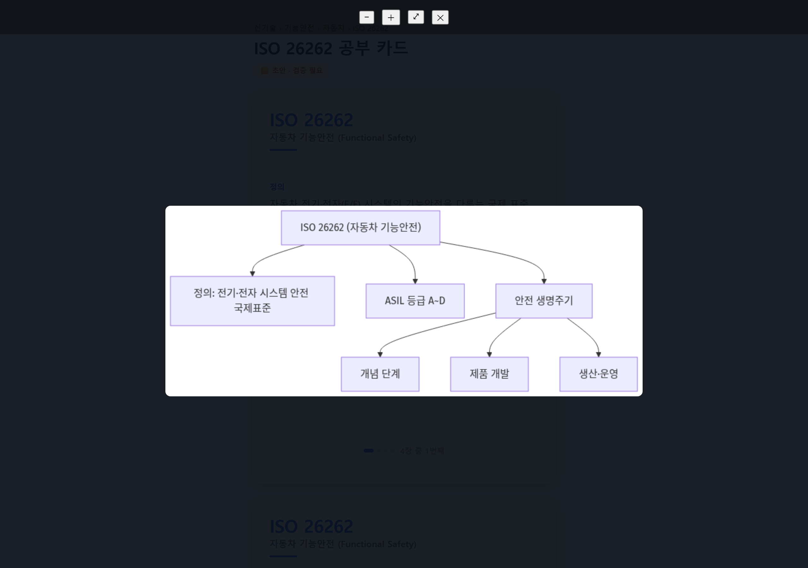

# 2주차 — 내 OS 구현하기 🚀

## 🎯 미션 1. 내 OS 만들기

**✅ 선택:** 콘텐츠 OS — **차곡(Chagok) 카드뉴스 자산화 OS**

> **한 줄 요약** — 공부한 기술사 주제를 넣으면 → **시험용 카드뉴스 한 세트**로 만들어 → 도메인별로 **차곡차곡 쌓아** 언제든 꺼내보는 나만의 카드 도서관. (공부한 게 흩어지지 않고 자산으로 남는다.)

---

### 📐 기획

**1주차와는 방향을 완전히 새로 잡았다.** 1주차가 "무엇을 만들지" 설계·준비였다면, 2주차는 **실제로 돌아가는 카드 시스템 자체**를 만드는 데 집중했다.

- **OS 유형:** 기록 자산화형 — 흘러가는 공부를 카드로 남겨 자산으로 쌓는다.
- **무엇을:** 정보관리기술사 공부 정보를 **카드뉴스로 자산화**해, 어려운 개념을 쉽게 이해하도록 돕는 개인 OS. (이후 **다른 시험 영역 → 일반인용**으로 확장 예정.)
- **왜:** 기술사 공부는 양이 방대하고, 매번 자료를 새로 찾아 정리하다 **1회성으로 흩어진다.** 한 번 정리한 걸 **일관된 카드 틀**로 남겨두면, 반복 학습이 쉬워지고 공부가 그대로 자산이 된다.
- **어떻게:** `주제 입력 → 정보수집 → 기획 → 문구 → 이미지 카드 → 도메인별 저장` 파이프라인. 정적 HTML(서버 없이 브라우저에서 바로 열리는 방식)로 가볍게.
- **중요한 선:** 시험 공부용이므로 정확성이 생명. 각 항목에 **출처·검증 자리**를 두고, 문구엔 "시험용" 성격을 명시한다. (자동 검증 기능은 2차 과제로.)

**주차별 로드맵 (5주):**

| 주차 | 기간 | 할 것 |
|---|---|---|
| ✅ 1주 | 7/9~7/12 | 설계 · 스킬 설치·테스트 · **카드 뷰어**(자동 생성·클릭 팝업·이미지 확대) · 문서 자동생성 |
| 🔄 2주 | 7/13~7/19 | **도서관 목록** (여러 주제 카드 관리) |
| 3주 | 7/20~7/26 | 자료 수집(자동/수동) · 정리 · 카드 자동 생성 |
| 4주 | 7/27~8/2 | PDF/PNG 카드 배포 · 관리자 기능 |
| 5주 | 8/3~8/9 | 1차(차곡) → 2차(타 시험·과목 확장) → 3차(일반 영역·공유) |

---

### ⚙️ 구현

> 실제로 만든 것 (링크·스크린샷 — 이미지는 `이미지첨부/` 폴더에)

**접근 — 남의 도구를 고치다 → 전용으로 직접 만들기.** 처음엔 기존 카드 이미지 생성기(threads-carousel, 이하 **"기성 생성기"**)를 써보려 했다. 그런데 한계가 명확했다: **주제를 하나만** 보여주고(새 주제를 만들면 이전 걸 덮어씀), 정렬이 가운데로 코드에 박혀 있고, **카드 클릭 확대가 없었다.** 내가 원한 건 "카드 한 세트 공장"이 아니라 **"주제를 쌓고 골라보는 도서관"**이라, **차곡 전용 카드 뷰어(이하 "차곡 뷰어")를 직접 만드는 쪽**으로 전환했다. (기성 생성기를 만지며 얻은 요구사항이 그대로 전용 뷰어의 설계도가 됐다.)

| 부품 | 역할 |
|---|---|
| 🧩 카드 자동생성 엔진 | 주제 **데이터만 채우면** 카드가 자동으로 생성됨. 내용이 많으면 규칙에 따라 **다음 장으로 자동 분할**. (내용 ↔ 디자인 분리) |
| 🖼️ 카드 뷰어 | 흰 바탕 + 파란 강조, 좌상단 정렬, **우리만의 5장 카드 틀**(표지·정의·특징 / 암기·개념도 / 세부 / 배경) |
| 🔍 클릭 확대 팝업 | 카드를 누르면 크게 뜨고 **좌우로 넘김** (✕/Esc/배경 클릭으로 닫기) |
| 📐 카드 크기 통일 | 가장 큰 카드 기준으로 **모든 카드 높이를 동일**하게 (도서관에 쌓았을 때 깔끔) |
| 🗺️ 개념도 확대 뷰어 | 개념도를 누르면 그림만 크게 + **원본 3배까지 확대 + 드래그 이동** |
| 🗂️ 보관함 구조 | 10개 도메인 폴더(소프트웨어공학·DB·네트워크·보안·PM·IT경영·신기술 …) — 도메인 → 대·중·소 주제로 정리 |
| 📄 문서 자동생성 | 설계도 · 로드맵 · 논의이력 · 체크리스트/백로그 · 설치로그를 MD 파일로 남겨 이력 관리 |

- **쓴 스킬 9종 설치·테스트 완료**(증빙 저장): 자료수집(deep-research·extracting-pdfs) / 정리(lecture-to-summary·llmapper·content-research-writer) / 문구(revision-notes·copywriting) / **개념도 자동생성(mermaid — 한글 완벽)** 등. → 3주차부터 카드 내용 자동생성에 연결 예정.

---

### 🧗 과정에서의 삽질

| 막힌 벽 | 어떻게 풀었나 |
|---|---|
| **기성 생성기는 주제 하나만 표시** — 새 주제가 이전 걸 덮어씀, 도서관 개념 없음 | 깊게 고칠수록 위험·비용↑ → **차곡 전용 뷰어를 직접 제작**으로 전환 |
| **정적 HTML이 폴더를 직접 못 읽음** + 한글 파일명 깨짐 | 개념도를 **영문 파일명 + base64로 HTML에 내장** (미리보기에서도 바로 보임) |
| **카드 크기가 들쭉날쭉** — 도서관에 쌓으면 지저분 | 가장 큰 카드 높이를 측정해 **전부 같은 높이로 고정**(목록·팝업 카드 모두 동일 확인) |
| **미리보기 패널이 캐시·타이머로 부정확** | **로컬 서버 + 실제 브라우저에서 직접 측정·스크린샷**으로 검증 (감이 아니라 수치로) |
| 카드 헤더·소제목이 카드마다 제각각 | 헤더/소제목을 **전부 통일**(번호 대신 "N장 중 M번째"로 표시해 여러 주제로 착각하는 것 방지) |

---

### ✅ 결과물

> 완성한 것 / 작동 화면

**실제로 한 바퀴 돌렸다** — 첫 주제 **ISO 26262(자동차 기능안전)**를 데이터로 넣어 **카드 4장 세트**를 자동 생성. 클릭 확대 팝업·좌우 넘김·개념도 3배 확대까지 **실제 브라우저에서 작동 확인.**

- 파일: `카드보관소/07_신기술(AI-클라우드-빅데이터)/기능안전/자동차/ISO26262/카드.html`
- 카드 틀(5장 구성) + 자동 분할 엔진 + 확대 팝업 + 개념도 확대 뷰어 = **모두 동작**
- 문서 5종 자동 저장(설계도·로드맵·논의이력·백로그·설치로그)로 **이력이 그대로 남음**

**📸 작동 화면**

_① 카드 목록 (크기 통일)_

_② 카드 클릭 → 확대 팝업_

_③ 개념도 확대 뷰어 (3배 줌)_

**아직 안 끝난 것 (정직하게):**
- **도서관 목록 화면**(도메인 → 주제 목록 → 카드, 새 주제 자동 반영)은 **이번 주(2주차) 착수 예정.** 지금은 주제 1개(ISO 26262)만 있는 상태.
- 카드 **내용 자동생성**(스킬 연결)은 3주차, PDF/PNG 배포는 4주차.

---

### 💡 알게 된 인사이트 & 공유하고 싶은 내용

- **남의 도구를 억지로 고치는 것보다, 요구가 명확해지면 전용으로 만드는 게 빠르다.** 기성 생성기를 만진 시간이 헛일이 아니라, 그게 곧 내 전용 뷰어의 설계도가 됐다.
- **"검증"은 눈이 아니라 수치로.** 미리보기 화면만 믿었다가 어긋난 적이 많아, 실제 브라우저에서 크기를 측정해 확인하는 습관을 들이니 반복 실수가 줄었다.
- **사소한 통일(카드 크기·헤더·소제목)이 "쌓이는 자산"의 신뢰를 만든다.** 자산화가 목적이라면 낱개 완성도보다 **일관성**이 먼저다.
- **기록은 "자동 생성 + 일관된 틀"을 만났을 때 자산이 된다.** 손으로 매번 정리하면 흩어지지만, 틀에 맞춰 자동으로 쌓이면 그때부터 공부가 자산으로 남는다.

---

## 📣 미션 2. 유닛 활동 참여 & SNS 공유

> 유닛 활동에 적극 참여(유닛원으로서 or 참가자로서)한 뒤, 그 경험을 SNS에 올리기

- **참여한 유닛 / 활동:** 나만의 OS 유닛
- **무엇을 했나 (경험):** '나만의 OS 유닛'에 참여해 **차곡 OS(기록 자산화형)**를 소개하고, 등록 답변(①OS 유형 ②한마디 정의 ③주차별 5주 계획 ④함께 하고 싶은 것)을 정리했다. 특히 유닛에서 하고 싶은 것으로 **"협업 테스트 검증 시스템"**을 제안했다 — 개발에서 제일 중요한 테스트 단계를, 유닛 구성원들의 **다양한 경험 기반 테스트**를 특정 시스템에 모아 관리함으로써, 한 시스템을 여러 각도에서 검증하는 구조를 함께 만들어보고 싶다.
- **SNS 인증 링크:** __
