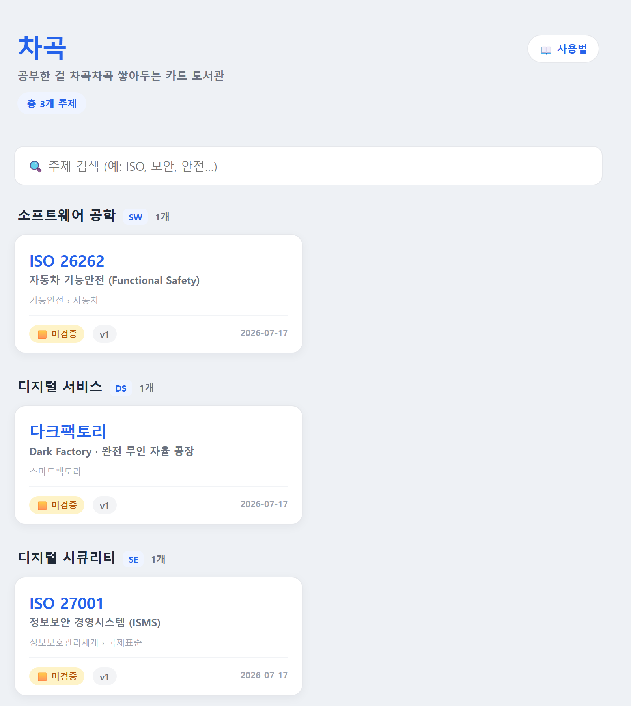
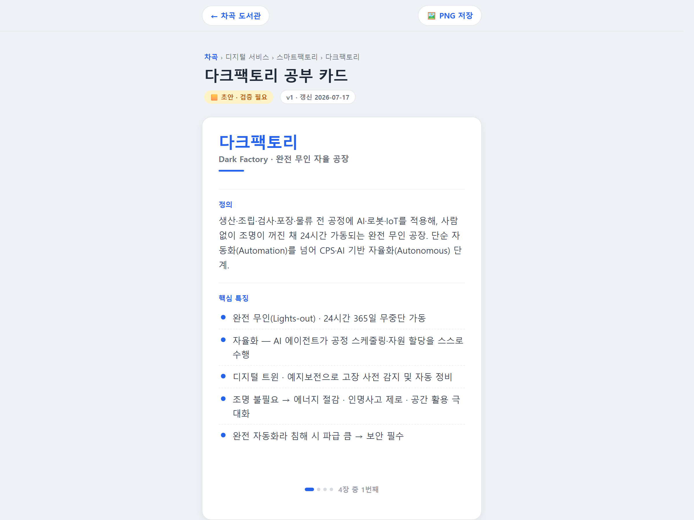
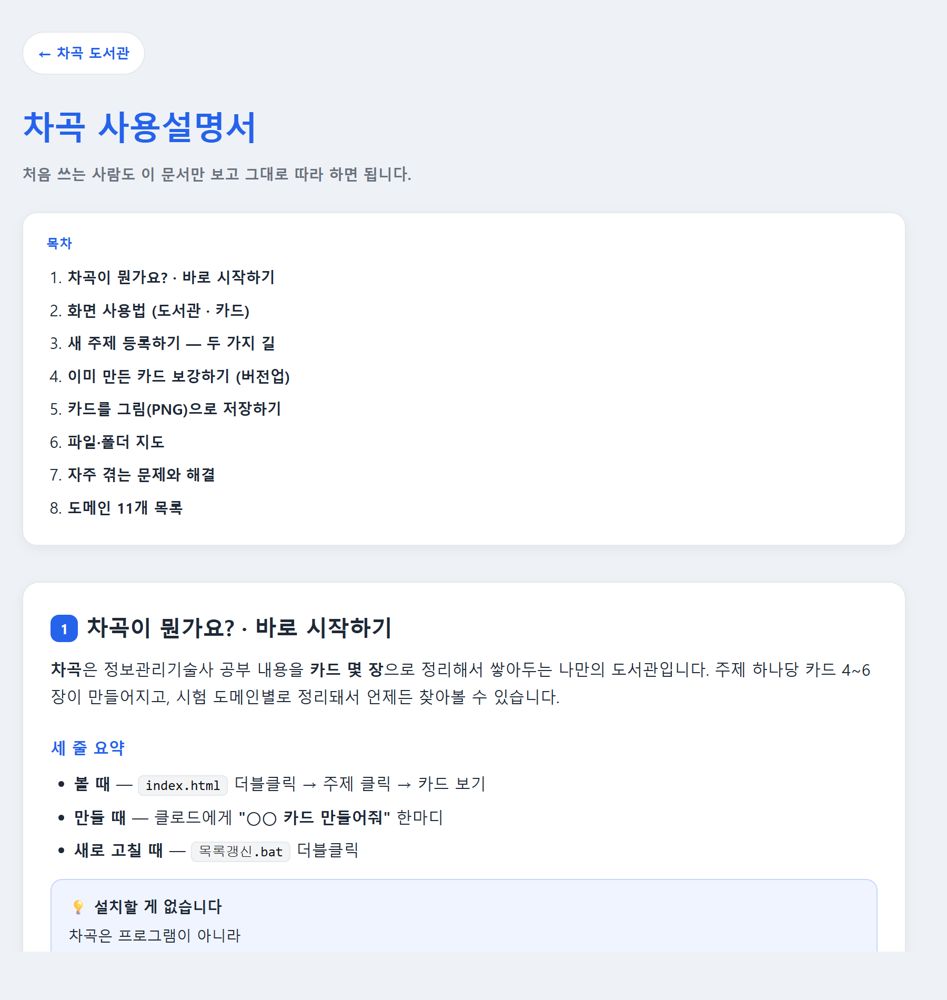

# 3주차 — 내 OS 최종 완성 🏁

> 미션을 진행하며 과정과 결과를 기록해주세요. (다 못 채워도 OK, 한 것 위주로!)

## 🎯 미션 1. 내 삶을 돕는 OS 최종 완성
> 지금까지 공유하며 받은 **피드백을 반영해 최종 완성**!

**✅ 대상:** 콘텐츠 OS — **차곡(Chagok) 카드뉴스 자산화 OS**

> **한 줄 요약** — 공부한 기술사 주제를 넣으면 → **시험용 카드뉴스 한 세트**로 만들어 → 도메인별로 **차곡차곡 쌓아** 언제든 꺼내보는 나만의 카드 도서관.

---

### ✅ 완성한 것 (무엇을)

**한 바퀴가 돌았다.** 2주차엔 주제 하나(ISO 26262)를 카드로 만드는 것까지였다. 3주차엔 **만들기 → 보기 → 저장/내보내기 → 설명서**가 전부 이어져서, 이제 "주제 하나 만들어줘" 한마디로 시작해 도서관에 꽂히는 것까지 끊기지 않는다.

| 완성한 것 | 내용 |
|---|---|
| 🏛️ **도서관 첫 화면** | `index.html` — 도메인별 주제 목록 + **검색**. 주제 클릭 → 그 주제 카드로 |
| 🔄 **새 주제 자동 반영** | `목록갱신.bat` **더블클릭 한 번**이면 카드·목록 자동 생성 (서버 필요 없음) |
| 🧾 **반자동 주제 레시피** | 자료수집 → 정리 → 문구 → 개념도까지 **클로드가 실행 + 나는 ✋확인만**. 절차를 문서로 고정 |
| 🗂️ **도메인 11개 재편** | 임의 분류 → **실제 시험 도메인 11개**로 재편. 폴더는 영문 코드, 화면엔 한글 이름표 |
| 🖼️ **카드 PNG 내보내기** | 전체 저장 / 한 장만 저장. 968×1406px 2배 고화질, 한 장 ≈2초 |
| 🌱 **출처·검증 씨앗** | `주제데이터.json`에 출처·검증상태·버전·갱신일 저장 → 카드 배지·도서관에 표시 |
| 📖 **사용설명서** | `사용설명서.html` 8장 — 처음 쓰는 사람이 이 문서만 보고 따라 할 수 있게 |

**쌓인 주제 3개** — ISO 26262(소프트웨어 공학) · **다크팩토리**(디지털 서비스) · ISO 27001(디지털 시큐리티)

---

### 🔁 피드백 반영한 점

외부에서 받은 지적보다, **2주차 제출물에 내가 직접 "아직 안 끝났다"고 적어둔 것**이 이번 주의 숙제였다. 그때 정직하게 남겨둔 게 그대로 할 일 목록이 됐다.

| 2주차에 스스로 적어둔 것 | 3주차 결과 |
|---|---|
| "**도서관 목록 화면**은 이번 주 착수 예정. 지금은 주제 1개(ISO 26262)만 있는 상태" | ✅ **완성** — 도메인별 목록 + 검색 + 새 주제 자동 반영. 주제도 1개 → 3개 |
| "카드 **내용 자동생성**(스킬 연결)은 3주차" | ✅ **완성** — 반자동 레시피 확립 + **다크팩토리로 첫 완주**(PDF 4건 + 웹 3건 → 카드 4장, 출처 7건 기록) |
| "PDF/PNG 배포는 **4주차**" | ✅ **한 주 앞당겨 완료** — html2canvas로 카드 PNG 저장 |

**그리고 하나 더 — 내가 쓰다가 찾은 버그.** 만드는 사람이 아니라 **쓰는 사람** 입장이 되니 비로소 보였다. PNG로 뽑은 개념도가 **가로로 2.72배 늘어나 있었다.** 화면에선 멀쩡한데 PNG에서만 퍼졌다. 원인은 `object-fit`을 html2canvas가 무시하는 것이었고, 상자 방식으로 바꿔 고쳤다. (원본 0.783 / 화면 0.785 / PNG 0.785 → 늘어남 **1.00배**)

---

### 📦 결과물 (링크·스크린샷)

**① 도서관 첫 화면** — 도메인별로 주제가 쌓이고, 검색으로 바로 찾는다. 각 주제엔 검증상태·버전·갱신일 배지.

**② 카드 화면 (다크팩토리)** — 레시피로 처음부터 끝까지 만든 새 주제. 오른쪽 위 **🖼️ PNG 저장** 버튼, 왼쪽 위 도서관으로 돌아가기, 하단에 "4장 중 1번째".

**③ 사용설명서** — 8장 구성. 도서관 머리말의 **📖 사용법** 버튼에서 열린다.

**주요 파일**

| 파일 | 역할 |
|---|---|
| `index.html` | 도서관 첫 화면 (더블클릭으로 시작) |
| `목록갱신.bat` | 더블클릭 → 카드 + 목록 자동 생성 |
| `사용설명서.html` | 쓰는 법 8장 |
| `_scripts\주제만들기.js` · `_scripts\목록만들기.js` | 주제데이터.json → 카드.html / 폴더 훑어 목록 생성 |
| `_engine\카드템플릿.html` | 카드 자동생성 엔진 원본 |
| `_docs\주제만들기_레시피.md` | 새 주제 만드는 절차 + 버전업 절차 |
| `카드보관소\04_DS\스마트팩토리\다크팩토리\` | 이번 주 첫 완주 주제 (카드·개념도·주제데이터·`_원본\`) |

---

### 🧗 과정에서의 삽질

| 막힌 벽 | 어떻게 풀었나 |
|---|---|
| **`html-to-image`의 `toPng()`가 에러도 없이 영원히 안 끝남** — 76초를 기다려도 무응답 | 라이브러리를 **html2canvas 1.4.1로 교체**. "에러가 안 나는 것"과 "되는 것"은 다르다는 걸 배움 |
| **PNG에서만 개념도가 가로 2.72배로 퍼짐** (화면은 멀쩡) | html2canvas가 **`object-fit`을 무시**하는 게 원인 → 상자(`.concept-box`) + `max-width/height` 방식으로 변경 |
| **카드 안 개념도는 원본의 29%(157×200)** — PNG로 뽑으면 글씨가 안 읽힘. 화면은 클릭 확대가 되지만 **PNG는 클릭이 안 됨** | 개념도를 다시 그리지 않고 **원본 base64를 그대로 5번째 장으로 내보냄** → 손실 0 · 처리 0초 |
| **설명서를 `.md`로 만들었더니 도서관에서 클릭하면 다운로드돼버림** | 브라우저에서 바로 봐야 하므로 **HTML로 제작** |
| **"빈 공간만큼 개념도를 키우면 1.7배"라고 추정**했는데 틀림 | 실제로 재보니 **남는 공간이 0**이었다. 추정이 실측에 뒤집힘 |

---

### 💡 알게 된 인사이트

- **"추정하지 말고 측정할 것."** 2주차 인사이트가 "검증은 눈이 아니라 수치로"였는데, 이번 주에 더 세게 겪었다. 개념도를 1.7배 키울 수 있다고 계산해놓고 실제로 재보니 남는 공간이 0이었다. 머릿속 계산은 실측 앞에서 자주 진다.

- **에러가 안 난다고 되는 게 아니다.** `html-to-image`는 아무 에러도 뱉지 않고 그냥 영원히 안 끝났다. 실패가 시끄럽게 오면 오히려 쉽다. 조용히 멈추는 게 제일 어렵다.

- **만든 사람에서 쓰는 사람으로 넘어가야 보이는 게 있다.** 개념도가 2.72배 퍼진 버그는 기능을 다 만든 뒤 **내가 실제로 카드를 뽑아보다가** 찾았다. 만들 땐 안 보이던 게 쓰자마자 보였다.

- **정직하게 남긴 "아직 안 끝난 것"이 다음 주 설계도가 됐다.** 2주차에 못 한 걸 굳이 적어둔 게 이번 주 할 일 목록 그대로였다. 안 되는 걸 숨기지 않는 게 결국 나한테 이득이었다.

- **차곡을 만든 진짜 소득은 카드가 아니라 "만드는 방식"이었다.** 조별 세션에서 다른 분들의 마이 OS를 듣다가, 차곡에서 세운 틀(폴더 규칙 → 데이터 → 자동생성 → 일관된 결과물)이 **전혀 다른 주제에도 그대로 얹힌다**는 걸 알았다. 로드맵에 "2차 = 다른 영역으로 확장"이라고 적어두긴 했지만 먼 얘기라고 생각했는데, 생각보다 훨씬 가까이 있었다. _(따로 구상 중인 프로젝트와 연결해볼 실마리를 얻었고, 조별 세션에서 공유회 제안까지 받았다. 아직 초기 단계라 내용은 다듬어지면 공유할 예정.)_

- **이제 부족한 건 기능이 아니라 내용이다.** 1차 개발이 끝나고 로드맵의 다음 0순위를 **"기능 추가 없음 — 그냥 주제 5~10개 쌓아보기"**로 잡았다. 도서관은 주제가 쌓여야 값어치가 나온다. 만드는 재미에서 쓰는 단계로 넘어가는 게 이번 주의 마지막 결론이었다.

---

## 📣 미션 2. 스폰지 토크데이 SNS 후기
> 오늘 토크데이 후기를 SNS에 올리기 (**#스폰지클럽 필수 · 셀 3개 지급!**)

- **후기 내용:**

> 오늘 스폰지클럽 토크데이.
>
> 조별 세션에서 다른 분들의 '마이 OS'를 들었다. 솔직히 가장 먼저 든 생각은 **"다들 진짜 만들어 오셨네"** 였다. 기획서가 아니라 돌아가는 물건들이었다.
>
> 두 가지가 남았다.
>
> 하나. **나도 할 수 있겠다는 자신감.** 남의 결과물을 보면 보통 작아지는데, 오늘은 반대였다. 다들 대단한 걸 만들었는데 이상하게 "나도 저기 낄 수 있겠는데"라는 마음이 들었다. 아마 나도 지난 3주간 손으로 뭔가를 완성해봤기 때문일 것이다.
>
> 둘. **예상 못 한 연결.** 다른 분들 OS를 듣다가, 지금 만들고 있는 차곡(공부한 걸 카드뉴스로 쌓는 OS) 말고 **따로 품고만 있던 아이디어**가 갑자기 실마리를 찾았다. 아직 초기 구상이라 못 밝힌다고 했더니, 오히려 "좋은 아이디어인데 공유회를 해보면 어떻겠냐"는 제안까지 받았다.
>
> 혼자 생각할 땐 계속 계획이던 게, 말하는 순간 일정이 됐다.
>
> #스폰지클럽

- **SNS 인증 링크:** https://www.instagram.com/p/Da5FAXGn7PA/
