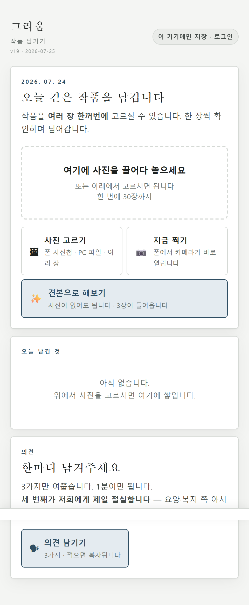
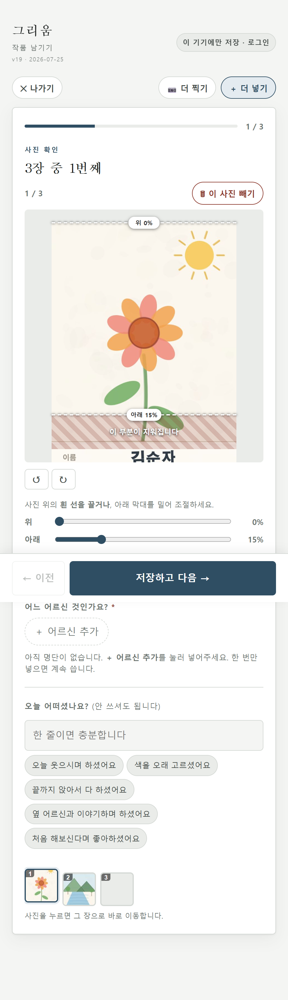

# 4주차 — 기획·구현 → 검증 → 기록 🧪

> 미션을 진행하며 과정과 결과를 기록했다. (다 못 채운 곳은 정직하게 그렇다고 적었다.)
>
> **3주차 회고에 "따로 구상 중인 프로젝트가 있다"고 적어뒀다. 그게 바로 이 그리움이다.** 차곡(콘텐츠 OS)과 나란히 품어온 것을, 이번 주에 꺼냈다.

**이번 주 프로젝트:** 그리움(Geurium) / 영문 병기 **MMM** — 주간보호센터에서 어르신이 만든 작품을 **버려지기 전에 붙잡아** 가족에게 닿게 하는 서비스.

> **한 줄 요약** — 센터에서 매일 만들어지고 매일 버려지는 어르신의 작품을, 직원이 걷으면서 한 장 찍으면 → 이름칸만 잘라내 서버에 쌓이고 → 가족은 문자에 붙은 링크 하나로 본다.

---

## 🎯 과제 1. PRD 기획 및 구현

### ✅ PRD 6칸 (→ 전체는 `docs/PRD.md`)

| 항목 | 요약 |
|---|---|
| **① 문제 정의** | 센터에서 작품은 **이미 매일 만들어지는데** 한 달 뒤 버려진다. 가족은 그런 게 있었는지도 모른다. *"어르신들 색칠한 종이, 그날 벽에 붙였다 다음 프로그램 오면 떼서 버려요. 둘 데가 없어요."* |
| **② 주요 페르소나** | **주간보호센터 요양보호사 15년차.** 작품과 사람이 한 자리에 있는 유일한 순간을 쥐고 있고, **이미 이름을 적고 있다.** |
| **③ 가치·소구** | *"매일 만들어지고 매일 버려지는 것을, 버려지기 전에 붙잡는다."* 센터에: **"버릴 때 아까웠던 그것, 걷으면서 한 장만."** 가족에: **"오늘 어머니가 뭘 만드셨는지, 문자에 붙은 주소 하나로."** |
| **④ 핵심 기능** | 5개 — 찍기 / 명단 탭 1회 / **이름칸 잘라내기** / 쌓인 것 보기 / 링크 열람. **뺀 것 5개**도 이유와 함께 명시. |
| **⑤ 성공 기준** | "좋아요"는 성공이 아니다. **행동만 센다** — 주=7일 내 2회 이상 재열람 · 보조=2개월차 지속 + 직원 소요 불증가 · 궁극=자녀가 어르신에게 작품 얘기를 꺼냈는가. |
| **⑥ 만들지 않을 것** | **9개** — DIY 앨범 · 사후 편집 · 트랙1(어르신 직접) · 트랙2(가족 등록) · 알림 · 로그인 · 얼굴사진 · 영상 · 감정분석. |

**추가로 넣은 것:** ⑦ 기관 도입 조건 8개(트랙3 전환으로 새로 생긴 관문) · ⑧ 이 PRD를 무너뜨릴 수 있는 것.

### 🔍 레퍼런스·차별화

경쟁 제품 5개를 조사했다 — 케어포 「가족돌봄」, 케어로, 케어로그 등. 이들도 활동사진·앨범을 공유한다. 그래서 **범주를 바꿨다.**

| 우리 | 경쟁(기관 공지앱) |
|---|---|
| **개인(어르신) 단위** — 우리 어머니가 무엇을 만드셨나 | 활동 단위 — "원예활동 진행, 참여 14명" |
| **작품만** — 얼굴 없이 초상권 소멸 | 활동사진 — 얼굴 노출 |
| **쌓인 시간이 해자** — 1년이면 100장 | 공지성 — 지나가면 사라짐 |

비교 대상을 케어포(기관앱)에서 **FamilyAlbum(みてね, 가족 사진앱)**으로 옮겼다. 우리가 경쟁하는 건 "기관 공지"가 아니라 "가족이 부모의 하루를 기억하는 방식"이다.

### 📦 구현물 — 스토리보드에서 **실제 앱 v19**까지

이번 주에 스토리보드에서 실제 앱까지 갔다. MVP 3기능(올리기·저장·열람)이 전부 동작한다.

| 화면 | 누가 | 실제 동작 |
|---|---|---|
| **직원 화면** (`index.html`) | 센터 직원 | 사진 올리기 → 명단 탭 1회 → **이름칸 잘라내기** → 로그인하면 **서버(Supabase 서울)에 저장** |
| **가족 화면** (`view.html`) | 자녀·가족 | 직원이 만든 **공유 링크(토큰)**를 열면 — 설치·가입 없이 쌓인 작품을 본다 |

**단순 프로토타입이 아니다:**
- **서버 저장** — 로그인하면 기기가 아니라 서버(서울 리전)로. 실계정으로 저장·권한 검증 완료
- **권한(RLS)** — 남의 기록은 못 본다. 퇴사자 계정은 `active=false` 한 번에 전체 차단(시험 통과)
- **가족 링크** — 추측 불가 토큰(48자), 폐기하면 즉시 차단. 비공개 버킷
- **보안 3겹** — 커밋마다 비밀·개인정보 자동 스캐너 + 보안 점검 + `/security-review`

> **왜 처음부터 앱을 안 만들고 스토리보드부터 갔나:** 이번 주에 만든 것 대부분이 틀릴 거라 판단했고, 실제로 검증 도중 **만드는 주체가 가족→센터로 바뀌었다.** 동작하는 앱이었다면 갈아엎었을 것을 HTML은 30분에 고쳤다. **방향이 굳은 뒤에 실제 앱으로 올렸다.**
>
> **아직 공개 배포 링크는 없다.** 공개 = 어르신 개인정보 노출 시작이라, 볼 사람(센터 시연·파일럿)이 생기는 시점에 배포하기로 했다. 그래서 여기서는 로컬 시연 스크린샷으로 제시한다.

*(서버 저장·가족 열람 화면은 실계정·실데이터가 필요해 여기서는 위 두 화면으로 갈음한다. 동작은 위 구현물 표 참조.)*

### 🧗 과정에서의 삽질

| 막힌 벽 | 어떻게 풀었나 |
|---|---|
| **"작품이 집에 온다"는 전제 위에 서비스를 세웠는데, 절반도 참이 아니었다** | 자녀 12명 중 작품이 손에 닿는 사람은 2명뿐. 집에 도착해도 어르신 6명 전원 "며칠 안에 사라진다". → **올리는 주체를 가족에서 센터로 옮겼다.** 작품·어르신·올릴 사람이 한 자리에 모이는 순간은 집이 아니라 센터였다 |
| **문제를 푼 방법이 그대로 사고 경로였다** — 이름을 못 쓰는 어르신은 직원이 대신 써주기로 풀었는데 | *"실명 유출 경로가 그림 그 자체입니다."* → 이름은 **정해진 칸에만** 쓰게 하고 확인 뒤 **그 칸을 잘라낸다.** OCR도 필요 없다 |
| **(개발) 공개 저장소 커밋 이력에 내 실이메일이 남아 있었다** | 현재 파일만 더미로 바꿨을 뿐 과거 이력엔 그대로였다. 브랜치를 깨끗한 커밋 하나로 재작성 + 백업 후 force-push해 이력에서 제거. **"현재를 고친다 ≠ 이력을 고친다"**를 배웠다 |

---

## 🗣 과제 2. 유저 피드백

### ⚠️ 먼저 정직하게 — 「외부 실제 유저 2명」은 아직 1명이다

과제는 **「기본: 실제 사람 2명 이상」 + 「플러스알파: 가상 페르소나」** 구조다. 화면을 보고 응답한 사람은 2명인데, **그중 순수 외부인은 1명(양세)이고 나머지 1명은 제작자 본인 테스트다.** 숨기지 않고 그대로 적는다. 그리고 **이 미충족 자체가 이번 주 가장 큰 배움이었다.**

| 층 | 누구 | 무엇을 줬나 |
|---|---|---|
| **실제·외부** | **양세** (스폰지클럽 유닛) | 첫 외부 응답. 세대 미스매치 발견 |
| **실제·자체** | 제작자 본인 테스트(PC·모바일) ※본인 | 화면 문제(모바일 이해도 급락) 발견 |
| **가상·플러스알파** | 페르소나 41명·2라운드 | 깨진 가정 12건 |

### 외부 실제 응답 — 양세

수정한 화면(6장면·조작 0)을 처음 보는 외부인에게 보여줬다.

| | 답 | 의미 |
|---|---|---|
| 이해했나 | ✅ **"바로 이해했습니다"** | 6장면·조작0으로 바꾼 판단이 외부에서 검증됨 |
| 내가 쓸까(S3) | 🔴 안 쓸 것 같다 | ← 표면만 보면 거부 |
| 왜(S4) | *"어머니는 조금 더 **활동적인** 걸 좋아하셔서요"* | **거부가 아니라 "본인이 아직 대상이 아님"** |
| 어르신은(S5) | ✅ **좋아하실 것 같다** | S3↔S5가 갈렸다 |

**S3만 보면 "부정 피드백"이지만, S5까지 보면 "제품 문제가 아니라 세대 문제"다.** 그리고 이 한 문장:

> **"할머니가 살아계셨다면 그림 그리는 걸 좋아하셨을 것 같아요."**

외부인이 **프로젝트 이름('그리움')의 정서를 그대로** 말했다. → 새 리스크(배포 대상 세대 미스매치: 30~40대에겐 정작 필요한 응답층이 안 나온다)를 발견해, 다음엔 50~60대에게 뿌리기로 했다.

### 가상 페르소나 41명 — 깨진 가정 12건

NVIDIA `Nemotron-Personas-Korea`(CC BY 4.0, KOSIS 통계청 인구분포 기반)에서 조건별 추출.

> ⚠️ 인구통계는 통계 기반이나, **인터뷰 답변은 언어모델이 생성한 가설**이며 실제 조사 데이터가 아니다. 본문의 센터 종사자 인용은 전부 **시뮬레이션**이며 실제 인터뷰가 아니다.

| # | 세웠던 가정 | 결과 |
|---|---|---|
| 1 | 어르신 본인이 중심 사용자다 | ❌ 직접 등록 가능 1/15 |
| 2 | 누가 대신 올려주면 된다 | ❌ 자녀 0/5 · 센터 0/5 지속 |
| 9 | 작품이 집에 온다 | ❌ 자녀 12명 중 2명만 |
| 10 | 기관이 개인별 매칭을 기록한다 | ❌ 센터 8명 중 0명 |
| 11 | 제3자 초상권이 최대 장벽 | ✅ 작품 사진엔 얼굴이 없다 |

(전체 12건 + 리스크 31건은 프로젝트 리스크 등록부에)

### 💡 알게 된 인사이트

- **가장 큰 오류는 AI 41명이 아무도 못 짚었다.** 1라운드 15명을 다 돌린 뒤 사람이 한마디로 짚었다 — *"메인 타겟은 요양원이 아니라 주간보호센터인데요."* 이 한마디로 리스크 여러 개가 정리됐다. 15명 중 아무도 못 짚은 건 당연하다. **요양원 종사자를 골라 넣은 게 나였으니까.**

- **AI 검증은 내가 던진 질문의 범위를 벗어나지 못한다.** 41명을 400명으로 늘려도 같다. 프레임이 틀렸으면 400명이 다 같이 틀린다. **이것이 「실제 사람 2명」이 왜 기본 요건인지에 대한 실증이다.** 요건을 다 못 채운 채로, 그 요건이 옳았다는 것을 증명한 셈이다.

- **3주차 인사이트가 4주차에 그대로 이어졌다.** "추정하지 말고 측정"이 이번엔 "머릿속 페르소나 41명 말고 실제 사람 1명"으로, "만든 사람에서 쓰는 사람으로"가 "내가 요양원이라 생각한 걸 남이 주간보호센터라 바로잡음"으로 왔다. **혼자 정교하게 틀리는 것보다, 남에게 일찍 보여주고 거칠게 맞는 게 싸다.**

---

## 📣 과제 3. SNS 기록

> 기획·구현·피드백 전 과정의 소회를 SNS에 남기는 미션. (#스폰지클럽)

**제목:** *"어머니가 그리워서 만들기 시작했는데, 어머니는 사용자가 아니었습니다"*

**중심 메시지:** *아끼다 똥 된다.* 4일 동안 코드보다 **깨진 가정 12개**를 먼저 만들었고, AI로 얻은 건 답이 아니라 **날카로워진 질문**이었다. 그 위에 실제 돌아가는 앱을 세웠다.

<!-- 발행 후 링크 삽입 -->
- **SNS 인증 링크:** (발행 예정 — 게시 후 URL 삽입)

---

## 이번 주 한눈에

| | |
|---|---|
| 기간 | 2026-07-21 ~ 07-24 |
| 별개 프로젝트 | 차곡(3주차까지)과 나란히, **따로 품어온 그리움을 본격 착수** |
| 코드 | 스토리보드 HTML → **실제 앱 v19** (서버 저장·가족 열람·보안 3겹) |
| 검증 루프 | 가정 → 스토리보드 → 실사용자 테스트 → 수정 → **양세 재검증** → 실제 앱 |
| 정직하게 남긴 것 | 외부 실제 유저 2명 미충족(현재 1명) → 다음 주 50~60대에게 발송 |

> 출처: NVIDIA `Nemotron-Personas-Korea` (CC BY 4.0). 인구통계는 통계 기반이나 인터뷰 답변은 언어모델이 생성한 가설이며 실제 조사 데이터가 아님.
