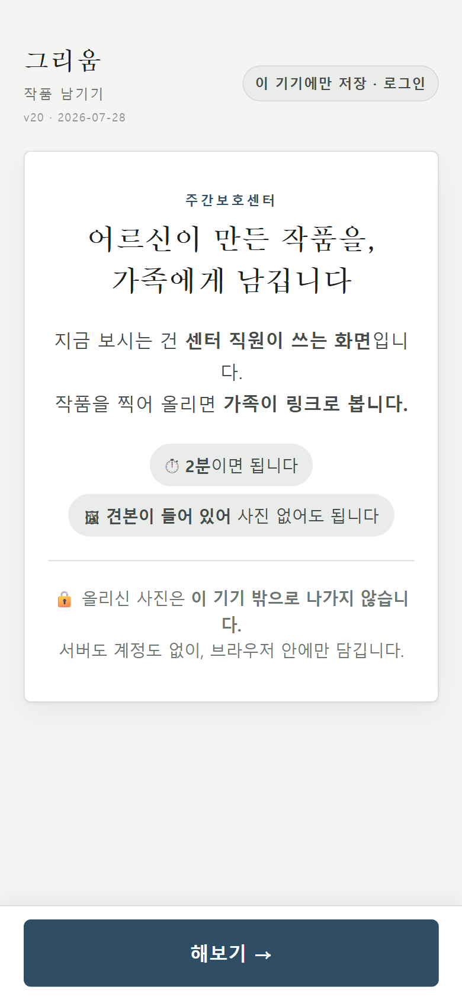
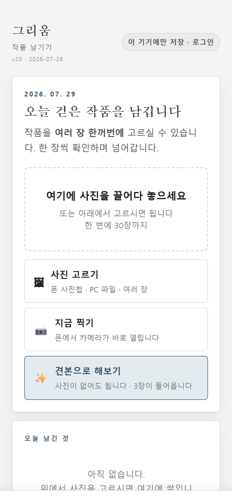
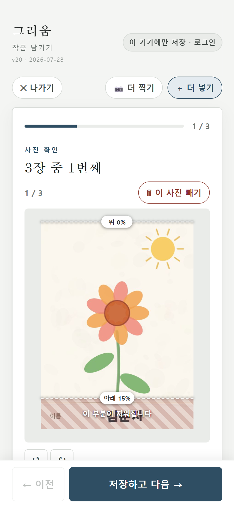

# 5주차 — 마지막 과제 🏁

> 이번 기수의 마지막 과제예요. 과정과 소회를 기록해주세요. (다 못 채워도 OK!)

이번 기수에 만든 건 **그리움(Geurium)**, 영문으로는 MMM(Miss My Mother)입니다.
주간보호센터에서 어르신들이 매주 그림을 그리고 뭔가를 만드시는데, 벽에 한 달쯤 붙어 있다가 버려집니다. 가족은 그런 게 있었는지도 모릅니다. 그걸 남겨서 가족에게 보내주는 서비스입니다.

🌐 https://geurium.vercel.app

---

## 🎯 과제 1. 구현, 그 다음의 것


> 만드는 건 끝났는데 — 그 다음이 진짜 시작이에요 (답이 안 나와 있어도 OK, 고민을 꺼내놓는 것 자체가 과제)

- **지금 걸려 있는 고민 하나:**

  만들긴 다 만들었는데, 정작 쓸 사람한테 아직 한 번도 못 보여줬습니다. 센터 시연 약속이 아직 하나도 안 잡혔어요.

- **그게 왜 고민인지 (무엇이 걸리는지):**

  처음엔 그냥 시간 문제라고 생각했습니다. 아는 사람 통해서 센터 한 곳만 연결되면 될 줄 알았거든요. 그런데 일곱 명한테 물어봤고 전부 안 됐습니다. 다들 "알아볼게요" 하고는 소식이 없었습니다. 그제야 이게 운이 나쁜 게 아니라 제 접근이 틀렸구나 싶었습니다.

  설문도 마찬가지였습니다. 다섯 분이 답을 주셨는데, 나중에 보니 다섯 분 전부 부모님이 시설에 안 다니시는 분들이었어요.

  | | |
  |---|---|
  | 바로 이해했나 | 4 / 5 |
  | 지금 쓰고 싶나 | 3 / 5 |
  | 어르신이 좋아하실까 | **5 / 5 만장일치** |

  마지막 줄 보고 좀 좋았는데, 생각해보니 이건 어르신이 하신 말씀이 아닙니다. 가족분들이 "우리 부모님이라면 좋아하실 것 같다"고 짐작하신 겁니다. 어르신 본인한테는 아직 한 번도 못 물어봤습니다. 표본 0명이에요.

  더 걸리는 건 따로 있습니다. 이 상태로 기능을 계속 붙이면 어떻게 될까 싶은 거예요. 지난 4주 동안 제일 많이 한 일이 사실 코드 짜는 게 아니라 제가 세운 가정이 깨지는 걸 확인하는 거였습니다. 열두 개쯤 깨졌는데, 전부 누군가한테 물어봐서 깨진 겁니다. 안 물어보면 안 깨지고, 그러면 저는 계속 맞는 줄 알고 갈 것 같습니다.

- **어떻게 풀어볼 생각인지:**

  지인 통하는 건 일단 접었습니다. 일곱 번이면 충분히 해본 것 같아서요. 대신 센터에 직접 전화 걸고 찾아가려고 합니다.

  그전에 들고 갈 걸 먼저 만들려고 해요. 동의서, 뭐 하는 서비스인지 설명하는 종이 한 장, 여쭤볼 질문지. 빈손으로 가면 그 자리에서 좋게 끝나도 두 번째 만남이 안 잡힐 것 같습니다.

  시연은 제가 미리 만들어둔 링크 하나로만 하려고 합니다. 센터 어르신 사진은 동의서 받기 전엔 안 씁니다. 이건 좀 세게 못박아뒀는데, 당일에 제일 일어나기 쉬운 사고가 "그럼 우리 어르신 사진으로 한번 해보시죠" 라고 봐서요. 그 자리에서 거절하기가 쉽지 않을 것 같았습니다.

  그리고 기능을 켜는 걸 세 단계로 쪼갰습니다. ①제가 만든 링크로 보여주기 ②센터에 계정 주기 ③실제 가족에게 발송하기. 지금은 ①까지만 열려 있습니다. ②③ 앞에 아직 정리 못 한 게 남아 있어서 알면서 안 열어뒀어요.

- **필요한 게 있다면 무엇인지:**

  주간보호센터에서 일하시는 분 한 분만 소개받을 수 있으면 좋겠습니다. 요양원 말고 주간보호센터입니다. (이거 헷갈려서 초반에 페르소나를 잘못 짰던 적이 있어서요.) 한 다리만 건너면 몇 주가 줄어들 것 같습니다.

  그리고 개인정보 동의서를 어떻게 만드는지 모르겠습니다. 써본 적이 없어요. 지금 0건이고 ②③으로 가려면 이게 먼저인데, 뭘 참고해야 하는지부터 막혀 있습니다.

---

## 🏁 과제 2. 구현 마무리 + 실제 유저 피드백 받기


> 시작할 때 "이번엔 이건 꼭 만들겠다" 했던 것 — 지금 어디까지 왔나요? (스폰지클럽 내 유저피드백 모집 가능)

- **최종 완성한 것 (지금 어디까지):**

  기능은 셋으로 잡았습니다. 올리기, 저장, 가족이 열람하기.

  | | |
  |---|---|
  | ① 올리기 — 찍기 → 명단에서 이름 한 번 누르기 → 이름칸 잘라내기 | ✅ 동작 |
  | ② 저장 — 체험은 기기 안에, 로그인하면 서버에 | ✅ 동작 |
  | ③ 열람 — 가족이 링크로 본다 | ⏸ 코드는 다 됐는데 꺼놨습니다 |

  세 번째를 끈 채로 내보냈습니다.

  배포 30분 전에 마지막으로 한 번 확인해보다가, 가족 공유 링크가 하나라도 살아 있으면 로그인 없이 그 센터 사진 전체를 목록으로 훑어서 내려받을 수 있다는 걸 발견했습니다. 제 서비스인데 제가 뚫었어요. 고칠 방법은 알았지만 4~6시간짜리였고, 그날 안에 될 것 같지 않았습니다. 그래서 껐습니다.

  이번 주에 그 구멍은 실제로 막았습니다. 사진을 4시간짜리 임시 주소로만 내보내게 바꾸고, 창고로 가는 옛 길은 철거했습니다. 밖에서 다시 찔러보고 안 열리는 것도 확인했고요.

  그런데도 ③은 아직 안 켰습니다. 구멍을 막은 거랑 기능을 켜는 건 다른 판단이라고 봤어요. 어르신 사진은 한 번 나가면 회수가 안 되니까 조금 더 조심하기로 했습니다.

  마지막 주에 하나 더 붙였는데, 사진이 시기별로 묶여서 쌓이는 화면입니다. 1970년대, 1990년대, 2026년 7월 이런 식으로요. 옛날 사진은 정확한 날짜를 모르는 경우가 대부분이라, 날짜 대신 "예전 것 → 몇 년대" 로 고를 수 있게 했습니다.

- **🚀 실제 배포 URL:** https://geurium.vercel.app

  사진이 없어도 「✨ 견본으로 해보기」를 누르면 3장이 들어옵니다. 설치도 가입도 없이 30초면 전 과정이 다 보입니다.

- **결과물 (링크·스크린샷 — 이미지는 `이미지첨부/` 폴더에):**







- **받은 유저 피드백:**

  다섯 분한테 받았습니다. 그전까지는 AI 페르소나 41명이 전부였어서, 실제 사람한테 받은 건 이번이 처음이었습니다.

  기억에 남는 두 마디가 있는데,

  > "부모님과의 대화 주제가 생길 것 같아요" — 배짱님(40대)
  >
  > "손바닥 위 모래알처럼 사라지는 게 너무 아쉬우실 것 같아요" — 쏭님(20~30대)

  앞의 말이 특히 좋았습니다. PRD에 최종 지표를 "자녀가 어르신에게 작품 이야기를 꺼냈는가" 로 적어놨었는데, 제가 물어보지도 않았는데 같은 말이 나와서요. 이게 맞는 방향이구나 싶었습니다.

  다만 위에도 적었듯이 다섯 분 다 부모님이 시설에 안 다니시는 분들이었습니다. "이런 게 있으면 좋겠다"는 확인이 됐고, "지금 쓸 수 있다"는 아직 아무한테도 확인 못 했습니다.

---

## 📣 과제 3. SNS에 남기기


> 구현했던 것들 + 그 다음 단계에 대한 생각 (아끼면 아무 일도 안 일어나요 — 꺼내놓는 순간 가장 많이 남아요)

- **구현했던 것들 (무엇을 / 어떻게 굴러가는지 / 뭐가 달라졌는지):**

  직원이 작품을 찍어 올리면 이름칸이 잘려서 서버에 쌓이고, 가족은 링크 하나로 시기별로 묶인 걸 봅니다.

  프레임워크 없이 그냥 정적 파일로 만들었습니다. 빌드 도구가 하나도 없어요. 처음엔 임시로 그랬는데 하다 보니 이게 더 편해서 끝까지 그렇게 갔습니다. 사진은 4시간짜리 임시 주소로만 나가고, 가족 화면이 사진 창고를 직접 부르는 건 커밋할 때 자동으로 막히게 해뒀습니다. 한 번 뚫린 자리라 또 그럴까 봐요.

  3주차까지는 "코드를 거의 안 짰다"고 적었었는데, 지금은 주소를 누르면 열리는 게 생겼습니다. 근데 돌아보면 달라진 건 코드 양이 아니라 순서였던 것 같습니다. 먼저 물어보고 그다음에 만들었어요. 반대로 했으면 지금쯤 다 갈아엎고 있었을 것 같습니다.

- **다음 단계 생각 (뭘 더 하고 싶은지 / 남은 것 / 어디로):**

  지금은 작품 보관함인데, 옛날 사진이 들어오기 시작하면 한 사람의 시간표가 될 것 같습니다. 거기까지 가면 포토북으로 뽑아서 드리고 싶어요. 이건 좀 나중 얘기고요.

  당장 남은 건 ③열람을 켜기 전에 정리해야 할 보안 항목들, 그리고 동의서입니다. 솔직히 기술보다 동의서 쪽이 더 오래 걸릴 것 같습니다.

  그다음은 센터 한 곳에서 8주쯤 써보는 겁니다. 볼 지표는 다운로드 수가 아니라 "자녀가 어르신에게 작품 얘기를 꺼냈는가" 하나입니다. 그게 안 움직이면 나머지는 봐도 의미가 없다고 생각합니다.

- **SNS 인증 링크:**
  <!-- 발행 후 여기에 URL -->

---

## 🪞 소회

마지막 주니까 하나만 적겠습니다.

이번 기수에 저를 헷갈리게 한 게 몇 번 있었는데, 나중에 몰아서 보니까 다 같은 모양이었습니다.

권한 시험 7개가 전부 통과라고 떠서 안심했는데, 알고 보니 시험할 계정이 0개였습니다. 아무것도 없으니 아무것도 안 나온 거였어요. 권한 빼는 명령을 실행했는데 에러가 안 나서 됐구나 했더니, 그건 그냥 조용히 무시된 거였습니다. `git log`가 깨끗해서 이력이 지워진 줄 알았는데, 브라우저로 직접 열어보니 다 남아 있었습니다.

세 번 다 "나쁜 게 안 보인다"를 "나쁜 게 없다"로 읽었습니다. 도구가 거짓말을 한 게 아니라 제가 도구 밖을 안 본 거였어요.

그래서 규칙을 하나 만들었습니다. 막았다고 말하기 전에, 막기 전엔 나왔다는 걸 먼저 재둔다. 별거 아닌데 이게 있고 없고가 컸습니다. 이번에 구멍 막은 걸 증명할 때도 결국 이 방법이었어요. 같은 자리를 아침에 한 번, 저녁에 한 번 쟀습니다.

```
아침   폴더 다 보임 · 파일 이름이랑 크기 다 보임 · 사진도 그냥 내려받아짐
저녁   비어 있음    · 비어 있음                  · 400 에러
```

아침에 나왔다는 기록이 있으니까 저녁의 빈 결과가 증거가 됐습니다. 처음부터 저녁만 쟀으면 "원래 없었던 거 아냐?" 소리를 스스로도 못 했을 겁니다.

그리고 하나 더. 기능을 끄는 것도 출시더라고요.

「열람」은 이 제품이 존재하는 이유입니다. 그걸 잠근 채로 내보내는 건 솔직히 지는 기분이었습니다. 근데 켠 채로 내보냈으면 되돌릴 수가 없었어요. 어르신 사진은 한 번 나가면 회수가 안 되니까요.

다 됐을 때 배포하는 게 아니라, 안 된 걸 안 된 채로 잠그고 배포하는 것도 있다는 걸 이번에 알았습니다. 대신 뭐가 왜 잠겼는지, 언제 풀 건지는 화면에도 문서에도 적어뒀습니다.

그런데 막상 켜려고 보니 이것도 한 번에 켜는 게 아니더라고요. 그래서 위에 적은 것처럼 세 단계로 쪼갰습니다.

---

*그리움(Geurium) / MMM — 주간보호센터 어르신의 작품을 가족에게 남기는 서비스*
*스크린샷은 배포된 걸 폰 크기로 열어서 찍었습니다. 사진이랑 이름은 전부 견본이고 실제 어르신 자료는 한 장도 없습니다.*
