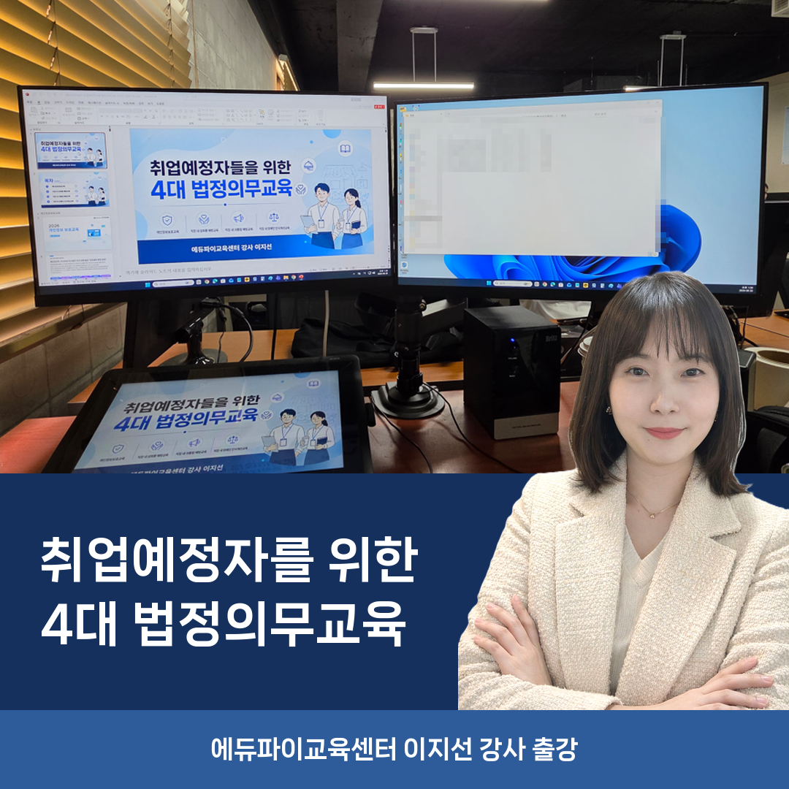
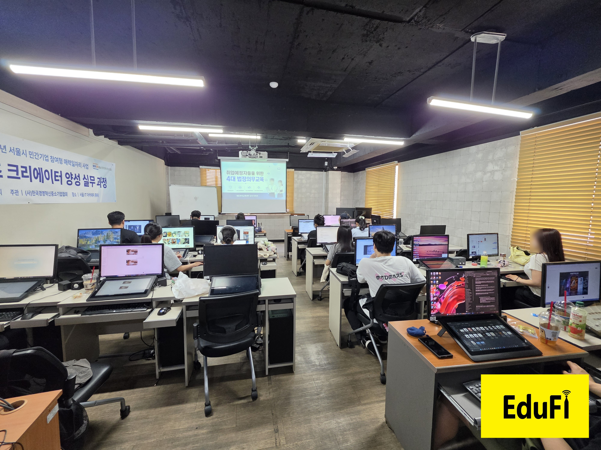

# 1주차 — 나만의 OS 만들기 🛠️

> 미션을 진행하며 **과정과 결과물**을 기록해주세요. (다 못 채워도 OK, 한 것 위주로!)

## 🎯 미션 1. 내 OS 재료 찾기
> 인터뷰 스킬(아이데이션)로 "내 삶에 필요한 게 뭔지" 찾기

- **과정 (어떻게 찾았나):**
  클로드코드와 문답형 인터뷰를 진행했다. "요즘 반복되거나 귀찮은 일"부터 시작해,
  각 업무를 **매번 똑같은 부분(고정) vs 매번 바뀌는 부분(변수)** 으로 쪼개보고,
  마지막엔 "제일 스트레스인 것과 그때의 감정"까지 파고들었다.

- **결과:**
  반복 업무 재료 3개를 찾았다.
  1. 고객사별 제안서·견적서·메일 (1건 1시간, 고정 70% + 변수 30%)
  2. 교육사업별 업무 체크리스트 (양식이 노션·엑셀·메모 등으로 흩어짐)
  3. **홈페이지 교육 후기 업로드 (우선순위 1위)** — 글쓰기 + 사진편집(얼굴 모자이크·로고) + **두 사이트(edufi.co.kr·edufi.kr) 동시 업로드**

- **느낀 점:**
  세 업무 모두 "매번 새로 하는 것 같지만 틀은 반복되는" 구조였다.
  진짜 문제는 시간이 아니라, **후기가 자꾸 뒤로 밀려 쌓이면서 생기는 답답함**이라는 걸 인터뷰를 통해 알게 됐다.
  그래서 내 OS의 첫 목표를 "후기를 밀리지 않고 두 사이트에 빠르게 올리기"로 정했다.

## 🧩 미션 2. 내 OS 기획
> 인터뷰 결과 + 세션 내용(흐민·배짱·키노) 활용해 기획

- **기획 내용:**
  후기 업로드가 너무 복잡해서, 과제 팁대로 **3단계로 가정하고 1단계부터** 기획했다.
  - 1단계 · 콘텐츠 생성: 강의 정보 입력 → 후기 글 초안 자동 생성
  - 2단계 · 사진 처리: 얼굴 블러 + 로고 + 썸네일
  - 3단계 · 자동 업로드: 두 사이트에 자동 등록
  실제 후기 URL(edufi.co.kr/history/311)을 분석해 **고정 양식**(시작 멘트, ■항목, 마무리 블록, 사진 5장 배치)을 뽑아냈다.

- **막혔던 점 / 어떻게 풀었나:**
  처음엔 두 사이트에 톤을 다르게 쓰려다 복잡해졌는데, **내용이 동일**하다는 걸 확인하고 "원본 1개만 잘 만들기"로 단순화했다.
  사진 자동 블러는 처음에 오탐(거대한 블러 덩어리)이 심했는데, 구형 감지기(Haar)를 **최신 AI 모델(YuNet)** 로 바꿔 해결했다.

## ⚙️ 미션 3. 내 OS 구현
> 실제로 만들어본 것 (클로드코드 '채널' 기능 활용 OK)

- **결과물:**
  **`edufi-review` 클로드코드 스킬**을 만들었다. 이제 강의 다녀와서 "에듀파이 후기 써줘" + 사진 폴더만 주면:
  1. **후기 글** — 고정 멘트·■항목·한 줄 한 문장 양식으로 약 1,300자 자동 작성
  2. **진행 사진** (`process_photos.py`) — 얼굴 자동 블러(AI) + 우측 하단 로고
  3. **디자인 썸네일** (`make_thumbnail.py`) — 현장 사진 + 남색 제목 + 하단 "에듀파이교육센터 OO 강사 출강" + 강사 누끼, 나눔스퀘어 네오 ExtraBold
  → 매번 1시간씩 걸리던 후기 준비가 몇 분으로 줄었다.

- **링크 / 스크린샷:** (이미지는 `이미지첨부/` 폴더에)
  - 완성 썸네일: 
  - 얼굴 블러 + 로고 처리 사진: 
  - 참고 후기 원본: https://edufi.co.kr/history/311 , https://www.edufi.kr/63

## 📱 미션 4. SNS 1주차 소감
> AI 도움 없이 직접 작성! (인증하면 셀 지급)

- **인증 링크:** https://www.instagram.com/p/DaYAVH8EvB9/?img_index=1&igsh=Z3dteWtrNnJlYmNx
