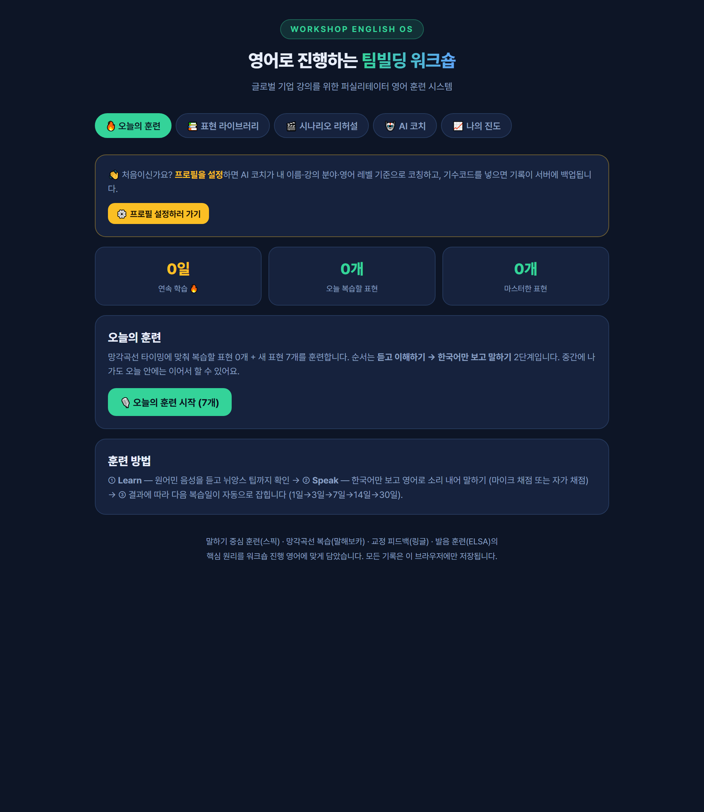

# 5주차 — 마지막 과제 🏁

> 이번 기수의 마지막 과제예요. 과정과 소회를 기록해주세요. (다 못 채워도 OK!)

## 🎯 과제 1. 구현, 그 다음의 것

> 만드는 건 끝났는데 — 그 다음이 진짜 시작이에요 (답이 안 나와 있어도 OK, 고민을 꺼내놓는 것 자체가 과제)

- **지금 걸려 있는 고민 하나:**
  **"이제 도구는 넘치는데, 나는 어떤 목적으로 그 도구를 쓸 것인지를 어떻게 생각하고 결정할 것인가."**
  6주 동안 클로드코드를 포함해 정말 많은 AI 도구를 쓰고 결과물을 만들면서 내린 결론이다. 만드는 방법이 아니라, **무엇을 위해 만들 것인지를 정하는 기준**이 지금 나에게 없는 것이 걸린다.

- **그게 왜 고민인지 (무엇이 걸리는지):**
  6주 전에는 "나는 비개발자니까 어려울 거야"가 문제였다. 지금은 반대가 됐다. **만들 수 있으니까 만들게 되는 것**이 문제다.
  - 아이디어가 떠오르면 바로 구현으로 들어갈 수 있게 되면서, "이걸 왜 만드는가"를 건너뛰는 일이 생긴다.
  - '남들이 다 AI를 쓰니까 나도 해야지'로 움직이면 산출물의 개수는 늘어도 정작 내 일과 삶에 남는 것은 적다.
  - 7개를 만들어 보니 **실제로 매일 쓰는 것과, 만들고 나서 안 여는 것**이 갈렸다. 그 차이가 어디서 생기는지를 아직 내 언어로 정리하지 못했다. 기준이 없으니 다음 것을 만들 때도 같은 일이 반복될 것 같다.

- **어떻게 풀어볼 생각인지:**
  1. **적용 영역을 두 축으로 나눈다** — ①개인의 삶 ②업무 효율성. 두 축은 판단 기준이 다르다고 보고, 각각 따로 기획해 본다.
  2. **만들기 전에 목적을 먼저 적는 절차를 만든다** — "나는 지금 어떤 목적으로 AI를 쓰려는 건가? 어떤 결과물을 만들기 위해 이 선택을 한 건가?" 두 질문에 답이 안 써지면 착수하지 않는다.
  3. **기획 → 적용 → 회고를 한 사이클로 돌린다** — 이미 만든 7개를 대상으로 "실제로 쓰는가 / 안 쓰는가"를 먼저 회고해서, 판단 기준을 사후에 뽑아낸다. 그 기준을 다음 OS를 만들 때 사전 체크리스트로 쓴다.
  4. 정리된 기준은 강의 콘텐츠로도 옮긴다. 기업교육에서 만나는 분들도 같은 지점("AI를 왜 쓰는가")에서 멈춰 있기 때문이다.

- **필요한 게 있다면 무엇인지:**
  - **다른 사람의 판단 기준** — 스폰지클럽 멤버들은 무엇을 만들지/안 만들지를 어떤 기준으로 정하는지가 제일 궁금하다. 내 기준만으로는 편향될 것 같다.
  - **회고 주기를 강제하는 장치** — 혼자 하면 미루게 되어서, 월 1회 정도 고정된 점검 시점이 필요하다.
  - **실사용자 표본** — 내가 쓰는 것과 남이 쓰는 것의 기준이 다를 수 있어, 파트너 강사·수강생의 실제 사용 데이터를 계속 받아볼 통로가 필요하다.

## 🏁 과제 2. 구현 마무리 + 실제 유저 피드백 받기

> 시작할 때 "이번엔 이건 꼭 만들겠다" 했던 것 — 지금 어디까지 왔나요? (스폰지클럽 내 유저피드백 모집 가능)

- **최종 완성한 것 (지금 어디까지):**
  6주 동안 개인/업무에 도움이 되는 **나만의 OS 7개**를 클로드코드로 만들었다.

  | # | OS | 무엇을 하는가 |
  | --- | --- | --- |
  | 1 | 교육 후기 자동화 OS | 강의 후기 → 홈페이지 후기·네이버 블로그·카드뉴스까지 |
  | 2 | 생성형 AI 업무활용 OS | 기업교육 4시간 실습을 그대로 담은 수강생용 워크북 |
  | 3 | **워크숍 잉글리시 OS (글로벌 영어회화)** | 영어로 워크숍을 진행하기 위한 표현 훈련·AI 코치·리허설 |
  | 4 | 커리어 OS | 진로취업캠프용 이력서·자소서 실습 도구 |
  | 5 | L.A.D 미션 OS | 대학생 팀 리더십 워크숍 운영(콘솔·QR 미션) |
  | 6 | 프로모 OS | 강사양성과정 홍보 소재(캐러셀·릴스 대본·발행 플랜) 제작 |
  | 7 | 일상 OS | 이사·나들이 등 삶의 반복 업무 |

  이번 주에는 그중 **워크숍 잉글리시 OS**를 실제 유저에게 써보게 하는 단계까지 마무리했다.

- **🚀 실제 배포 URL:** https://english-os-zeta.vercel.app/

- **결과물 (링크·스크린샷 — 이미지는 `이미지첨부/` 폴더에):**

  

  - 5개 탭 구성 — **오늘의 훈련**(망각곡선 SRS 복습 + 말하기 채점) / **표현 라이브러리**(워크숍 진행 흐름 그대로 10개 카테고리 108표현) / **시나리오 리허설**(풀 시나리오·미션 브리핑·돌발상황 대응 + 내 대본 등록) / **AI 코치**(한→영 대본 변환·롤플레이·교정 등 프롬프트 5종) / **나의 진도**(스트릭·레벨)
  - 서버 API 키 없이 동작하고, 학습 기록은 브라우저에 저장 + 기수코드로 서버 백업

- **받은 유저 피드백:**
  **영어 강사 경력이 있는 사내 강사 1명**에게 실제로 사용해 보게 하고 피드백을 받았다.
  - > "기업 교육을 준비하는 강사가 활용하기에는 이 정도면 우선 충분하다."
  - 영어를 가르쳐 본 사람이 **강사의 준비 도구로서** 판단했다는 점에서 의미가 있었다. 4주차에 가상 페르소나로 검증했던 포지셔닝(범용 영어앱이 아니라 "강사의 무대 영어 리허설 도구")이 실제 유저에게서도 같은 방향으로 확인됐다.
  - 남은 과제: 표본이 아직 1명이다. 다음 강사양성과정 기수의 파트너 강사들이 합류하면 실사용 데이터를 이어서 받을 예정이다.

## 📣 과제 3. SNS에 남기기

> 구현했던 것들 + 그 다음 단계에 대한 생각 (아끼면 아무 일도 안 일어나요 — 꺼내놓는 순간 가장 많이 남아요)

- **구현했던 것들 (무엇을 / 어떻게 굴러가는지 / 뭐가 달라졌는지):**
  스폰지클럽 2기 6주 동안 클로드코드로 만든 **나만의 OS 7개**를 정리해 올렸다.
  - **무엇을** — 교육 후기 자동화 · 생성형 AI 업무활용 · 글로벌 영어회화 · 커리어 · 팀 리더십 미션 · 마케팅 콘텐츠 · 일상 OS
  - **어떻게 굴러가는지** — 실제 배포해 쓰고 있는 화면을 함께 담아, 기획으로 끝난 게 아니라 돌아가고 있다는 걸 보여줬다.
  - **뭐가 달라졌는지** — 반복 업무에 쓰던 시간이 눈에 띄게 줄었고, 강의도 AI 활용을 통해 더 풍성해졌다. 무엇보다 **바뀐 건 실력이 아니라 관점**이었다. 아이디어가 떠올랐을 때 던지는 첫 질문이 "나는 비개발자니까 어려울 거야"에서 **"이건 어떻게 구현하지?"**로 바뀌었다.
  - 1주차에 가장 먼저 알게 된 건, 내 AI 활용이 생각보다 굉장히 기초만 사용하고 있었고 스스로 활용 범위에 대해 소극적으로 기준을 잡았다는 사실이었다. 그 지점부터 적었다.
  - 처음에는 카드뉴스(캐러셀)로 준비했는데, 올리다 보니 **릴스가 더 나을 것 같아 릴스로 업로드**했다.

- **다음 단계 생각 (뭘 더 하고 싶은지 / 남은 것 / 어디로):**
  - 이제 내가 활용할 수 있는 도구는 넘쳐난다. 그래서 중요한 건 도구가 아니라 **"내가 어떤 목적으로, 어떤 결과물을 위해 쓰는가"**다.
  - '남들이 다 AI를 쓰니까 나도 해야지'가 아니라, 목적을 먼저 정하고 도구를 고르는 순서로 가려고 한다.
  - 앞으로는 무분별하게 AI를 쓰는 대신 **개인의 삶과 업무 효율성에 각각 어떻게 적용하면 좋을지 기획해보고 적용해볼 예정**이다. (과제 1의 고민과 이어진다)

- **SNS 인증 링크:** https://www.instagram.com/reel/Dbhl1rKSEMU/
