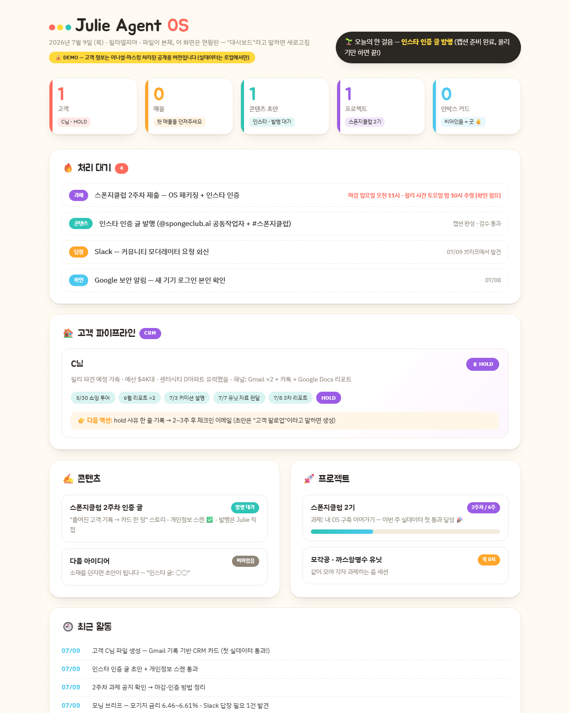

# 2주차 — 내 OS 구현하기 🚀

> 미션을 진행하며 **기획 → 구현 → 삽질 → 결과물 → 인사이트** 를 상세히 기록해주세요.
> (다 못 채워도 OK, 한 것 위주로!)

## 🎯 미션 1. 내 OS 만들기
> **[ 내 삶을 돕는 OS ]** 또는 **[ 콘텐츠 OS ]** 중 하나를 선택해 완성해주세요.

**✅ 선택: 내 삶을 돕는 OS — Julie Agent OS v2 (필라델피아 부동산 중개 + 콘텐츠 + 커뮤니티 과제)**

### 📐 기획
> 무엇을, 왜, 어떻게 만들지

- **무엇을**: 필라델피아에서 부동산 중개 일을 하며 흩어지는 모든 것 — 고객 기록, 매물 문의, 인스타 콘텐츠, 스폰지클럽 과제 — 을 **Claude가 비서처럼 운영하는 파일 기반 OS.**
- **왜**: 1주차 v1은 HTML 커맨드 센터 + AI 전화 에이전트였다. 화면과 버튼은 그럴듯한데 실제 업무가 하나도 흐르지 않았고, "필리줄리님은 컨셉만 잡은 것 같다"는 말을 들었다. 아팠는데 맞는 말이었다. 실제 내 고객 기록은 지메일 계정 두 개, 구글 문서 리포트, 카톡에 뿔뿔이 흩어져 있는데 OS 안은 비어 있었다.
- **어떻게**: 원칙을 뒤집었다 — **"지능은 에이전트, 데이터는 파일, 화면은 현황판일 뿐."** 규칙 전체를 커널 문서(CLAUDE.md) 하나에 넣었다: 말 걸면 알아서 분류되는 **8개 모듈 라우팅**(모닝 브리프 / 캡처 인박스 / 부동산 파이프라인 / 콘텐츠 / 자료 제작 / 업무 덜어내기 / 프로젝트 / 대시보드·회고), 되돌리기 어려운 일(이메일 발송·SNS 발행)은 **초안까지만 만들고 내 승인 후 실행**하는 게이트, 그리고 개인정보 규칙.

### ⚙️ 구현
> 실제로 만든 것 (링크·스크린샷 — 이미지는 `이미지첨부/` 폴더에)

- **커널 + 폴더 구조**: 고객·매물·리포트·콘텐츠·프로젝트·작업로그가 전부 마크다운 파일 (git으로 이력 관리). 템플릿 3종(고객 파일 / 에이전트 문의 이메일 / 쇼잉 리포트).
- **Gmail·Slack·Drive를 MCP로 연결** — "확인해보세요"가 아니라 에이전트가 직접 읽는다. 모닝 브리프는 PC를 켜면 자동 실행: 필리 날씨 + 부동산 헤드라인 + 모기지 금리 + 안 읽은 메일 스캔 + 오늘의 한 걸음 1개.
- **실전 통과 ① — 진짜 고객으로 CRM**: 한 달간 진행한 실제 고객 한 분(hold로 마무리)의 이메일 기록을 에이전트가 직접 읽고 **고객 카드 한 장**으로 정리 — 상황 / 진행 타임라인(쇼잉 투어→리포트 3차→hold) / 매물 히스토리 / 다음 액션까지. 이제 이 고객이 다시 연락 오면 기록 뒤지는 대신 파일 하나 열면 된다.
- **실전 통과 ② — 인스타 인증 글**: 이번 주 경험을 소재로 초안 작성 + 발행 전 검수(오탈자·사실·Fair Housing·개인정보)까지 OS가 하고, 발행만 내가 한다.
- **대시보드 UI**: 파일들을 읽어 재생성되는 "써니 스티커 보드" 현황판 — 고객 파이프라인, 처리 대기, 최근 활동, 말 걸기 치트시트.
- **공개용 마스킹 파이프라인**: 발행 전 개인정보 자동 스캔 스크립트(`_tools/privacy-scan.py`) + 이니셜 마스킹 → 공개 데모로 배포.

**쓴 도구**: Claude Code(에이전트·두뇌) + MCP(Gmail/Slack/Drive) + 마크다운·git(데이터·이력) + Vercel(공개 데모).

### 🧗 과정에서의 삽질
> 막혔던 지점, 시도한 방법, 어떻게 풀었는지 솔직하게

1. **전화 에이전트의 함정.** v1의 핵심은 리싱 오피스에 커미션 조건을 확인하는 AI 전화였다. 그런데 곰곰이 보니 목적은 전화가 아니라 **"고객에게 줄 리포트 완성"**이었고, 전화는 수단일 뿐이었다. 미국 리싱 오피스는 이메일 회신이 잘 되는 곳이라 → 이메일 파이프라인(매물 파일 → 문의 초안 → 답 모아 리포트)으로 교체. **방향 전환은 후퇴가 아니라는 것**을 배웠다.
2. **"만들었는데 왜 하나도 안 쓰지?"** 이번 주 최대 삽질은 코드가 아니라 나 자신이었다. 시키면 뭐든 만들어주는 게 신기해서 계속 만들기만 했고, 활용은 0이었다. 원인은 기능 부족이 아니라 **실데이터가 한 번도 통과한 적 없다는 것.** 실제 고객 케이스 하나를 넣어보니 그제서야 시스템이 "돌아갔다". 이번 주에 세운 기준: **기능 추가 < 실데이터 1회 통과.**
3. **고객 개인정보 vs 공개 제출.** 고객 실명·매물·예산이 담긴 OS를 어떻게 공개 저장소와 SNS에 올리지? → **이원화**로 풀었다: 실데이터는 로컬 전용(로컬 git 커밋만, push 금지), 공개용은 이니셜 마스킹(C님, D아파트) + 발행 전 자동 스캔 스크립트가 한 번 더 잡아준다. 부동산은 Fair Housing 규정도 있어서 콘텐츠 검수 단계에 그것도 넣었다. **사람의 조심성은 스케일이 안 되니 규칙을 OS에 박아야 한다.**
4. **"Vercel은 세이브가 안 된다며?"** 배포 직전에 헷갈렸던 것. 알고 보니 정적 페이지는 **현황판(사진)**이고 저장은 로컬 파일+git이 이미 하고 있었다. 데이터가 바뀌면 마스킹판을 다시 배포하면 끝. 웹에서 직접 입력·저장하는 진짜 웹앱(Supabase)은 다음 단계로 미뤘다 — 이번 주 기준은 "쓰기"였으니까.

### ✅ 결과물
> 완성한 것 / 작동 화면

- **▶️ 라이브 데모 (마스킹판): https://julie-os-demo.vercel.app**
- **실제로 돌아가는 중**: 실제 고객 카드 1건(이메일 기록 기반 자동 정리), 인스타 초안 1건(검수 통과), 아침마다 자동 브리프, 모든 작업이 로그 파일에 자동 한 줄 기록.
- 오늘 하루 흐름이 그대로 증거다: 아침 브리프 → 과제 공지 Slack에서 확인 → 고객 카드 생성 → 인스타 초안 → 대시보드 리디자인 → 마스킹 → 배포까지, 전부 OS와의 대화로 진행.

### 💡 알게 된 인사이트 & 공유하고 싶은 내용
> 하면서 깨달은 것, 크루들과 나누고 싶은 것

- **"컨셉만 잡은 것 같다"는 말이 이번 주 최고의 피드백이었다.** 구조가 있는 것과 돌아가는 것은 다르다. OS는 기능이 아니라 **내 진짜 데이터가 통과하는 순간** 시작된다.
- **시스템의 가치 = 만들어진 것이 아니라, 오늘 내 일이 실제로 줄어드는 것.** 이 기준 하나로 "다음에 뭘 만들까"가 "지금 뭘 통과시킬까"로 바뀌었다.
- **화면이 아니라 파일이 자산이다.** HTML은 언제든 다시 그리면 되지만, 마크다운 파일과 git 이력은 쌓일수록 값어치가 생긴다.
- **개인정보를 다루는 직업이라면 마스킹을 OS에 내장할 것.** 공개하는 순간마다 사람이 조심하는 방식은 반드시 한 번은 실패한다. 스캔 스크립트 + 로컬/공개 이원화를 추천.
- 같은 조 양세님의 "지적을 그때그때 규칙으로 박아 다음엔 반복 안 하게 한다"는 방식이 인상 깊었는데, 나도 커널 문서에 규칙을 추가하는 식으로 같은 걸 하고 있었다. **OS의 성장 = 규칙의 축적**인 것 같다.

## 📣 미션 2. 유닛 활동 참여 & SNS 공유
> 유닛 활동에 적극 참여(유닛원으로서 or 참가자로서)한 뒤, 그 경험을 SNS에 올리기

- **참여한 유닛 / 활동:** 스폰지클럽 인스타(@spongeclub.ai) 계정 운영 참여 + 7/12 이기적 공유회 모더레이터 예정
- **무엇을 했나 (경험):** 이번 주 과제 경험("흩어진 고객 기록 → 카드 한 장")을 인스타 포스트로 제작 — OS가 초안과 발행 전 검수(개인정보·Fair Housing)까지 하고, 발행은 직접.
- **SNS 인증 링크:** (발행 후 링크 추가 예정)
