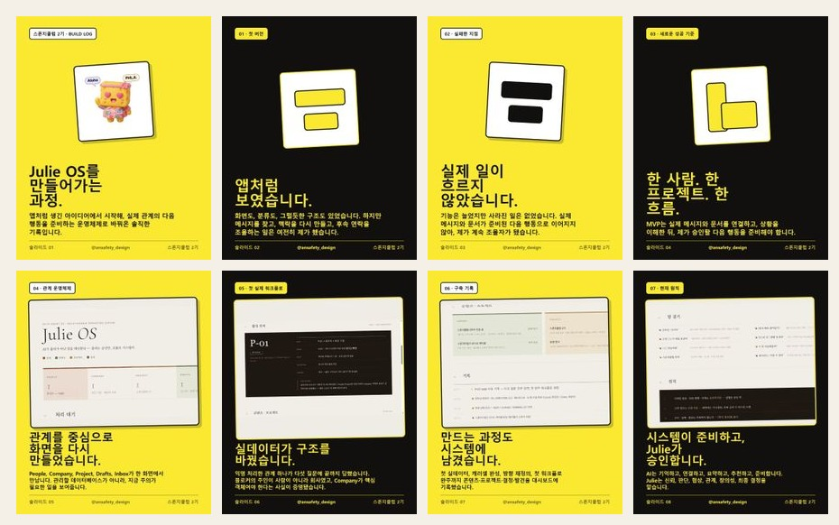
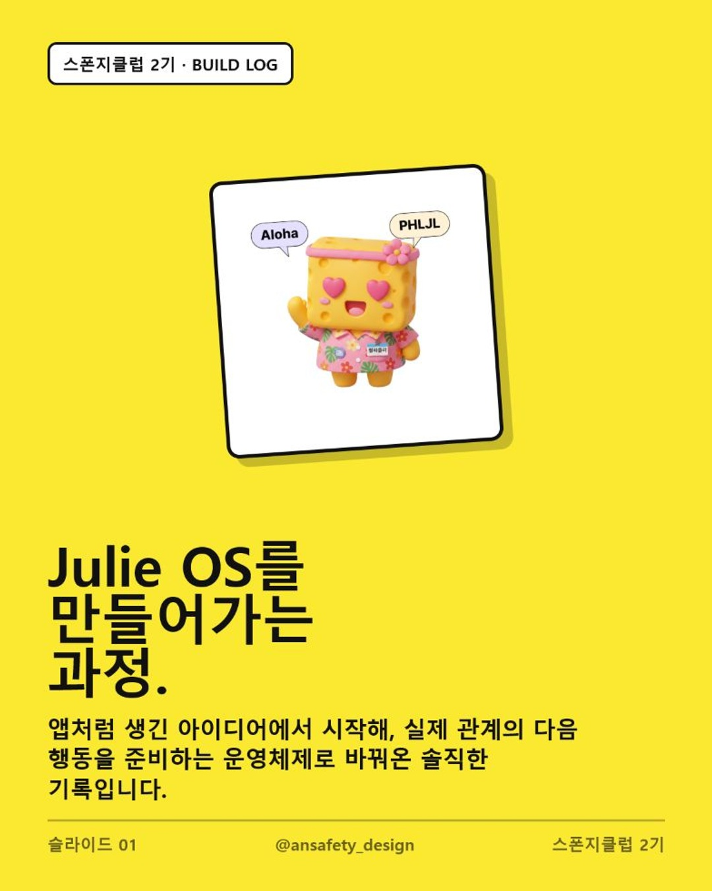
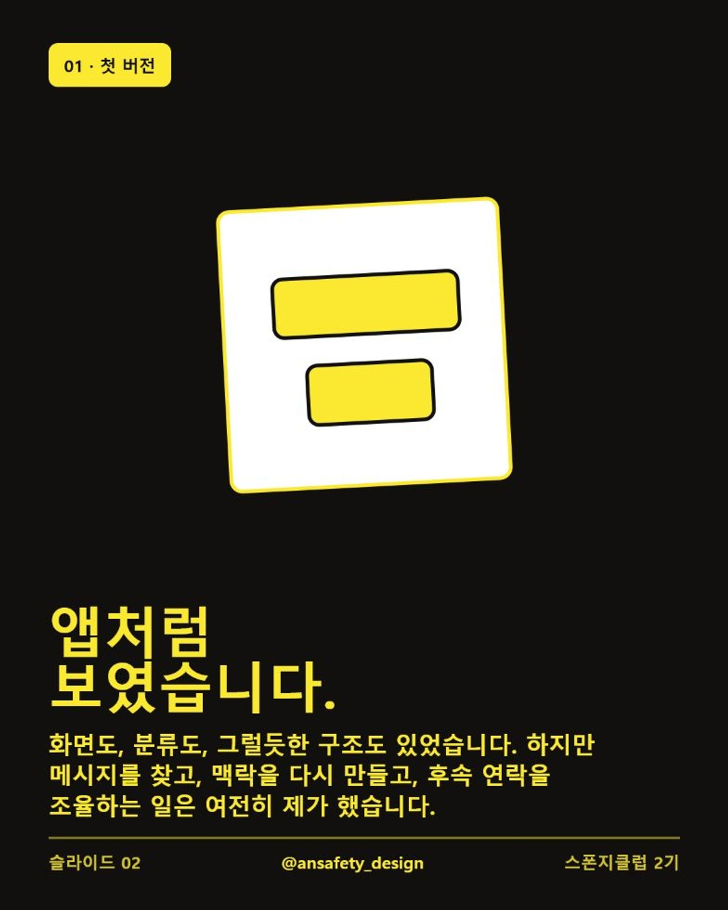
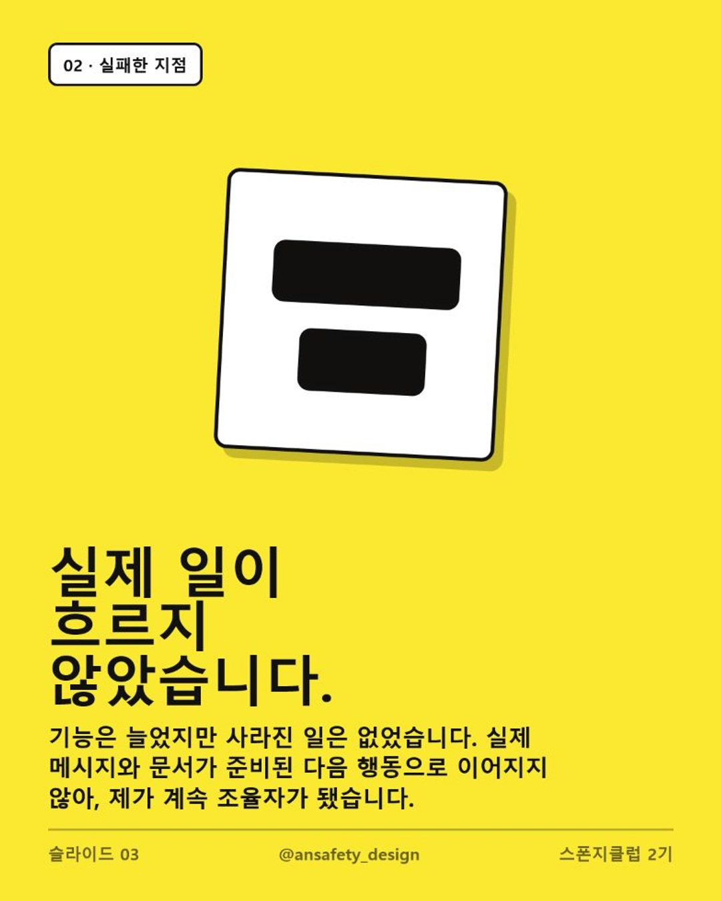
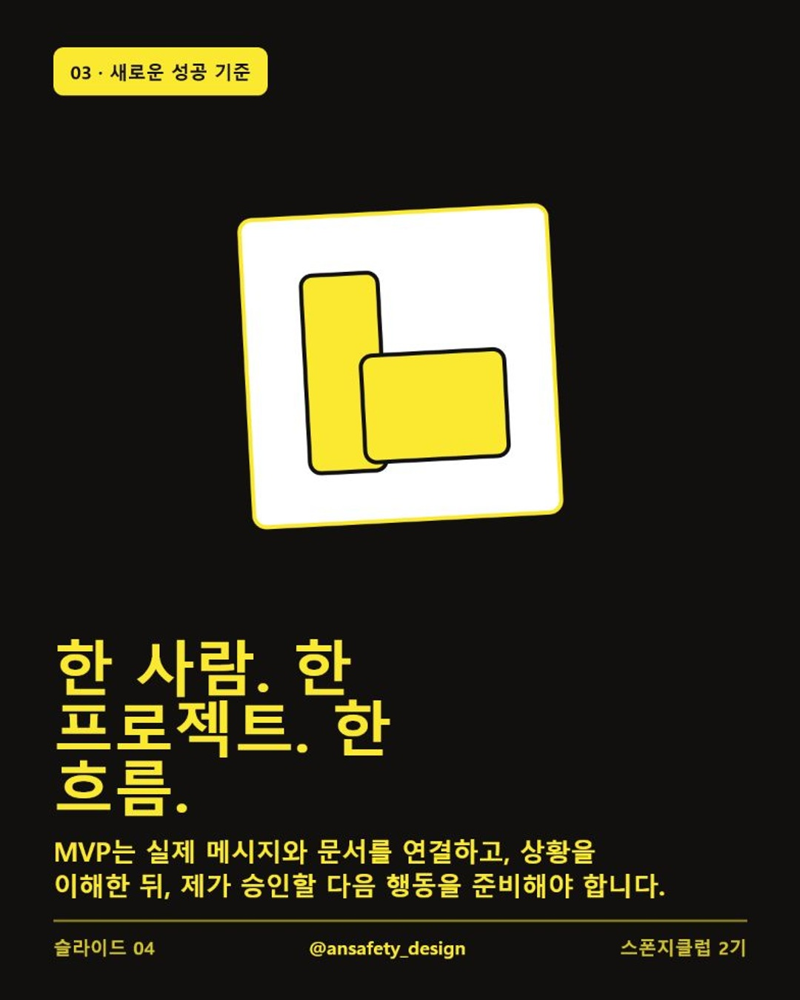
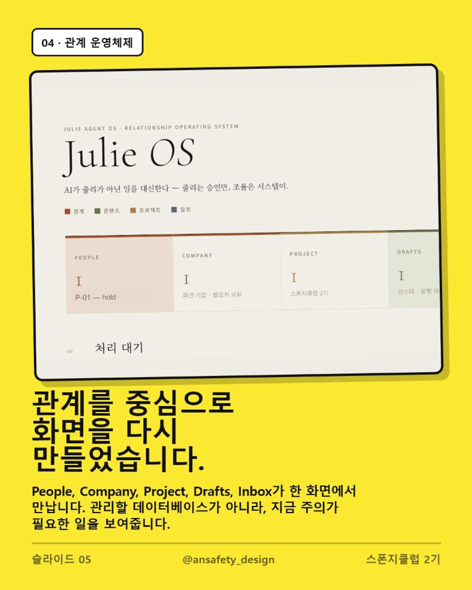
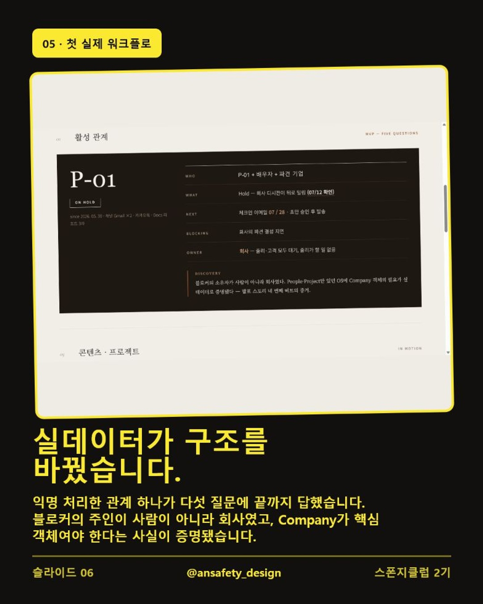
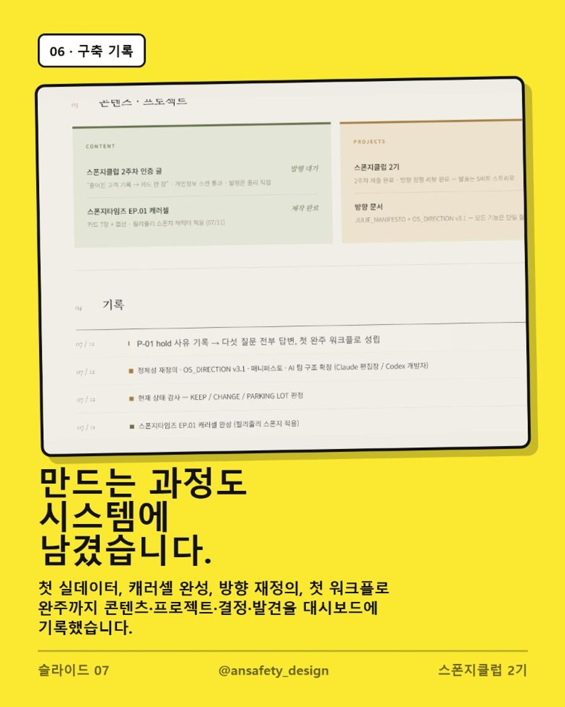
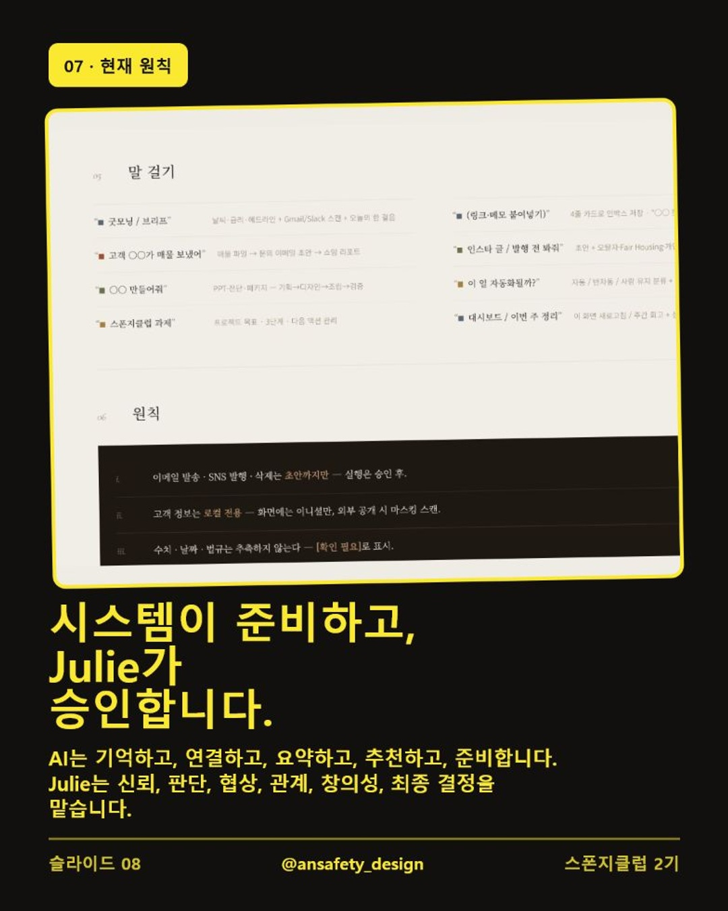

# 2주차 — Julie OS v3.3을 만들어가는 과정

## 결과물

이번 주에는 **Julie OS v3.3**을 **앱처럼 보이는 화면**에서
**실제 관계의 다음 행동을 준비하는 운영체제**로 다시 정의하고,
첫 번째 실제 워크플로를 통과시켰습니다.

### 만든 것

- `People · Company · Project`를 중심으로 한 관계 운영 화면
- 익명 처리한 실제 관계 `P-01`의 5가지 질문 정리
  - 누가 관련되어 있는가?
  - 무슨 일이 일어나고 있는가?
  - 다음 행동은 무엇인가?
  - 무엇이 진행을 막고 있는가?
  - 다음 단계의 주인은 누구인가?
- Julie OS 구축 과정을 정리한 한국어 캐러셀 8장
- 동일한 내용의 영어 캐러셀 8장
- 스폰지클럽 노랑·다크 블랙 교차 팔레트
- 모든 페이지 하단 `@ansafety_design` 표기
- 실제 관계 정보 `P-01` 마스킹

### 인스타그램 인증

- 게시 계정: [@ansafety_design](https://www.instagram.com/ansafety_design/)
- 게시물: [Julie OS를 만들어가는 과정](https://www.instagram.com/p/Daq_eGsE2RY/)

한국어 캐러셀 8장 펼쳐보기

인스타그램에 올린 글 전문

처음에는 Julie OS를 ‘앱’처럼 만들고 있었습니다.

화면도 있었고, 분류도 있었고, 그럴듯한 구조도 있었습니다.  
그런데 이상하게 제 일은 하나도 줄지 않았어요.

메시지를 다시 찾고, 흩어진 맥락을 연결하고, 다음 연락을 챙기고,
결국 모든 일을 제가 조율하고 있었습니다.

그래서 성공 기준을 바꿨습니다.

더 많은 기능이 아니라,

**한 사람. 한 프로젝트. 하나의 실제 워크플로.**

실제 관계 데이터를 넣어보니 제 일은 Gmail이나 문서 같은 앱을
중심으로 움직이지 않았습니다. 사람, 회사, 프로젝트 사이의
‘관계’를 중심으로 움직이고 있었습니다.

그리고 첫 실데이터를 통해 중요한 것도 발견했습니다.

진행을 막고 있던 주체가 사람이 아니라 회사였어요. 그 순간
Julie OS에 People과 Project뿐 아니라 Company가 반드시 필요하다는
사실이 증명됐습니다.

지금의 Julie OS는 다섯 가지 질문에 집중합니다.

누가 관련되어 있는가?  
무슨 일이 일어나고 있는가?  
다음 행동은 무엇인가?  
무엇이 진행을 막고 있는가?  
그다음 단계의 주인은 누구인가?

제가 만들고 싶은 건 저를 더 열심히 일하게 만드는 시스템이
아닙니다.

AI가 기억하고, 연결하고, 요약하고, 다음 행동을 준비하면 저는
신뢰, 판단, 관계, 협상, 창의성, 최종 결정에 집중하는 시스템입니다.

**시스템이 준비하고, Julie가 승인합니다.**

아직 완성된 플랫폼은 아닙니다. 하지만 이번에는 처음으로 실제 일이
끝까지 흘렀습니다.

이제 같은 흐름을 반복하면서 Julie가 아니어도 되는 일을 하나씩
없애보려고 합니다. 💛🖤

## 삽질 과정

### 1. 처음에는 ‘그럴듯한 앱’을 만들었다

화면, 메뉴, 분류를 만들면 OS가 되는 줄 알았습니다. 겉으로는 완성된
제품처럼 보였지만 메시지를 찾고, 맥락을 다시 만들고, 후속 연락을
조율하는 일은 여전히 제가 하고 있었습니다.

**기능은 있었지만 사라진 일은 없었습니다.**

### 2. 성공 기준을 완전히 바꿨다

기능의 수를 세는 대신 아래 흐름 하나가 실제로 끝까지 가는지를 보기로
했습니다.

`한 사람 → 한 프로젝트 → 실제 메시지와 문서 → 상황 이해 → 다음 행동 준비 → Julie 승인`

### 3. 실데이터가 데이터 구조를 바꿨다

`P-01` 관계를 다섯 질문으로 정리하니 블로커의 주인이 사람이 아니라
회사라는 사실이 드러났습니다. People과 Project만 있던 구조에
Company가 핵심 객체로 추가되어야 한다는 것을 실데이터로 확인했습니다.

### 4. 캐러셀이 ‘한 장씩’ 나오지 않았다

처음 만든 결과물은 캐러셀 자체가 아니라 편집 대시보드 전체가 한 화면에
보였습니다. 제출용으로 쓸 수 없어서 편집 화면과 제출 화면을 분리하고,
각 슬라이드를 1080×1350 JPG로 다시 출력했습니다.

### 5. 개인정보와 브랜드를 다시 손봤다

화면에 남아 있던 고객 이니셜을 `P-01`로 한 번 더 마스킹했습니다.
파스텔 컬러로 흩어져 있던 카드도 스폰지클럽의 노랑·다크 블랙으로
통일하고, 모든 페이지에 `@ansafety_design`을 넣었습니다. 같은 구성을
영어 세트로도 만들었습니다.

### 6. 마지막 GitHub 제출에서도 막혔다

처음 작업한 Julie OS 폴더의 `.git`이 OneDrive 온라인 전용 상태라
저장소로 인식되지 않았고, GitHub CLI 설치와 기기 인증 코드도 여러 번
만료됐습니다. 결국 IDE에 연결된 실제 `spongeclub-2` 저장소와 필리줄리
제출 폴더를 다시 찾아 제출 위치를 바로잡았습니다.

## 인사이트

> **MVP는 기능이 많은 작은 제품이 아니라, 실제 일 하나가 처음부터
> 끝까지 흐르며 수작업을 없애는 증거다.**

Julie OS의 현재 원칙은 단순합니다.

**시스템이 준비하고, Julie가 승인합니다.**
