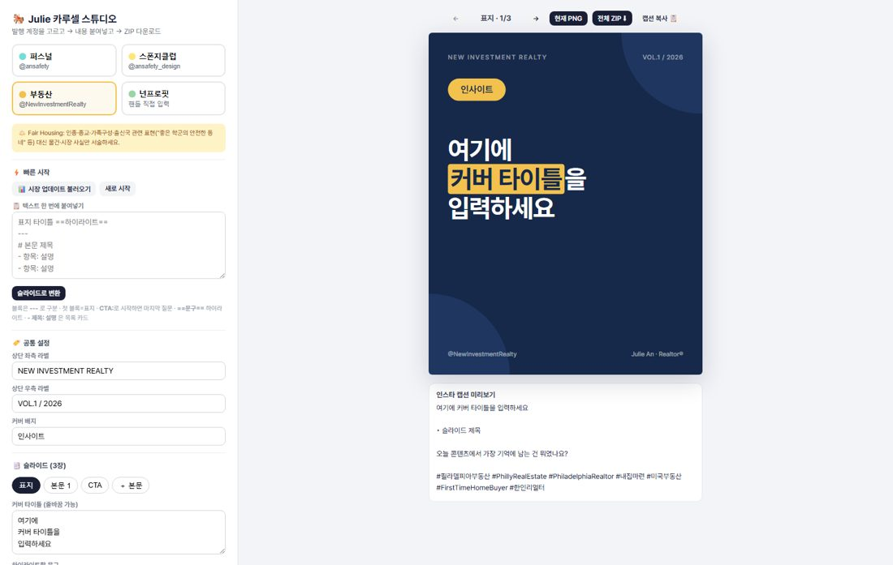
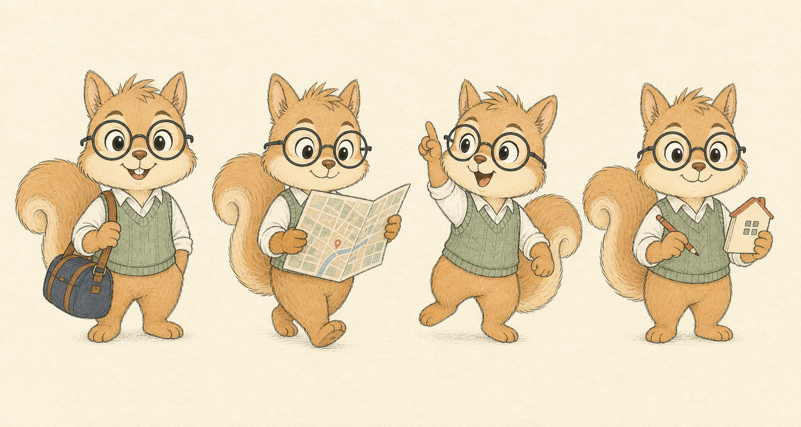
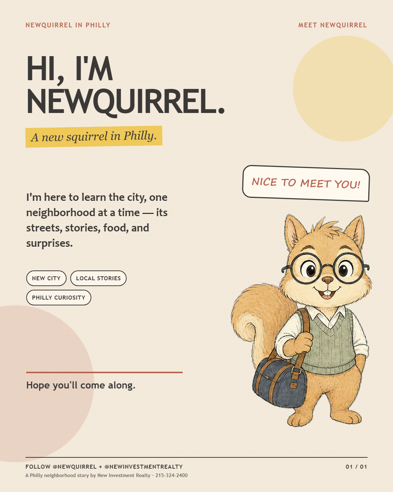
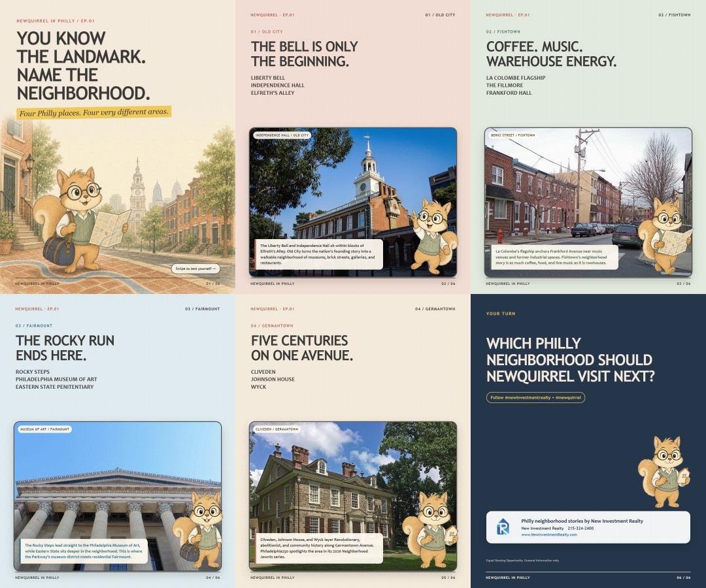
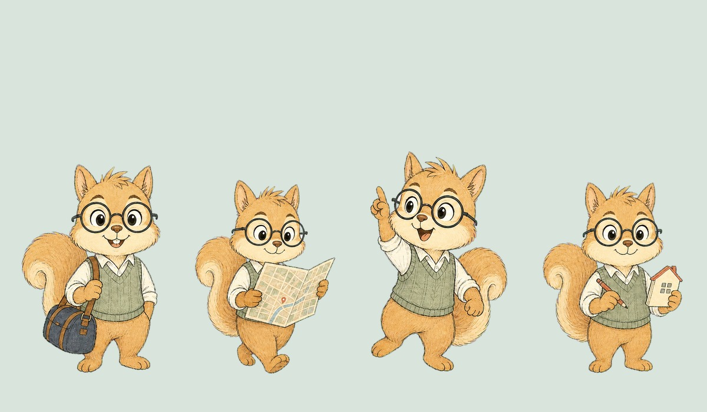

# 3주차 — 내 OS 최종 완성 🏁

> 부제: **이름을 다섯 번 버렸다**
>
> 1주차에 "컨셉만 잡은 것 같아요"라는 피드백을 받았습니다. 아팠지만 맞는 말이었어요.
> 그래서 3주차엔 기준을 딱 하나로 바꿨습니다 — **기능을 늘리지 말고, 실제 데이터를 한 번 끝까지 통과시키자.**
> 화면과 버튼을 늘리는 대신, 실제 일 두 개(고객 한 명 / 콘텐츠 계정 하나)를 처음부터 끝까지 통과시켰습니다.

## 🎯 미션 1. 내 삶을 돕는 OS 최종 완성

### 📊 숫자로 보는 일주일

| OS 모듈 | 실데이터 통과 | 버린 캐릭터 이름 | 전면 재기획 | 축적한 제작 규칙 | 발행 |
|---|---|---|---|---|---|
| 8개 | 고객 1명 · 계정 1개 | **5개** | **2회** | **33조** | 인스타 3건 |

### ✅ 완성한 것

**① 화면에서 파일로 — 줄리 OS v2**

1주차의 줄리 OS는 예쁜 HTML 커맨드 센터였습니다. 문제는 **열어봐도 할 일이 안 생긴다**는 것. 그래서 화면을 버리고 **파일 기반 운영 OS**로 다시 지었습니다. 커널 문서(`CLAUDE.md`) 하나가 8개 모듈을 묶고, 판단·작성은 AI가, 이력은 전부 마크다운으로 남습니다.

> 모닝 브리프 · 캡처 · 부동산 쇼잉 리포트 · 콘텐츠 · 자료 제작 · 업무 덜어내기 · 프로젝트 · 대시보드/주간회고

**② 실데이터 1회 통과 — 흩어진 고객 한 명을 카드 한 장으로**

지난 한 달 진행한 고객 한 분의 기록은 **지메일 2개 계정 · 구글 문서 · 카톡**에 흩어져 있었습니다. 매번 세 곳을 뒤져야 "이 사람 어디까지 갔지?"를 알 수 있었죠. OS가 그걸 읽고 **상황 / 진행 단계 / 다음 액션**까지 고객 카드 한 장으로 정리했습니다. 이제 파일 하나만 엽니다.

**③ 매일 아침 실제로 돌아가는 모닝 브리프**

날씨 · 모기지 금리 · 필라 부동산 헤드라인 + 내 인박스/고객/프로젝트 현황. 데모가 아니라 **오늘 아침에도 실제로 돌렸습니다.**

**④ 반복 워크플로우 두 개를 런북으로 고정**

- **리믹스 런북** — 매주 동기들 과제를 스캔해 제 콘텐츠 소재로 리메이크
- **VA 플레이북** — 신규 문의를 분류하고 회신 초안까지 생성

**⑤ 그 OS로 실제 계정 하나를 처음부터 끝까지 만들었다 — `Newquirrel in Philly`**

이번 주의 진짜 시험대였습니다. 소재메이커 공유회의 제작 순서를 그대로 제 버전으로 이식했습니다:

```
기획 잠금 → 공식 출처로 사실 검증 → 카피를 사람이 확정[결재]
→ 그다음에만 이미지 생성 → 검수 → 걸린 실수를 규칙 파일에 축적
```

필라델피아 로컬 캐릭터 계정을, 캐릭터 시트 → 1080×1350 카루셀 6장 → **로컬 카루셀 스튜디오**(문구·색·포즈를 고쳐 PNG로 뽑는 도구)까지 만들어 실제 발행했습니다.









---

### 🧗 삽질 기록 (솔직하게)

> 이번 주 피드백을 준 사람은 남이 아니라 **만들다가 계속 걸린 저 자신**이었습니다.

**사건 1 — 이름을 다섯 번 버렸다**

캐릭터 이름을 `Niffy`로 잡았습니다. NIR(New Investment Realty)에서 따온 거라 의미도 좋았고요. 그런데 상표를 확인해보니 문제가 셋이었습니다.

- **Miffy** — 세계적으로 관리되는 동물 캐릭터 브랜드인데, 한 글자 차이입니다.
- 영국 지식재산청에 2025년 **NIFFY** 상표가 미디어·인쇄물·장난감·엔터테인먼트 분야(9·16·28·41류)로 출원돼 있었습니다. 제가 만들려는 영역과 정확히 겹칩니다.
- 《Tom & Jerry Kids》에도 Niffy라는 단역이 있었습니다.

여기서 **이름은 저작권이 아니라 상표 문제**라는 걸 알았습니다. 그래서 다시 잡았습니다 — `NIR Knows Philly`(회사 캠페인 같음) → `NIR Scout`(사랑받을 캐릭터 이름이 아님) → `Niri`(다른 분야에서 이미 사용 중) → 그리고 최종 **`Newquirrel`**.

> `New + Squirrel` = ① New Investment Realty의 **New** ② 필라델피아에 **새로 온** 다람쥐 ③ 필라델피아로 **새로 오는 사람들**

의미가 세 겹으로 붙었고, Miffy에서도 확실히 멀어졌습니다. **"좋은 이름"이 아니라 "안전하면서 이야기가 붙는 이름"을 찾는 게 목표였다는 걸 다섯 번째에야 알았습니다.**

**사건 2 — 완성한 카루셀을 통째로 버렸다 (2회)**

**1차 폐기** — 6장을 다 만들고 보니 `Philadelphia is a city of neighborhoods` 같은 문장뿐이었습니다. 예쁘긴 한데 **읽고 나서 새로 알게 되는 게 없었어요.** 저장할 이유가 없는 콘텐츠였습니다. 전부 엎고 "랜드마크를 보고 동네를 맞히는" 정보형으로 다시 기획했습니다.
→ Old City=리버티벨 / Fishtown=라 콜롬베 / Fairmount=로키 계단 / Germantown=클리브덴

**2차 폐기** — 정보는 들어갔는데 이번엔 **페이지가 비어 보이고 폰트가 캐릭터랑 안 어울렸습니다.** 각진 광고체 + 작은 캐릭터 = 프레젠테이션 템플릿 같았죠. 실제 장소 사진을 화면 절반 이상 크게 넣고, 랜드마크 이름 나열 대신 "왜 이 장소가 이 동네를 설명하는지" 2~3문장을 붙이고, 폰트를 부드러운 휴머니스트 산세리프로 바꿨습니다.

**사건 3 — 말풍선이 캐릭터 귀를 잘랐다**

캐릭터 시트를 **네모로 크롭해서** 카드에 넣었더니, 머리가 잘리고 옆 포즈의 배경 조각이 같이 딸려 왔습니다. 배경을 크로마키로 제거하고 **투명 전신 포즈 PNG 4장**으로 분리했습니다. 이후 첫 게시물에선 말풍선이 귀를 덮어서 그것도 위로 올렸습니다.



→ 규칙으로 박았습니다: **"카루셀에는 시트를 네모로 크롭하지 않는다. 머리·귀·꼬리·손·소품·발이 모두 보이는 전신 PNG를 쓴다."**

**사건 4 — "hand-drawn"이라고 썼는데, 거짓말이었다**

계정 소개에 `Hand-drawn stories about Philly`라고 썼습니다. 그런데 손으로 그린 게 아니잖아요. **사실이 아닌 표현이었습니다.** `Illustrated stories` / 물어보면 `AI-assisted illustration`으로 정확히 답하는 걸로 바꿨습니다. 같은 이유로 등록하지도 않은 `TM` 표기도 로고에서 뺐습니다.

**사건 5 — 끝을 광고로 닫으면 감성툰이 광고판이 된다**

처음엔 마지막 장을 큰 집 아이콘 + "부동산 문의" 박스로 만들었습니다. 앞의 다섯 장과 완전히 끊기더라고요. 경쟁 사례를 확인해보니 **Naked Philly**(OCF Realty가 운영)도 콘텐츠 안에서는 광고를 안 하고, 프로필과 사이트 구조가 전환을 담당하고 있었습니다.
→ 마지막 장을 **독자 질문 + 팔로우 유도**로 바꾸고, NIR은 `Philly neighborhood stories by New Investment Realty`처럼 **출처 관계만 투명하게** 작게 밝혔습니다.

**사건 6 — 부동산이라서 못 쓰는 말이 많다**

동네 소개가 핵심 소재인데, 부동산 계정이라 **Fair Housing이 상시 리스크**입니다. `safe neighborhood`, `best schools`, `perfect for families`, 특정 국적이 많이 산다는 표현 — 전부 금지어로 규칙에 박았습니다. 동네는 교통·건축·공원·상점처럼 객관적으로만 설명합니다. 사진도 아무거나 못 씁니다. Wikimedia Commons·Pexels에서 라이선스가 명확한 것만 쓰고 **작가·원본·라이선스·크롭 여부를 `photo-credits.md`에 기록**했습니다.

**사건 7 — 렌더링 도중 Chrome이 죽었다**

카드를 PNG로 뽑는데 이 PC의 Chrome 그래픽 프로세스가 충돌했습니다. 파일 문제가 아니라 환경 문제였어서, **Edge 헤드리스 렌더링으로 갈아타** 해결했습니다. 그 뒤엔 카드 문구의 특수문자가 깨져 나와서(인코딩) 복구하고, PNG 출력 직전에 한 번 더 저장하는 걸 규칙으로 넣었습니다.

---

### 💡 알게 된 인사이트

**한 줄: 좋은 OS는 내 일을 도와주는 게 아니라, 내가 아닌 일을 대신한다.**

1. **"AI가 내 일을 돕는다"가 아니라 "AI가 내가 아닌 일을 대신한다".** 초안과 검수까지가 AI 몫, 확인하고 보내는 건 제 몫. 이 선을 지키는 게 오히려 시스템의 중심이었습니다. 자동화의 성패는 기능 개수가 아니라 **'내가 판단할 시간을 얼마나 남겨주는가'**로 갈렸습니다.
2. **한 번 걸린 실수를 규칙 파일에 적는 게, 기능 하나 더 만드는 것보다 다음 주 속도를 훨씬 많이 올린다.** 이번 주에만 33조가 쌓였고, 다음 9편은 이 규칙 위에서 시작합니다.
3. **완성한 걸 버릴 수 있어야 완성된다.** 카루셀 두 번, 이름 다섯 번을 버렸습니다. "이미 만들었으니까"는 발행 이유가 못 됩니다. 기준은 하나 — **읽고 나서 새로 알게 되는 게 있는가.**
4. **예쁜 건 검수 항목이 아니다.** 1차 폐기의 원인은 디자인이 아니라 내용이 없었던 것. 그런데 화면만 보면 그게 안 보입니다. "저장할 이유가 있나?"를 따로 물어야 보입니다.
5. **규제가 있는 업종은 금지어를 먼저 규칙으로 박고 시작해야 한다.** Fair Housing·PA 광고 표기·상표·사진 라이선스 — 다 만든 다음에 걸리면 처음부터 다시입니다.

### 📦 결과물 링크

- **인스타 발행 (OS 결과물):** [JULIE OS, 이제 실제 일을 통과하기 시작했습니다](https://www.instagram.com/p/Da9F0HIEzWm/) — @ansafety_design · #스폰지클럽
- **Week 1 기록:** [필라델피아 리얼터, AI로 '삶의 OS'를 짓기 시작했습니다](https://www.instagram.com/p/Da9FdDNk_e9/)
- **콘텐츠 모듈 산출 계정:** [@newquirrel](https://www.instagram.com/newquirrel/) (Newquirrel Philly)
- **OS 여정 카루셀 7장:** `이미지첨부/ANSAFETY-2026-07-14-01~07.png`
- **스폰지 인증 카루셀 7장:** `이미지첨부/SPONGE-2026-07-14-01~07.png`

## 📣 미션 2. 스폰지 토크데이 SNS 후기

- **후기 내용:**

  **"AI는 바이브를 대체할 수 없어요 🧡"**

  스폰지클럽 첫 오프라인 모임에서 **세션 2 모더레이터**로 함께했습니다. 화면 밖에서 만나니 말의 온도와 사람의 맥락이 훨씬 잘 느껴지더라고요. 이날 저에게 남은 키워드 세 개 —

  | 키워드 | 남은 것 |
  |---|---|
  | **바이브** | 같은 공간에서 느끼는 시너지·신뢰·에너지. AI로 대체할 수 없는 것 |
  | **마음 돌봄** | 기술이 편리해질수록, 사람의 마음을 돌보는 일이 더 중요해진다는 것 |
  | **상위 1%** | 우리의 열정만큼은 이미 상위 1%라는 것 |

  이번 주 내내 "AI에게 무엇을 넘길까"만 생각했는데, 모임에서는 정확히 그 반대편 —**넘기면 안 되는 것**이 무엇인지가 보였습니다. 제 OS의 기준이 "AI가 내가 아닌 일을 대신한다"로 정리된 데에는 이날 대화가 컸습니다.

- **SNS 인증 링크:** https://www.instagram.com/p/Da9G02UmKWz/
  (@ansafety_design · **#스폰지클럽** · @spongeclub.ai 공동작업자 등록 완료)
