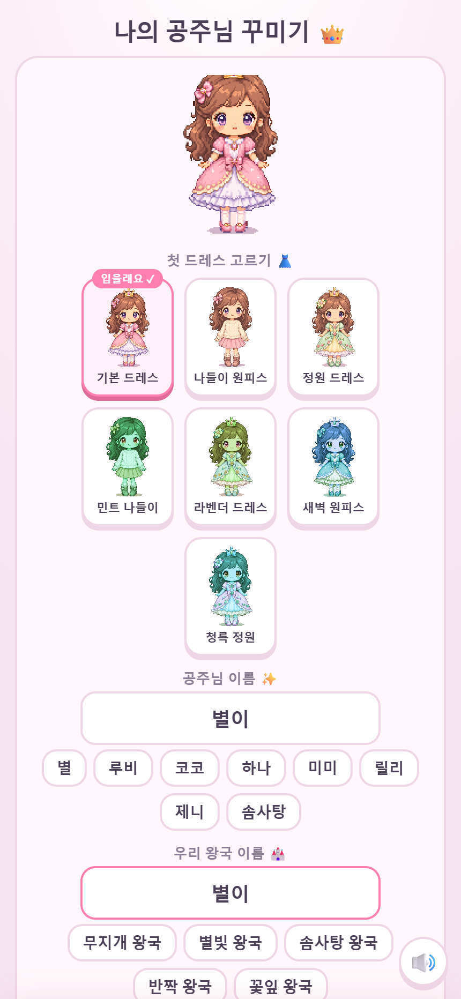
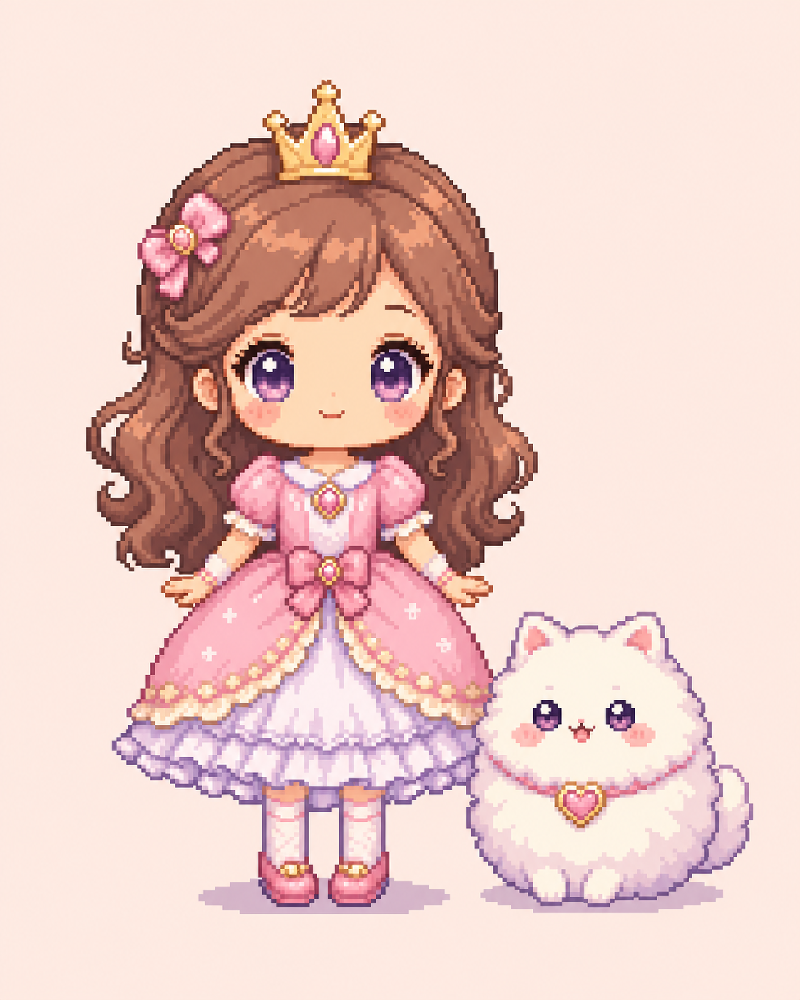

# 4주차 — 기획·구현 → 검증 → 기록 🧪

> 과제를 진행하며 과정과 결과를 기록해주세요. (다 못 채워도 OK, 한 것 위주로!)

이번 주 만든 것: **공주님 픽셀 성** — 미국 1학년(우리 아이 또래) 대상 교육 게임.
"공부시키는 앱"이 아니라 **"놀다 보니 배우는 게임"**을 목표로, 퀴즈를 게임의 연료로 넣었습니다.
🌐 라이브(폰 설치 가능 PWA): **https://gongju-castle-show.netlify.app**

## 🎯 과제 1. PRD 기획 및 구현
> 주요 가치 · 페르소나 · 소구 방식을 담은 PRD → 구현까지

- **주요 가치:**
  **"지지 않는 게임 속에서 스스로 배운다."** 파산·탈락·시간압박 없이, 아이가 주사위를 굴리고
  성을 키우는 과정에 덧셈·영어·독서 퀴즈가 자연스럽게 섞여 들어갑니다. 틀려도 벌이 아니라 응원.
  개인정보 수집 0(로컬 저장만) — 계정·서버 없이 아이가 안전하게 혼자 플레이.

- **페르소나:**
  - **주 사용자:** 미국 1학년(듀오링고 S1U4 수준, 난이도 2~3학년). 글보다 그림·소리로 이해하고,
    손가락으로 직접 만지고 싶어 하며, "이겨야 하는" 압박엔 금방 질림.
  - **구매/허락자(부모):** 화면 시간을 쓰더라도 **뭔가 남는** 걸 원하고, 광고·결제·개인정보에 예민.

- **소구 방식:**
  검증된 세 게임의 재미 구조를 각각 아이용으로 이식했습니다.
  - **모노폴리 = 뼈대:** 둘레를 돌 때마다 칸을 밟아 **내 성이 자란다**(소유·성장).
  - **듀오링고 = 엔진:** 잘게 쪼갠 즉시피드백 퀴즈 + 스트릭 + 틀린문제 복습(재접속 습관).
  - **Covet = 꽃:** 옷·아이템 수집에 목적을 주는 **스타일링 챌린지**(별점, 최소 3개 보장).

- **만들지 않을 것 (봉인):** 판단이 흔들릴 때 대조할 기준. 이 선을 넘는 기능은 아무리 좋아 보여도 안 만든다.
  - **유료 판매·앱스토어 등재** — 돈 받는 순간 다른 게임이 된다(검증·환불·경쟁 급상승). 지금 잡을 가치는 판매값이 아니라 **브랜드·신뢰·포트폴리오**.
  - **실패·파산·시간압박** — 어린 학습자의 불안을 키운다. 무실패·격려형 원칙과 충돌.
  - **로그인·계정·개인정보 수집** — 아이가 안전하게 혼자 논다. 기록은 기기 안에만(백업 코드로 내보내기).
  - **광고·결제** — 부모가 옆에서 감시하지 않고도 쥐여줄 수 있어야 한다.

- **구현한 것 (링크·스크린샷 — 이미지는 `이미지첨부/` 폴더에):**
  단일 HTML 파일 하나로 전부 구현(계정·서버·빌드 없음), 매 단계 Playwright로 검증하며 배포.
  - **v2 → v3 대개편:** "퀴즈 앱에 보드를 씌운 것"을 **"성을 키우는 게임에 퀴즈가 연료로 들어가는 것"**으로 뒤집음.
  - 산리오풍 캐릭터 + 모노폴리식 성 성장 + 듀오링고식 여정지도(길·랭크업) + Covet식 패션쇼 +
    펫 키우기 + 인터랙티브 방꾸미기(탭투플레이스) + 코인 가게 + 미니게임 5종.
  - **PWA로 배포:** 폰에서 "홈 화면에 추가" 시 앱 아이콘으로 설치·오프라인 실행. BGM/음소거, 공주님·왕국 이름짓기.
  - **v4 방향 확정:** 코드로 찍던 각진 픽셀이 촌스러움의 근본 원인 → **AI 생성 아트로 전면 교체** + 캐릭터가 대사로 **말하는** 시스템으로 완성도 도약(시안 2종 중 정교한 픽셀아트 채택).
  - **데모데이 피치 덱까지 완성:** 이 폴더 [`데모데이-피치덱.html`](데모데이-피치덱.html) — 자기완결 HTML 한 파일, 폰·노트북·빔프로젝터 어디서든 열림. 8슬라이드, 키보드 네비(←→·F 풀스크린·N 발표자 노트), **심사위원 즉석 스캔용 QR 내장**.
**📸 배포된 게임 화면 (라이브)**

  
  

**📸 하이라이트 — 여왕 대관식 피날레 · 드레스업 · 폰에서 바로 여는 게임 QR**

  
  
  

**📸 v4 아트 방향 시안 — 첫 버전 → 두번째 버전** (2종 중 '정교한 픽셀아트'를 채택해 코드픽셀에서 전면 교체)

  
  

**📸 드레스 시안 4종 · 펫 시안 3종**

  
  
  
  
  
  
  

## 🗣 과제 2. 유저 피드백 받기
> 실제 2명 이상 + 플러스 알파로 가상 페르소나

- **실제 유저 피드백 (2명 이상):** 실제 아이 2명에게 플레이 시킴.
  - **유저 1 (초1) · 유저 2 (초2):** 둘 다 **26단계까지** 몰입해서 플레이. 공통 반응 **"너무 재밌다 —
    이걸로 끝나면 안 된다"**(더 하고 싶다 = 재접속·깊이 요구 신호).
  - **가장 좋아한 것: 패션쇼(옷 꾸미기).** 두 아이 모두 패션쇼를 1등으로 꼽음 → "여자아이들의 공주 게임"의
    핵심 재미가 여기 있음이 실측으로 확인됨.
  - **요리 게임도 재밌어함**(2순위).
  - → 튜토리얼 없이 26단계까지 혼자 굴러갔다는 건 온보딩·조작이 아이 손에 맞았다는 뜻(막힘 없음).

- **가상 페르소나 서베이 (부모 4명, +알파)** *— NVIDIA Nemotron 한국 합성 페르소나로 초1~3 자녀 부모를 인터뷰. 아첨을 막으려 "안 쓸 이유"부터 물음. (실제 검증의 전 단계일 뿐, 진짜 부모를 대체하지 않음)*:
  - 만난 부모: 신은경(35·전업주부) · 박유하(32·창업준비) · 박호철(44·보험상담) · 송순근(49·정보보안).
  - **가장 치명적인 거절 이유:** "'공부된다'를 부모가 확인할 방법이 없다 — 애만 재밌고 부모는 깜깜이"(2명). 가장 뼈아픈 한마디: *"'공부되는 게임'이라 믿고 태블릿을 더 줘버린 상태가 되는 거죠. 그게 제일 무서워요."* → 교육 포지셔닝은 명분이 되는 만큼 틀렸을 때 부모를 배신하는 방향으로도 똑같이 작동한다.
  - **의외의 병목:** 게임 얘기보다 "낯선 링크(netlify 주소)를 못 믿겠다"가 먼저 나옴 → 잘 만드는 문제인 줄 알았는데 **믿게 하는 문제**였다.
  - **콘텐츠 고갈, 실측으로 확인:** 고정 81문항인 줄 알았는데 적응형이라 레벨1 아이는 실제로 **28문항**만 만난다. "이틀이면 다 봐요"는 은유가 아니라 사실이었다 → 문항 확충은 전체가 아니라 레벨1부터.
  - **→ 다음 수 = 주장에서 증거로:** 부모용 "오늘 배운 것" 요약 화면(*"오늘 별이가: 곱셈 3단계·관용구 5개·새 단어 4개·복습 2문제 🌟"*) — 이미 저장 중인 데이터로만, 코인 0. 위 거절 이유 1·4번을 동시에 친다.

- **피드백에서 알게 된 것:**
  가설(퀴즈·성 성장이 핵심)과 달리, **실제 아이들의 재미 중심은 "꾸미기(패션쇼)와 요리"**였다.
  여자아이들의 공주 게임에서 **인형 옷 갈아입히기**가 곧 놀이의 본체라는 것. → 로드맵을 뒤집어
  **패션쇼를 진짜 드레스업 인형 놀이로 확장 + 요리 강화 + "이걸로 끝나면 안 된다"에 답하는
  그랜드 피날레(여왕 대관식)**를 이번 최우선 작업으로 올림. (내 가설보다 실측이 이겼다.)

## 📣 과제 3. SNS 기록 남기기
> 기획 · 구현 · 피드백의 전 과정과 소회를 기록으로

- **기록 내용 (소회):**
  이번 주 가장 큰 배움은 **"내 데모를 내가 검증하면 안 된다"**였다. 혼자 "귀엽다"고 만족하는 대신
  실제 아이 눈높이(엑스퍼트 분석으로 냉정하게 진단)에 대보니, v2는 "퀴즈에 보드를 씌운 것"에 불과했다.
  게임을 통째로 뒤집어 **아이가 소유하고 키우는 구조**로 다시 지었고, 폰에 설치되는 상태까지 배포했다.
  그리고 실제로 아이 둘(초1·초2)에게 쥐여줬다. 결과는 예상 밖 — 내가 공들인 퀴즈·성 성장이 아니라
  **패션쇼와 요리**에 아이들이 빠졌고, 26단계까지 하고도 "이걸로 끝나면 안 된다"고 했다.
  *내 가설보다 실측이 이겼다.* 그래서 아이들이 실제로 사랑한 것(꾸미기·요리)을 키우고,
  "끝나면 안 된다"는 말에 **여왕 대관식 그랜드 피날레**로 답하는 중이다.
  만드는 재미보다 무섭지만, 이게 '컨셉'과 '진짜 쓰는 것'의 차이라는 걸 이번 주가 다시 가르쳐줬다.

- **발표 자료:** 이 전 과정(피벗 → 라이브 데모 → 두 겹 검증 → 정직한 다음 수)을 [데모데이 피치 덱](데모데이-피치덱.html)으로 묶었다. 심사위원이 QR을 스캔하면 5초 뒤 손에서 게임이 돈다 — "말보다 손이 증거".

- **SNS 인증 링크:** *[발행 후 링크 추가 — 발행은 Julie 승인/직접]*
