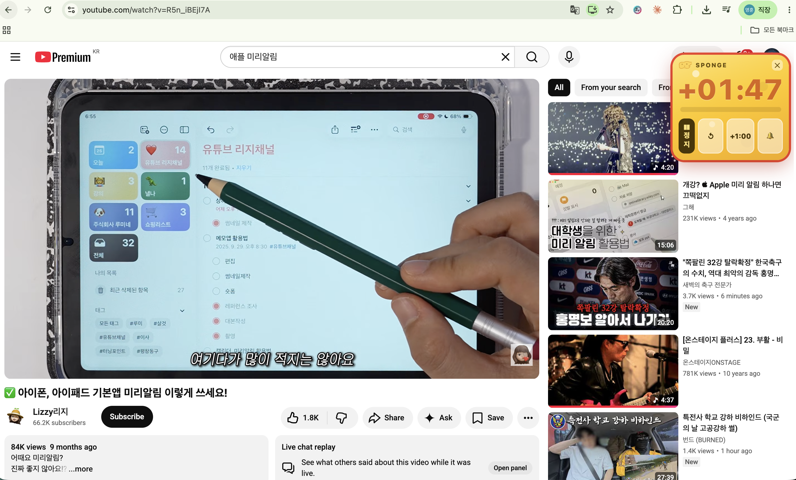

## 결과물

발표 시간을 딱 맞추려고 시작했지만, 일상에서도 쓰게 만든 **크롬 타이머**다. 보고 있는 페이지 위에 작은 타이머가 떠 있고(드래그로 이동), 남은 시간이 줄면 색과 소리로 알려준다.

- 코드: [`presentation-timer/`](presentation-timer) · 설치/사용법은 [README](presentation-timer/README.md)
- 핵심 기능
  - **두 모드**: 카운트다운 타이머 + 스톱워치(0부터 경과 시간 재기)
  - 페이지 위 **플로팅 오버레이**(드래그로 위치 이동)
  - **단축키**로 팝업 없이 바로 띄우고 시작·정지 (`⌘⇧Y` 타이머 / `⌘⇧U` 스톱워치)
  - 색상 경고: 초록 → 노랑(30초) → 빨강(10초) → 초과 시 깜빡임
  - 소리 알림: 30초·10초·종료 시점 비프음
  - 초과 시 `+00:15`처럼 넘긴 시간 표시 / `+1:00` 즉석 연장
  - 프리셋: 1·3·5·7·10분 + 뽀모도로 25분·휴식 5분 + 직접 입력
- 디자인은 스폰지클럽 심볼을 살려 노란 스폰지 테마 + 스톱워치 다이얼 아이콘으로 통일했다.

**실제 동작 화면** — 유튜브 영상을 보는 페이지 위에 타이머가 떠서, 정해둔 시간을 초과한 만큼(`+01:47`) 빨갛게 표시되고 있다.

## 삽질 과정

이번엔 바로 "만들어줘"라고 하지 않고, **상황·해야 할 일·의도·고려사항**을 적어준 뒤 _만들기 전에 필요한 걸 되물어 달라_고 했다. 그랬더니 AI가 표시 위치(팝업 vs 플로팅), 알림 방식, 시간 설정, 디자인 강도를 먼저 물어봤고, 답하면서 스펙이 또렷해졌다. 막혔던 지점은 이랬다.

- **팝업으로는 부족했다.** 익스텐션 팝업은 다른 곳을 클릭하면 닫혀서 발표 중에 계속 볼 수가 없다. 그래서 페이지 위에 떠 있는 플로팅 오버레이로 바꿨다.
- **소리가 안 울렸다.** 브라우저가 사용자 클릭 없이는 소리를 막는다(자동재생 정책). 그래서 오버레이의 **▶ 버튼을 누를 때 시작**하도록 해서 그 클릭으로 소리 잠금을 풀었다.
- **새로고침하면 시간이 사라졌다.** 숫자를 직접 깎던 방식이라 그랬다. '남은 시간' 대신 **끝나는 시각(절대시각)**을 저장해 매 순간 (끝나는 시각 − 지금)으로 계산하니, 다시 띄워도 이어졌다.
- **권한 욕심을 줄였다.** 모든 사이트 권한을 쓰면 "모든 웹사이트 데이터 읽기" 경고가 뜬다. `activeTab`으로 바꿔 내가 켠 탭에만 동작하게 했다.
- **발표 전용처럼 느껴졌다.** 1차로 만들고 보니 이름·문구가 발표에 묶여 일상에서 손이 안 갔다. 그래서 원래 요구였던 '시간 재기'에 맞게 **스톱워치 모드**를 더하고, 팝업 없이 **키보드 단축키**로 바로 띄우게 해서 일상 타이머로 굳혔다.
- **경로가 한글+공백이라 불안했다.** 제출 폴더(`1주차 과제 제출 폴더`) 안에 뒀더니 터미널에서 그 경로로 들어가다 에러가 났다. 크롬 로드는 되지만, 실제 쓰는 버전은 영문 경로(`~/sponge-timer`)에 두고 제출 폴더엔 코드·스크린샷만 남겼다.

## 인사이트

만들 결과물을 설명하기보다 **어떤 맥락에서 쓸지**를 주고 AI가 되묻게 하니, 내가 놓친 빈칸(소리·새로고침·권한)을 먼저 채울 수 있었다. 그리고 한 번에 완성하기보다, 써보고 "이건 일상에서 안 쓰겠다" 싶은 지점을 다시 맥락으로 돌려주니 도구가 내 쓰임에 맞게 자랐다.

---

# 추가 제출 — 개인 지식 OS (위키 + 회의록 적층 + 액션 아이템)

## 결과물

흩어져 있던 내 지식(메모·규칙·문서)을 **그래프 위키**로 시각화하고, 거기에 **Plaud 녹음기로 녹음한 미팅이 매일 아침 자동으로 쌓이는** 개인 지식 OS다. 미팅에서 "내가 다음에 해야 할 일"까지 AI가 뽑아준다.

- 코드: [`plaud-wiki-os/`](plaud-wiki-os) · 설치/사용법은 [README](plaud-wiki-os/README.md)
- 핵심 기능
  - **지식 그래프 위키**: 마크다운 지식을 한 장의 HTML로 — 노드 클릭하면 문서, 연결선은 문서 간 참조. 완전 로컬(외부 요청 0)
  - **대화형 챗**: 위키 옆 챗창에 질문하면 내 지식에서 검색해 답변 + 출처 노드 하이라이트 (로컬 의미검색)
  - **회의록 자동 적층**: 대면 미팅은 Plaud 디바이스, 유선 미팅은 통화녹음을 Plaud 앱에 업로드 → 매일 아침 8시 AI 요약이 위키 노드로 자동 추가되고, 언급된 기존 지식과 자동으로 연결됨 (공식 Plaud MCP 사용)
  - **액션 아이템 산출**: 새 미팅마다 "내가 다음에 할 일"을 AI가 추출해 노드에 체크박스로 기록 (+ 텔레그램 배달 옵션)
  - **덜어내기 도구**: 위키 화면에서 노드 삭제/숨기기 — 지식은 쌓는 것보다 버리는 게 어렵다는 걸 만들면서 배웠다

## 삽질 과정

- **비공식 API의 유혹.** 처음엔 Plaud 웹을 리버스엔지니어링한 비공식 API로 붙이려 했다. 만들다가 "이거 Plaud가 웹 바꾸면 그날로 죽는데?" 싶어서 공식 MCP로 갈아탔다. 문제는 MCP가 원래 '대화 중인 AI'용 프로토콜이라 무인 스케줄러랑 안 맞는다는 것 — 결국 **헤드리스 클로드(`claude -p`)를 크론처럼 돌려서 MCP를 대신 호출하게** 했다. 가져오기만 AI가 하고, 나머지 처리는 전부 일반 파이썬이라 비용도 거의 안 든다.
- **AI 코드리뷰가 데이터 소실을 잡았다.** 같은 날 같은 제목("주간 미팅")으로 두 번 녹음하면 파일명이 겹쳐서 두 번째 녹음이 조용히 사라지는 버그가 있었다. 사람이면 놓쳤을 텐데, 구현한 AI와 **다른 AI에게 리뷰를 시키니** 재현 스크립트까지 만들어서 증명해줬다. 파일명에 고유 해시를 붙여 해결.
- **"숨기기" 하나 눌렀는데 문서 21개가 사라졌다(뻔했다).** 노드 숨기기를 파일명으로 매칭했더니, 같은 이름의 파일이 21개라 전부 같이 숨어버리는 설계였다. 이것도 리뷰에서 걸렸고, 고유 ID 매칭으로 고쳤다. 파일명은 유일하지 않다 — 뼈에 새겼다.
- **만들다가 진짜 문제를 발견했다.** 그래프를 처음 띄웠더니 고립된 노드가 75개였다. 연결 안 된 지식이 4분의 1이라는 뜻. 그 순간 깨달은 건 "더 쌓는 도구"가 아니라 **"덜어내는 도구"가 필요하다**는 것 — 그래서 삭제/숨기기 기능을 우선 만들었고, 같은 날 클로드코드 스킬도 130개 → 15개로 정리했다. 시스템이 가벼워지니 답변도 빨라졌다.
