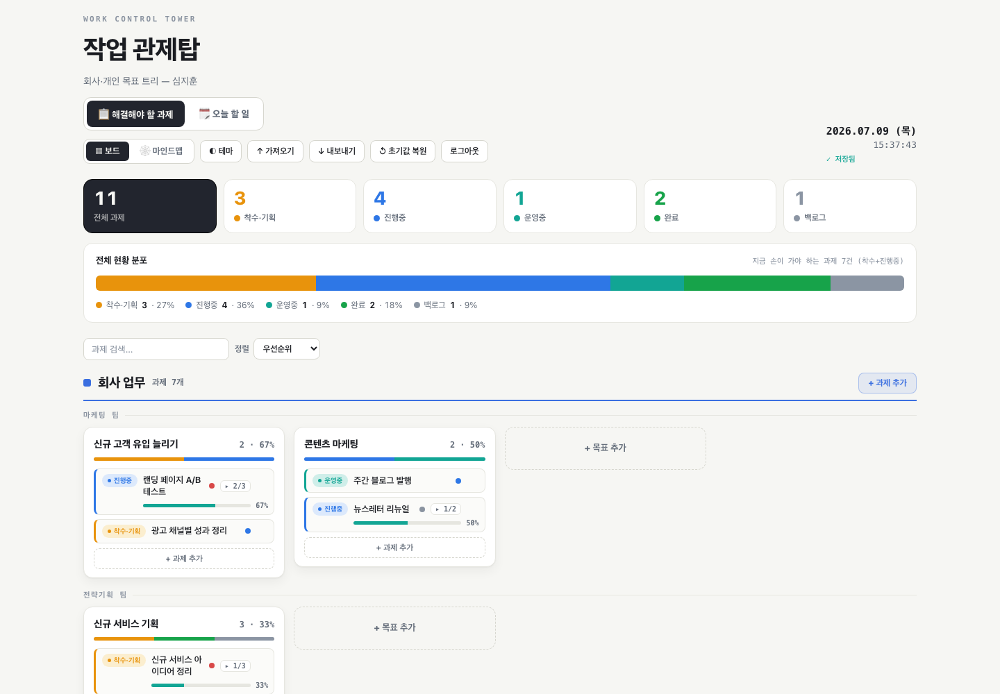
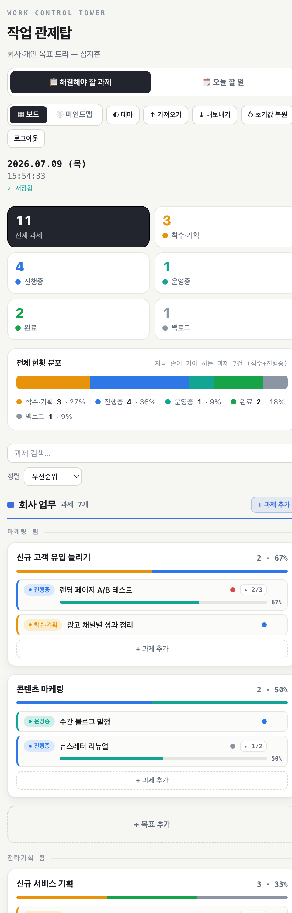

# 2주차 — 내 OS 구현하기 🚀

> 미션을 진행하며 **기획 → 구현 → 삽질 → 결과물 → 인사이트** 를 상세히 기록해주세요.
> (다 못 채워도 OK, 한 것 위주로!)

## 🎯 미션 1. 내 OS 만들기
> **[ 내 삶을 돕는 OS ]** 또는 **[ 콘텐츠 OS ]** 중 하나를 선택해 완성해주세요.

**✅ 선택:** **내 삶을 돕는 OS** — 🗼 **작업 관제탑(Work Control Tower)**

### 📐 기획
> 무엇을, 왜, 어떻게 만들지

- **무엇:** 회사 업무와 개인 목표를 **하나의 목표 트리(P1~P5)** 로 묶어, 할 일·진행율·일정을 한 화면에서 관제하는 나만의 로컬 웹앱.
  - P1 회사/개인 → P2 팀(마케팅·전략기획) → P3 목표(SEO·GEO, EMBA 등) → P4 세부 할 일 → P5 프로세스 단계(진행율 %)
- **왜:** 1주차 '1초 가계부'가 *돈* 하나를 정리해줬다면, 정작 매일 머리를 어지럽히는 건 **회사 일과 개인 목표가 노션·메모·머릿속에 흩어져 있는 것**이었다. "지금 뭐부터 해야 하지"를 매번 재구성하는 게 진짜 마찰점. 노션 같은 데 붙어 있지 않고, **폰에서 채팅 한 줄로 던지면 알아서 정리**되는 개인 관제탑이 필요했다.
- **어떻게:**
  - 노션 같은 SaaS에 종속되지 않도록 **데이터는 내 파일 하나(`data/state.json`)에 영구 저장**.
  - **집에 있는 맥미니에 24시간 상주**시켜, 맥북을 꺼도 폰에서 항상 접속되게.
  - **텔레그램 봇**으로 "14:00 에이블리 미팅"처럼 채팅으로 던지면 일정 저장 + 회사/개인 자동 분류 + 15분 전 알림.
  - **추가 과금 없이** — 텔레그램 봇의 '알아서 분류·정리'하는 두뇌는 **Claude Agent SDK**를 붙여 구현했다. 이미 쓰고 있는 클로드 구독을 그대로 물려, 별도 API 요금 없이 봇이 문장을 이해하고 회사/개인·시간을 판단하게 만들었다.

### ⚙️ 구현
> 실제로 만든 것 (링크·스크린샷 — 이미지는 `이미지첨부/` 폴더에)

클로드 코드로 **제로 의존성 Node 서버 한 장(`server.js`)** + 대시보드(`public/index.html`)로 만들었다. 개발 순서가 그대로 기록에 남아 있다:

- **7/8** — 초기 구축. 보드 뷰(목표 카드+할 일+진행율)와 마인드맵 뷰, 로그인, 파일 저장까지. 처음엔 집 와이파이(LAN)에서 비밀번호 로그인으로 돌림.
- **7/8** — **서비스화.** 맥미니 launchd(`com.jihoon.tower`)에 등록 → 껐다 켜도, 맥북이 꺼져 있어도 24시간 자동 실행되는 '진짜 서비스'가 됨.
- **7/9** — 대형 업데이트: ① **회사/개인 영역 분리**(일정마다 `domain: company/personal`, 캘린더 상단 전체·회사·개인 필터, 개인 일정은 주황 뱃지) ② **모바일 캘린더**(가로 스크롤 제거, 날짜 터치 → 일정 팝업) ③ **무인증 모드** ④ **텔레그램 봇 도메인 자동 인식**.
- **7/9** — 텔레그램 봇 버그 수정 + **브리핑 기능**(`/brief`·`/today`, 매일 아침 8시 자동 브리핑, 일정 15분 전 알림).
- **봇의 두뇌 = Claude Agent SDK (무과금).** 봇이 자연어를 이해하고 회사/개인·시간을 판단하는 부분은 Claude Agent SDK로 붙였다. 쓰던 클로드 구독을 그대로 물려서 **API 추가 요금 0원**으로 '알아서 분류·정리'가 돌아간다.

> 이 서비스는 **Tailscale 사설망(맥미니)에서만** 접속되는 개인 전용이라(공개 URL 없음, 외부 노출·과금 0), 크루들이 바로 열어볼 공개 링크는 없다. 대신 화면을 캡처해 첨부한다.
>
> **📸 작동 화면** (개인정보 보호를 위해 실제 회사 데이터는 빼고, 예시 데이터로 띄운 화면)
>
> 
> *보드 뷰 — 회사/개인 목표를 팀·목표별 카드로, 상태(착수·진행·운영·완료·백로그)와 진행율 %까지 한눈에.*
>
> 
> *모바일 뷰 — 폰에서 세로로 꽉 차게. 실제로는 여기에 텔레그램으로 던진 일정이 실시간으로 쌓인다.*

### 🧗 과정에서의 삽질
> 막혔던 지점, 시도한 방법, 어떻게 풀었는지 솔직하게

- **"맥북 꺼지면 폰에서 안 열림."** 처음엔 맥북에서 서버를 돌렸는데, 맥북을 닫으면 폰 접속이 끊겼다. → **맥미니를 상시 서버로** 삼고 launchd에 등록해 24시간 상주시켜 해결. "개발용 사본(맥북) / 라이브(맥미니)"를 분리하고, 코드만 `scp`로 배포하는 습관을 들였다.
- **집 밖에선 접속이 안 됨(그리고 집 IP가 계속 바뀜).** LAN IP가 `192.168.0.114` → `192.168.50.94`로 왔다 갔다 해서 주소가 안 고정됐다. → **Tailscale**을 깔아 고정 IP `100.x.x.x:4732`로 어디서든 접속. (폰이 안 뜨면 십중팔구 폰 Tailscale가 꺼진 거였다 — 이게 1순위 체크포인트라는 걸 몸으로 배움.)
- **나 혼자 쓰는데 매번 비밀번호 로그인하기가 귀찮음.** → 사설망 안에서만 도는 개인 서비스라 **무인증 모드**를 켜되, CSRF·Host 검증 같은 방어는 그대로 유지. "편의 ↔ 보안"에서 내 상황(사설망·1인)에 맞게 선을 그은 결정.
- **텔레그램 봇이 회사/개인을 자꾸 헷갈림.** "PT 예약"을 회사 일정으로 넣는 식. → 봇 프롬프트에 **오늘 날짜 + 도메인 판단 규칙**(사적=personal / 업무=company, 애매하면 company)을 넣어 자동 분류 정확도를 올림.

### ✅ 결과물
> 완성한 것 / 작동 화면

- **🗼 작업 관제탑** — 맥미니에서 24시간 도는 개인 관제 OS. 실제로 매일 쓰는 중(데이터 파일이 계속 갱신되고 있음).
- **핵심 기능:** 목표 트리(P1~P5) 보드/마인드맵 뷰 · 회사/개인 영역 분리 캘린더 · 진행율 % 추적 · 모바일 대응 · **텔레그램 봇(Claude Agent SDK)으로 채팅 한 줄 → 일정 저장·자동 분류·15분 전 알림·매일 아침 브리핑** · 무노출·무과금(Tailscale 사설망 + 구독 재활용).
- **작동 화면:** 위 '구현' 섹션의 보드/모바일 캡처 참고(`이미지첨부/` 폴더).

**📱 지금 실제로 어떻게 쓰고 있나 — 거의 개인 비서처럼**
텔레그램 봇(`@내 봇`)과 연동해두니, 대시보드를 켜지 않아도 **폰에서 채팅 한 줄로 다 굴러간다.** 하루 흐름이 이렇다:

- **아침** — 8시에 봇이 먼저 말을 건다. 오늘 일정 + 급한 과제를 🏢 회사 / 🏠 개인으로 나눠서 **자동 브리핑.** 눈뜨자마자 "오늘 뭐부터"가 정리돼 있음.
- **낮 (이동 중·미팅 중)** — 생각날 때 그냥 던진다. `"14:00 에이블리 미팅"`, `"금요일 PT 예약"` 처럼. 봇이 알아서 시간 파싱 → 일정 저장 → 회사/개인 자동 분류 → 관제탑에 꽂아준다. 노션 켜고 입력하는 그 귀찮음이 0이 됨.
- **일정 직전** — 시간 있는 일정은 **15분 전에 알림**이 온다. (예: 19:00 PT → 18:45 알림) 까먹고 지나치는 게 사라졌다.
- **아무 때나** — `/brief`나 `/today` 치면 지금 상황을 다시 브리핑. "내가 지금 뭘 놓치고 있지?"를 즉시 확인.

즉 **관제탑 = 데이터가 쌓이는 본체, 텔레그램 = 매일 대화하는 비서 창구**. 이 둘을 붙여놓으니 "관리 도구를 관리하는" 부담 없이, 말 걸면 알아서 정리해주는 비서를 하나 둔 느낌으로 쓰고 있다.

### 💡 알게 된 인사이트 & 공유하고 싶은 내용
> 하면서 깨달은 것, 크루들과 나누고 싶은 것

- **"만드는 것"보다 "계속 돌게 하는 것"이 진짜 OS.** 1주차엔 HTML 한 장으로 끝났는데, 2주차엔 "맥북을 꺼도 폰에서 열려야 한다"는 요구가 생기면서 **launchd 상시 실행 + Tailscale 원격 접속 + 배포 절차**까지 붙었다. 앱을 '띄우는' 게 아니라 '서비스로 살려두는' 감각을 처음 배웠다.
- **개인 서비스의 보안은 '전부 잠그기'가 아니라 '내 상황에 맞게 선 긋기'.** 사설망 1인용이라 로그인은 뺐지만 CSRF·Host 방어는 남겼다. 무조건 조이는 게 아니라 위협 모델을 정하고 그에 맞추는 것.
- **입력의 마찰을 없애니 진짜로 쓰게 된다.** 대시보드를 아무리 잘 만들어도 "앱 켜고 입력"이 귀찮으면 안 쓴다. 텔레그램에 한 줄 던지는 순간부터 매일 쓰는 도구가 됐다. → **크루들에게: 자기 OS의 '입력 통로'를 이미 매일 쓰는 앱(카톡·텔레그램)에 붙여보길 강추.**
- **"AI 비서 = 매달 돈"이 아니다.** 봇의 자연어 이해·분류는 **Claude Agent SDK**로 붙이고 **쓰던 클로드 구독을 그대로 물려서 API 추가 요금 0원**으로 돌린다. 별도 서버·유료 API 없이 맥미니 + 구독만으로 개인 AI 비서가 가능하다는 게 이번 주 가장 큰 수확. → **크루들에게: 자동화에 지레 겁먹지 말 것. 이미 있는 구독으로 무과금 세팅이 된다.**

## 📣 미션 2. 유닛 활동 참여 & SNS 공유
> 유닛 활동에 적극 참여(유닛원으로서 or 참가자로서)한 뒤, 그 경험을 SNS에 올리기

- **참여한 유닛 / 활동:**
- **무엇을 했나 (경험):**
- **SNS 인증 링크:**