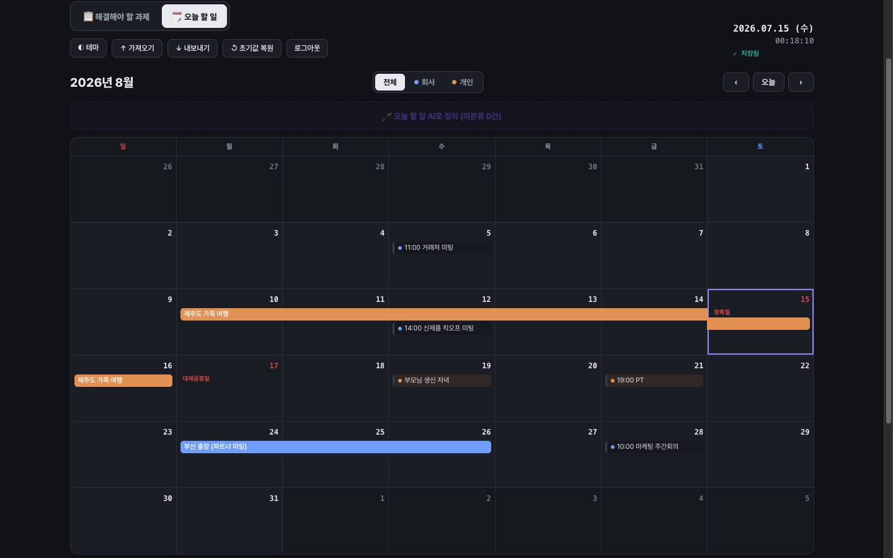
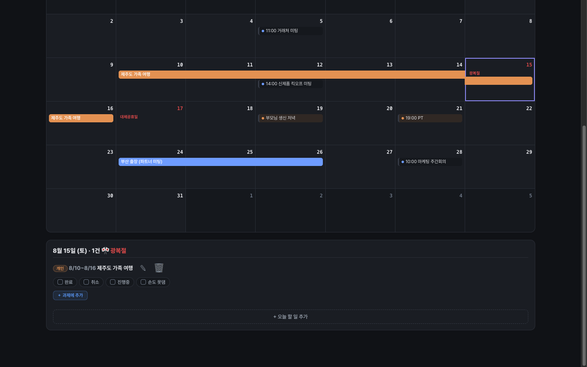

# 3주차 — 내 OS 최종 완성 🏁

> 미션을 진행하며 과정과 결과를 기록해주세요. (다 못 채워도 OK, 한 것 위주로!)

## 🎯 미션 1. 내 삶을 돕는 OS 최종 완성
> 지금까지 공유하며 받은 **피드백을 반영해 최종 완성**!

- **완성한 것 (무엇을):**
  - 2주차에 낸 **🗼 작업 관제탑**(맥미니 24시간 상주 + 텔레그램 비서)을 그대로 **일주일 내내 실사용**하면서, 쓰다가 걸리는 마찰만 골라 지우는 방식으로 최종본을 만들었다. 이번 주에 새로 붙은 것:
  - **① 기간(며칠짜리) 일정** — 지금까지는 모든 일정이 "하루짜리"만 됐다. 여행·출장처럼 며칠에 걸치는 일정을 넣으면 시작일 하루에만 박혀서 달력이 거짓말을 했다. → 일정에 종료일을 추가해 **캘린더에 주 단위 막대로 걸쳐서 표시**되게 하고, 텔레그램 봇도 "8/10~16 제주 여행", "3박4일 출장" 같은 말을 알아듣고 기간 일정으로 넣게 했다. **아침 브리핑도 기간 중이면 매일 "(~8/16)" 꼬리표를 달고 알려준다.**
  - **② 대한민국 공휴일 내장** — 회사 일정을 잡을 때마다 "그날 빨간날인가?"를 확인하러 달력 앱을 따로 열고 있었다. → 2025~2028년 공휴일(대체공휴일·선거일 포함)을 내장해서 **캘린더에 빨간 날짜 + 공휴일 이름**이 바로 뜬다. 날짜를 누르면 상세 헤더에도 🎌 공휴일명이 표시된다.
  - **③ 코드에 git 버전관리 도입 + 정리** — 일주일 만에 기능이 눈덩이처럼 붙어서 서버 한 장 + 화면 한 장이 1,900줄이 됐다. "정리 전 스냅샷"을 커밋으로 박아두고 코드 정리를 진행 — 이제 뭘 고쳐도 되돌릴 수 있는 상태에서 고친다.

- **피드백 반영한 점:**
  - 솔직 고백: **토크데이(7/12)에 참석하지 못해서 크루 피드백은 받지 못했다.** 대신 이번 주의 피드백 소스는 **"매일 쓰는 나 자신"**이었다. 위 3가지가 전부 실사용 중에 걸린 마찰에서 나왔다 — 여행 일정을 넣다가(→기간 일정), 미팅 잡다가 달력 앱을 또 열다가(→공휴일), 코드 고치기가 겁나다가(→git).
  - 또 하나의 자체 점검 장치로, **관제탑 기능을 하나하나 빼먹지 않고 발표자료(PDF)로 전수 정리**해봤다. 남에게 설명한다고 가정하고 기능을 전부 나열해보니 "있는 줄도 몰랐던 기능"과 "없는 줄 알았던 마찰"이 같이 드러났고, 그게 위 개선 목록의 출발점이 됐다.

- **결과물 (링크·스크린샷 — 이미지는 `이미지첨부/` 폴더에):**
  - Tailscale 사설망 전용(공개 URL 없음·외부 노출 0·과금 0)이라 공개 링크는 없다. 전체 화면(보드뷰·마인드맵뷰·캘린더뷰·모바일뷰)은 **2주차 제출 폴더의 `이미지첨부/`** 캡처 참고. 아래는 이번 주에 새로 붙은 기능 화면(개인 일정 보호를 위해 **예시 데이터**로 띄운 목업 화면):

  
  *새 캘린더 — 🎌 공휴일이 빨간 날짜+이름으로 표시되고(8/15 광복절·8/17 대체공휴일), 며칠짜리 일정이 주 단위 막대로 걸쳐 표시된다(🟠 개인 여행 8/10~16, 🔵 회사 출장 8/24~26).*

  
  *날짜를 누르면 상세 패널 헤더에 🎌 공휴일명이 뜨고, 기간 일정은 "8/10~8/16"처럼 기간째 표시된다.*
  - 최종 스펙 요약: 목표 트리(P1~P5) 보드/마인드맵 뷰 · 회사🔵/개인🟠 분리 캘린더(**+공휴일·기간 일정**) · 진행율 % 추적 · 모바일 대응 · 텔레그램 봇(Claude Agent SDK, 무과금) — 채팅 한 줄 → 일정 저장·자동 분류·15분 전 알림·매일 아침 8시 브리핑 · 맥미니 launchd 24시간 상주.

- **알게 된 인사이트:**
  - **"최종 완성"은 기능을 더 붙이는 게 아니라, 매일 쓰면서 걸리는 마찰을 지우는 것이었다.** 이번 주에 붙인 건 셋 다 화려한 신기능이 아니라 "쓰다가 짜증났던 것"의 제거다. 안 쓰는 OS에는 마찰 목록 자체가 안 생긴다 — **실사용이 곧 피드백 루프**다.
  - **피드백을 못 받는 상황에도 피드백 소스는 만들 수 있다.** 크루 피드백이 없으면 ① 내 사용 로그 ② "남에게 설명한다" 가정하고 전수 정리(발표자료화) — 이 둘이 꽤 훌륭한 대체재였다.
  - **오래 쓸 물건이 되는 순간 버전관리가 필요해진다.** 1주차 HTML 한 장 → 2주차 "서비스로 살려두기"(launchd·Tailscale) → 3주차 "안심하고 고칠 수 있게 하기"(git). OS가 성장하는 단계마다 요구되는 인프라가 다르다는 걸 몸으로 배웠다.

## 📣 미션 2. 스폰지 토크데이 SNS 후기
> 오늘 토크데이 후기를 SNS에 올리기 (**#스폰지클럽 필수 · 셀 3개 지급!**)
- **후기 내용:** 개인 사정으로 토크데이에 참석하지 못해 후기를 쓸 수 없었습니다. 다음 오프라인 기회에는 꼭 참여해서 크루들 OS를 직접 보고 오겠습니다. 🙏
- **SNS 인증 링크:** (불참으로 생략)
