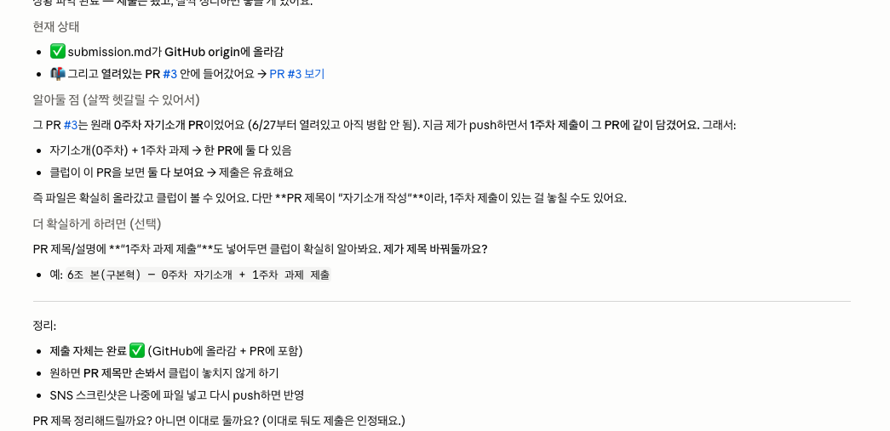
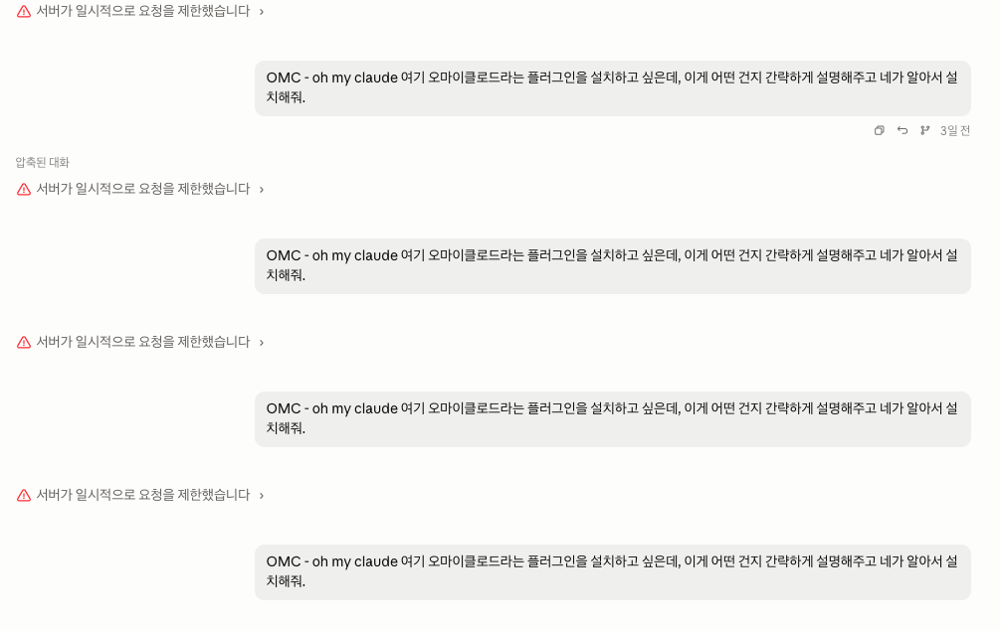

## 결과물

**내 OS: "영감 수집함"** — 흩어지는 영감을 가볍게 모아, 막힐 때 새 조합으로 꺼내주는 OS.

**① 내 OS 재료 찾기 (인터뷰)**
인터뷰 스킬로 '재료 카드'를 도출했다.
- **신념**: *영감은 모일수록 강해진다*
- **걸리는 지점**: 이미지·영상·간판·대화 등 영감을 줍긴 줍는데 여기저기(인스타·카톡·유튜브) 흩어져 정작 필요할 때 못 꺼낸다
- **OS가 된다면**: 가볍게 던진 영감이 쌓였다가, 막힌 순간 새 조합(히든카드)으로 와준다
- **한 문장**: "혼자 쥐어짜지 않고, 쌓아둔 영감이 알아서 새 아이디어로 와준다"

**② 내 OS 기획 (3단계 가정 → 1단계부터)**
- **1단계**: 혼자 '영감 수집함' (이번 주)
- **2단계**: 흐릿한 검색 + 막힐 때 추천
- **3단계**: 동료들과 공동 풀 → 섞어서 새 아이디어 추천
- 최대 리스크가 *"수집이 의무가 되면 안 하게 됨"*이라, 1단계는 기능을 늘리기보다 **'가볍게 던지는 습관'이 붙는지**를 먼저 검증하는 데 초점을 뒀다.

**③ 내 OS 구현 (클로드코드 '채널' 기능)**
텔레그램 봇으로 '영감 수집함'을 실제로 구축했다.
- 폰에서 **이미지·링크·메모·영상**을 던지면 → 자동으로 **태그 + 아트 디렉터 시선 코멘트**를 붙여 `references/날짜.md`에 저장
- 영상은 **ffmpeg로 한 장면을 뽑아** 분석해서 태그
- **"아이디어 줘"** 하면 쌓인 영감을 무작위로 섞어 **새 조합을 제안** (2단계 추천 일부를 선구현)
- 실제로 영감 5개 저장·작동 확인 (예: Suno 광고, 하이볼 여름 포스터, 픽셀 크리처 영상, "회피말고 해피하자" 카피)

**실제 저장 예시** — 텔레그램으로 던진 광고 이미지 한 장이 이렇게 정리되어 쌓인다:

```
## 08:40 · 이미지
- 내용: assets/2026-07-01_0840_suno-ad.jpg
- 태그: #타이포 #Y2K #크롬 #라임그린 #스트리트 #AI서비스 #광고
- 코멘트: "머릿속 그 멜로디 지금 세상 밖으로" — Suno 인스타 광고. 볼드 한글
        카피 + Y2K 패션(크로쉐 비니, 크롬 선글라스, 별 스티커) 조합이 AI 뮤직
        서비스를 감각적으로 포장한 레이아웃.
- 구분: External
```

**제출 확인 스크린샷**:



## 삽질 과정

- **텔레그램 봇이 자꾸 엉뚱한 폴더에 묶임** — 봇은 Claude 세션 1개에만 연결되는데, 여러 세션이 봇 하나를 두고 경쟁해서 OS 폴더가 아닌 세션이 자꾸 가로챘다. 프로세스까지 추적해 범인 세션을 찾아 정리하고, 채널을 OS 세션 하나로 고정해 해결.
- **권한 확인창이 계속 뜸** — 매 저장마다 허락을 물어 흐름이 끊겼다. `settings.local.json`에 필요한 도구·폴더(텔레그램 inbox) 접근을 미리 허용해 조용히 돌게 만듦.
- **사진에 ffmpeg가 잘못 돌아 에러** — 영상용 규칙이 사진에도 적용되려다 실패. 규칙을 명확히 나누고 ffmpeg를 설치해 영상 프레임 분석까지 작동시킴.
- **크레딧(사용량) 부족으로 흐름이 자주 끊김** — 작업 중간중간 사용 한도에 걸려 세션이 멈추고, 다시 이어가는 데 시간이 걸렸다. 한 번에 쭉 진행하지 못하고 끊겼다 이어붙이며 진행하다 보니 맥락을 다시 잡는 데 품이 들었다. 다음번엔 한도를 미리 확인하고 작업 단위를 더 짧게 끊어야겠다는 걸 배움.

  

## 인사이트

**"영감은 모일수록 강해진다" — 그런데 그 시작은 '가볍게'다.** OS는 거창한 자동화가 아니라 *내 하루가 통과하는 길*이었고, 아무리 좋은 기능도 '의무'가 되는 순간 안 쓰게 되기에 — 가장 중요한 설계 원칙은 기능이 아니라 **부담 없음**이었다.

## SNS 1주차 소감 (미션 4)

인스타그램에 1주차 회고를 직접 올렸습니다.

🔗 https://www.instagram.com/reel/DaOumCzhKp8/

> "기대하던 스폰지클럽 1주차가 마쳤다! 생각보다 설치할 게 좀 있었고 알아야 할 것들이 좀 있었지만, 과제를 하면서 그리고 다시보기를 하면서 조금씩 이해했다…"


