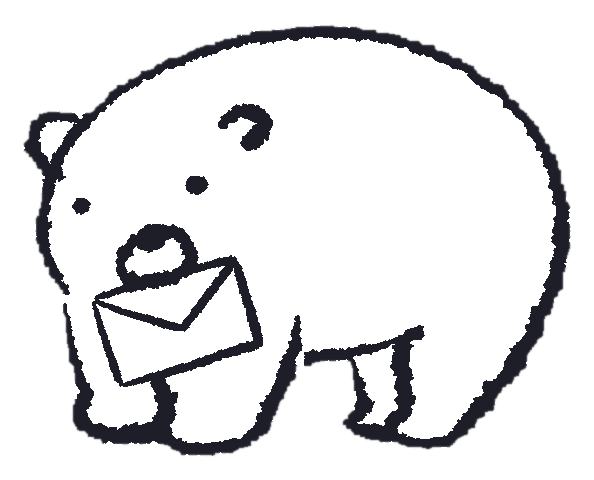
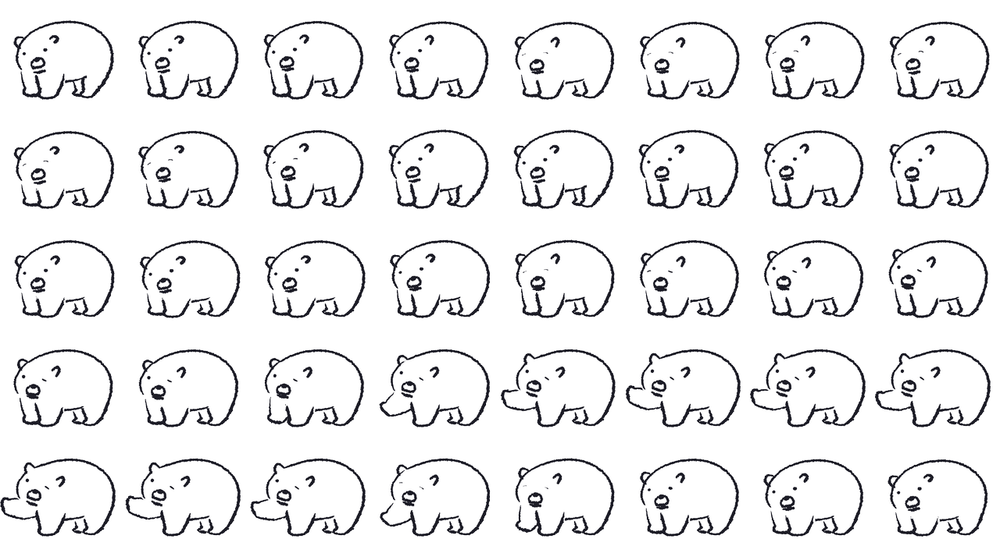

# 4주차 — 기획·구현 → 검증 → 기록 🧪

> 과제를 진행하며 과정과 결과를 기록해주세요. (다 못 채워도 OK, 한 것 위주로!)

## 🎯 과제 1. PRD 기획 및 구현
> 주요 가치 · 페르소나 · 소구 방식을 담은 PRD → 구현까지

**내 OS: 물어(mureo)** — "고민을 물어보면, 답을 물어다 줘요." 이름은 *물어보다 + 물어오다*의 중의어이고, 캐릭터가 곰인 이유는 "생각을 **곰곰이** 해서"다. 내가 직접 그린 곰 낙서를 캐릭터로 살렸다.

- **다운로드(URL 하나로 설치):** https://ttokddidownload.vercel.app — 애플칩/인텔 맥 모두 지원(각 칩 전용 빌드), Claude AI 내장이라 **설치하는 사람은 API 키가 필요 없다.**
- **설문(유저 테스트):** https://forms.gle/CMGuqLc1fHULV1hS9

- **주요 가치:**
  1. **덜어냄** — 사이트도 AI 사이트도 안 거치고, 화면에 떠 있는 곰 클릭(또는 ⌥+Space) 한 번이면 끝. 결정하는 그 '순간'에 바로 발동.
  2. **나를 아는 결정** — 매번 백지에서 시작하는 GPT와 달리, 물어는 내 과거 고민·결정·기준을 누적 기억해 "너 지난번에도 그랬잖아"처럼 나에게 맞춘 답을 준다.
  3. **거들기(명령 X)** — "나라면 ~", "~하는 게 어때"처럼 절친이 거들듯. 결정은 언제나 사용자의 몫.

- **페르소나:** 하루에도 사소한 결정(뭐 먹지·살까 말까·지금 할까)에 자주 붙잡히는 사람. 특히 **혼자 결정하는 1인 사업자/프리랜서**(상의할 사람이 없어 매 순간 혼자 판단)와 **결정 피로가 큰 2030**을 핵심으로 봤다.

- **소구 방식:** "결정되면? 물어가 곰곰이 정해줘." — 사이트 방문 없이 **화면에 상주하는 캐릭터 + 단축키**로 접근 마찰을 0에 가깝게. 무료 URL 설치로 진입장벽을 없애고, 캐릭터 애착으로 재방문을 만든다.

- **구현한 것 (링크·스크린샷 — 이미지는 `이미지첨부/` 폴더에):**
  - **네이티브 맥 앱(Electron)** — 프레임 없는 투명 창이 항상 위에 떠 있고, 빈 곳은 클릭이 통과돼 작업을 방해하지 않는다. 곰 위에서만 상호작용.
  - **키 숨김 프록시(Vercel)** — 앱은 내 서버(프록시)를 부르고, 서버가 Claude Haiku·Groq Whisper를 호출한다. **API 키는 서버에만** 있어 남들이 키 없이 그대로 쓴다.
  - **복잡한 고민은 선택지로 좁히기** — 고민이 막연하면 AI가 먼저 두세 갈래 선택지를 띄워(Claude의 질문식) 맥락을 좁힌 뒤 답한다.
  - **음성 입력(Typeless식)** — 🎤 버튼 또는 ⌥+Space 두 번이면 말로 고민을 넣고, Whisper가 텍스트로 옮긴다.
  - **"나를 기억"(차별화의 핵심)** — 답변마다 곰이 나에 대해 알게 된 것을 누적 저장하고, 다음부터 그걸 반영해 답한다. (예: "시킨 다음날 항상 후회한다고 했잖아 — 이번엔 참는 게 너다워") 프라이버시용 *기억 지우기*도 넣었다.
  - **살아있는 캐릭터 애니메이션** — 내 낙서 곰을 AI로 움직임 영상화한 뒤 프레임을 뽑아 스프라이트로 만들었다. 평소엔 가만히, 마우스를 올리면 얼굴만 갸우뚱, **답을 줄 땐 화면 밖으로 총총 걸어나갔다가 입에 편지를 물고 걸어 들어온다**('물어오다'를 그대로 연출).

  

  

## 🗣 과제 2. 유저 피드백 받기
> 실제 2명 이상 + 플러스 알파로 가상 페르소나

- **실제 유저 피드백 (2명 이상):**
  - 설문지를 만들어 배포 중 — https://forms.gle/CMGuqLc1fHULV1hS9 (설치·사용 후 "안 쓸 이유"와 GPT 대비·지불의사를 묻는 11문항)
  - *(수집된 실제 응답 2명 이상을 이 자리에 정리 예정)*

- **가상 페르소나 피드백:** 통계 기반 한국인 페르소나 5인 패널(20~50대·학생/1인사업자/주부/테크 회의론자/시니어)에게 먼저 부딪혀 봤다. **가장 아팠던 지적 3가지:**
  1. **"래퍼 아니냐"** — "챗GPT로 다 되는데, 차별점이 캐릭터뿐"(취준생·테크 전문가). 방어막이 캐릭터 애착밖에 없다는 정확한 지적.
  2. **가치 밸리** — 사소한 결정엔 앱이 과하고, 중요한 결정은 AI를 안 믿는다. 그 사이 '적당히 중요한' 결정이 시장인데 좁다.
  3. **사업성 불투명** — 무료로 API를 태우면 쓸수록 적자. 오히려 "무료인데 왜 무료인지 불안하면 안 쓴다"(1인 사업자).

- **피드백에서 알게 된 것:** **"AI는 재료고, 무기는 제품이다."** 래퍼 지적을 정면으로 받아, GPT엔 없는 **'나를 기억'**을 핵심 방어막으로 넣었다. 실제로 기억을 몇 번 경험시키니 곰이 "너 원래 후회 싫어하잖아"처럼 답해, 백지에서 시작하는 챗봇과 확실히 갈렸다. 또 '무료가 불안'이라는 역설을 배워, 무료/유료 경계를 명확히 하는 게 신뢰라는 걸 알았다. 방향은 '범용'을 조금 접고 **혼자 결정하는 사람(1인 사업자)**으로 좁히는 것.

## 📣 과제 3. SNS 기록 남기기
> 기획 · 구현 · 피드백의 전 과정과 소회를 기록으로

- **기록 내용 (소회):** 이번 주는 "AI를 붙이는 것"과 "제품을 만드는 것"이 다르다는 걸 몸으로 배웠다. 처음엔 그냥 GPT 래퍼처럼 보였는데, 가상 유저가 그걸 정확히 찔러줬고 — 거기서 도망치지 않고 **"곰이 나를 기억한다"**는 한 수를 넣자 제품의 존재 이유가 생겼다. 캐릭터도 단순 이미지 컷이 아니라 실제로 걸어서 편지를 물어오게 만드니, 이름('물어오다')과 화면이 하나로 붙었다. 기술보다 **"이걸 왜 써야 하는가"**를 끝까지 붙든 한 주.
- **SNS 인증 링크:** *(업로드 후 링크 추가 예정 · #스폰지클럽)*
