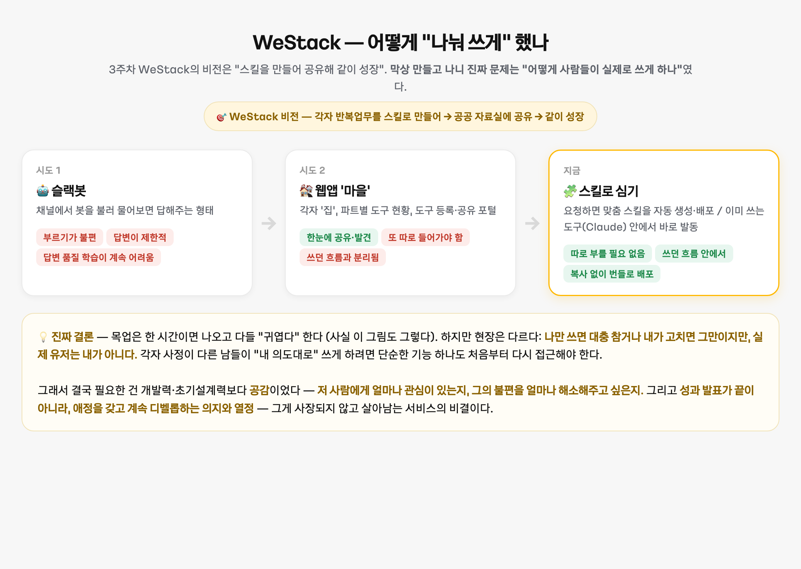
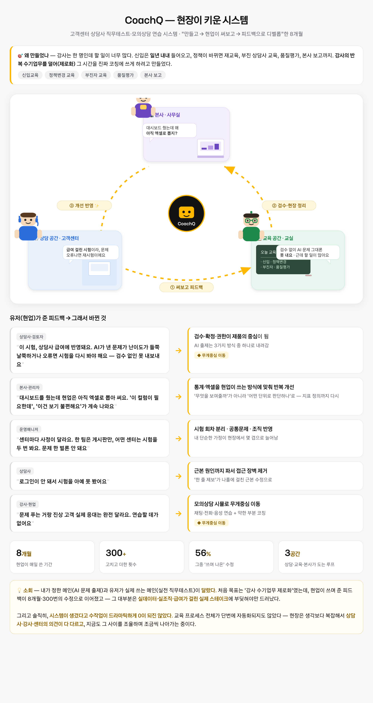

# 5주차 — 마지막 과제 🏁

> 이번 기수의 마지막 과제예요. 과정과 소회를 기록해주세요. (다 못 채워도 OK!)

> 🧩 3주차 WeStack의 비전은 "스킬을 만들어 → 공유해 → 같이 성장". 4주차엔 실제 스킬(CoachQ)을 만들었다. **이번 주 진짜 문제는 "만든 걸 어떻게 사람들이 실제로 쓰게 하나"** 였다.

## 🎯 과제 1. 구현, 그 다음의 것

> 만드는 건 끝났는데 — 그 다음이 진짜 시작이에요 (답이 안 나와 있어도 OK, 고민을 꺼내놓는 것 자체가 과제)
- **지금 걸려 있는 고민 하나:** 스킬을 만드는 것보다, **그 스킬을 남들이 실제로 쓰게 만드는 것(전달·품질)**이 훨씬 어려웠다.
- **그게 왜 고민인지 (무엇이 걸리는지):** "어디에 담아 전달하나"로 세 번 시도했는데 다 걸렸다 —
  - **① 슬랙봇** — 사람들이 봇을 부르는 것 자체를 불편해했고, 답변이 제한적이었으며, **답변 품질을 계속 학습시키는 게 어려웠다.**
  - **② 웹앱 '마을'** — 각자 '집'과 파트별 도구를 한눈에 공유하는 포털을 만들었지만, **또 따로 들어가야** 했고 쓰던 흐름과 분리됐다.
  - **③ 스킬로 심기** — 결국 사람들이 **이미 쓰는 도구(Claude) 안에 '스킬'로 심으니** 따로 부를 필요 없이 쓰던 흐름 안에서 발동됐다. (복사 설치도 어려워서 아예 스킬 번들로.)

  
  *봇도 웹앱도 아니고, 이미 쓰는 도구 안에 스킬로 심을 때 가장 자연스럽게 쓰였다.*

- **어떻게 풀어볼 생각인지:** 전달 형태는 '스킬 번들'로 방향을 잡았다. 이제 남은 건 **답변 품질** — 요청이 오면 맞춤 스킬을 자동 생성·배포하는 구조를 만들어, 품질을 사람이 매번 학습시키지 않고 스킬 자체가 근거(사내 지식)를 물고 답하게 한다.
- **필요한 게 있다면 무엇인지:** 흩어진 사용 피드백을 한 곳에 모으는 창구, 그리고 "실제로 쓰였는지"를 재는 지표.

## 🏁 과제 2. 구현 마무리 + 실제 유저 피드백 받기

> 시작할 때 "이번엔 이건 꼭 만들겠다" 했던 것 — 지금 어디까지 왔나요? (스폰지클럽 내 유저피드백 모집 가능)
- **최종 완성한 것 (지금 어디까지):** WeStack의 비전이 **실제 스킬(CoachQ 등)로 구현**됐고, 그걸 나눠 쓰는 형태가 **슬랙봇 → 웹앱 → Claude 스킬 번들**로 수렴했다. "만들어 공유해 같이 성장"이 실제 파이프라인(요청 → 맞춤 스킬 자동 생성 → 배포)으로 굴러가는 중.
- **🚀 실제 배포 URL:** URL이 아니라 **Claude 스킬 번들 형태로 배포**(사내). 별도 사이트 방문 없이 쓰던 도구 안에서 발동되는 게 핵심이라, 공개 URL은 없다.
- **결과물 (링크·스크린샷 — 이미지는 `이미지첨부/` 폴더에):**

  
  *4주차 결과물 CoachQ — 상담사·강사·본사 피드백이 돌며 자란 8개월.*

- **받은 유저 피드백 (현업, 익명화):**
  - "봇 부르는 게 번거롭고 답이 제한적이에요" → 웹앱을 거쳐 결국 스킬로 전환.
  - "웹앱도 또 들어가야 해서 안 쓰게 돼요" → 이미 쓰는 도구 안에 스킬로 심기.
  - (4주차 CoachQ 피드백: 급여 걸린 시험이라 검수 필수 / 대시보드보다 엑셀 / 센터별 2회 등)

## 📣 과제 3. SNS에 남기기

> 구현했던 것들 + 그 다음 단계에 대한 생각 (아끼면 아무 일도 안 일어나요 — 꺼내놓는 순간 가장 많이 남아요)
- **구현했던 것들 (무엇을 / 어떻게 굴러가는지 / 뭐가 달라졌는지):** WeStack("스킬 만들어 공유해 같이 성장")을 실제로 굴렸다. 스킬(CoachQ 등)을 만들고, 그걸 나눠 쓰는 형태를 슬랙봇→웹앱→스킬 번들로 실험했다. 그런데 진짜 배운 건 형태가 아니다 — **목업·포장은 한 시간이면 나오고 다들 "귀엽다" 하지만, 현장은 다르다. 나만 쓰면 대충 참으면 되는데 실제 유저는 내가 아니라서, 각자 사정 다른 남들이 '내 의도대로' 쓰게 하려면 단순한 기능 하나도 처음부터 다시 접근해야 한다.**
- **다음 단계 생각 (뭘 더 하고 싶은지 / 남은 것 / 어디로):** 결국 필요한 건 개발력·초기설계력보다 **공감**이었다 — 저 사람에게 얼마나 관심이 있는지, 그의 불편을 얼마나 해소해주고 싶은지. 그리고 **성과 발표가 끝이 아니라, 애정을 갖고 계속 디벨롭하는 의지와 열정** — 그게 사장되지 않고 살아남는 서비스의 비결이라고 생각한다. 남은 일도 그 연장선: ① 스킬 답변 품질을 사람이 매번 학습시키지 않고 근거로 담보 ② 요청→맞춤 스킬 자동 생성·배포 파이프라인 안정화 ③ "실제로 쓰였는지"를 지표로.
- **SNS 인증 링크:** (게시 후 붙이기)
