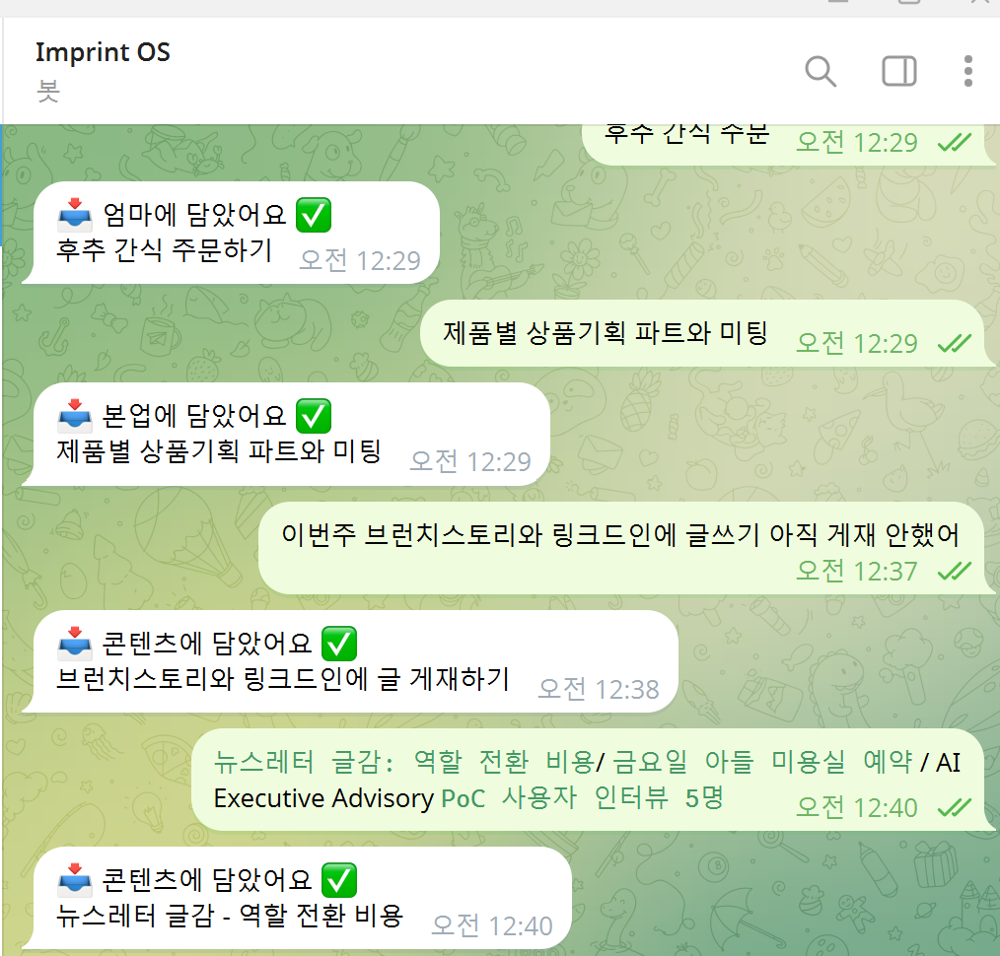
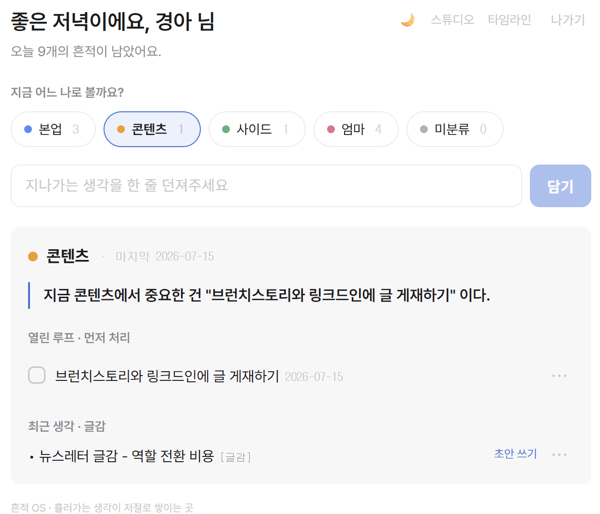
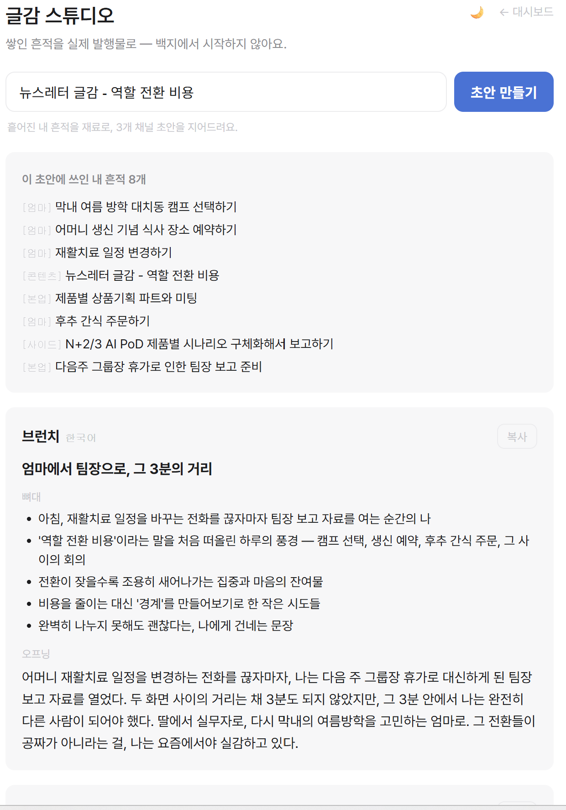

# 3주차 — 내 OS 최종 완성 🏁

> 미션을 진행하며 과정과 결과를 기록해주세요. (다 못 채워도 OK, 한 것 위주로!)

## 🎯 미션 1. 내 삶을 돕는 OS 최종 완성
> 지금까지 공유하며 받은 **피드백을 반영해 최종 완성**!

### ✅ 완성한 것 (무엇을)

**3주차에 흔적 OS를 두 단계로 최종 완성했다.**

**① 두뇌 완전 자동화** — 2주차엔 세 조각(캡처·분류·복원)을 다 만들었지만 딱 하나가 반쪽이었다. 분류·복원 두뇌(스킬)가 내 개인 비공개 저장소(`imprint-os-data`)를 직접 만지려면 세션에 붙여야 하는데, 2주차엔 접근 권한이 없어 **손으로 직접 커밋**해 확인했었다. 3주차에 개인 저장소를 세션에 연결하니, 두뇌가 `inbox.md`를 읽고 → 역할별로 분류해 `roles/`에 쓰고 → 역할을 부르면 한 화면으로 복원하는 걸 **내가 커밋하지 않아도** 스스로 해냈다. (4개 역할에 안 걸린 흔적은 원칙대로 `미분류`로 보관 → `roles/미분류.md` 생성 확인)

**② 스킬 → 실제 배포된 웹 서비스(v1)** — 여기서 한 발 더 나갔다. 클로드 코드 안에서만 돌던 '두뇌'를, **인터넷에 배포된 나만의 웹 서비스**로 만들었다.

> 텔레그램에 한 줄 던지면 → **Claude(Haiku)가 즉시 자동 분류** → **Supabase DB 저장** → **"📥 {역할}에 담았어요 ✅" 답장** → 언제 어디서나 **웹 대시보드**에서 "지금 이 역할"을 한 화면으로.

- **라이브 주소:** https://imprint-os-app.vercel.app _(비밀번호 1개로 보호되는 개인용)_
- **스택:** Next.js(App Router) · Supabase(Postgres) · **Claude API `claude-haiku-4-5`**(분류) · Vercel · Telegram Bot(`@imprint_os_bot`)
- **저장소:** https://github.com/gypsy93/imprint-os-app (**Phase 1~6 전부 완료 · v1.0 배포**)

### 🔁 피드백 반영한 점

- **(2주차 스스로 남긴 숙제 = "된다 ≠ 저절로 된다")** 2주차 최대 인사이트였던 이 문턱을 두 번 넘었다. ① 손 커밋을 없앤 자동화 → ② 아예 **24시간 도는 실제 서비스로 배포**. 이제 나는 텔레그램에 던지기만 하고, 나머지는 서버가 알아서 한다.
- **(두뇌를 코드로 이식)** 2주차의 분류 로직(스킬)을 **Claude API 프롬프트로 이식**해, 클로드 코드 세션 없이도 서버가 스스로 분류하게 만들었다. 애매하면 `미분류`로 두고 절대 지어내지 않는 안전장치는 폴백으로 그대로 유지.
- **✍️ (크루/토크데이에서 받은 피드백 반영) —** _이번 주 크루·유닛에서 실제로 받은 피드백과 반영한 점을 한두 줄로 채워주세요._

### 📦 결과물 (링크·스크린샷)

**① 실동작 증빙 — 텔레그램 한 줄이 자동으로 여러 역할에 나뉘어 담김** (라이브 확인 ✅)
- 서로 다른 성격의 문장들을 연달아 던져도, 봇이 각각을 **알맞은 역할로 분류**해 답장한다.
  - `후추 간식 주문하기` → **📥 엄마에 담았어요 ✅**
  - `제품별 상품기획 파트와 미팅` → **📥 본업에 담았어요 ✅**
  - `이번주 브런치스토리와 링크드인에 글쓰기 아직 게재 안했어` → **📥 콘텐츠에 담았어요 ✅** (원문을 `브런치스토리와 링크드인에 글 게재하기`로 **다듬어(clean_text)** 저장)
  - `뉴스레터 글감: 역할 전환 비용 …` → **📥 콘텐츠에 담았어요 ✅**
- 한 줄만 되는 게 아니라, **섞인 흔적을 실시간으로 갈라 담는** 것까지 실제 작동.

**② 웹 대시보드 — 역할별로 실제 쌓이고, 한 화면으로 복원** (라이브 확인 ✅)
- `imprint-os-app.vercel.app` 로그인 → **"좋은 저녁이에요, 경아 님 · 오늘 9개의 흔적"** 인사
- 역할칩(점·개수): **본업 3 · 콘텐츠 1 · 사이드 1 · 엄마 4 · 미분류 0** — 던진 흔적들이 역할별로 실제 반영
- **콘텐츠**를 누르면 그 역할의 상태가 한 화면으로 복원 — 한 줄 브리핑("지금 콘텐츠에서 중요한 건 …") + **열린 루프**(완료 체크) + **최근 생각·글감**('초안 쓰기'로 스튜디오 연결)
- UI는 직접 만든 디자인 가이드라인 적용본 — 흰 배경·회색 위계·단일 블루 액센트·역할 점(●)

**③ 글감 스튜디오 — 흩어진 흔적이 실제 글 초안으로 (흔적 → IP)** (라이브 확인 ✅)
- '뉴스레터 글감 - 역할 전환 비용'을 넣으니, **서로 다른 역할의 흔적 8개**(엄마 재활치료 일정·캠프 선택·생신 예약 / 본업 팀장 보고·상품기획 미팅 / 사이드 …)를 **근거로 묶어** 초안을 지어 줌.
- 결과: 브런치 초안 **"엄마에서 팀장으로, 그 3분의 거리"** — 뼈대(5줄)와 오프닝 문단까지. *어머니 재활치료 전화를 끊자마자 팀장 보고 자료를 여는 3분*을 '역할 전환 비용'이라는 내 글감과 실제로 엮어냈다.
- **어떤 흔적이 쓰였는지 근거 매핑**까지 보여줘, 내 기록이 그대로 콘텐츠 재료가 되는 걸 눈으로 확인.

**④ 두뇌 자동화 증빙** (개인 저장소 `imprint-os-data`)
- `"인박스 정리해줘"` → 밀린 캡처 자동 분류 → `roles/` 반영, `inbox.md` 비워짐
- `"본업 복원"` → 열린 루프 + 최근 글감을 한 화면으로 압축 브리핑

**⑤ 웹 서비스 v1.0 — 7일 로드맵(Phase 1~6) 완주 🏁**
같은 날, 배포에서 멈추지 않고 스펙의 7일치 기능을 끝까지 밀어 완성했다.
- **복원 대시보드 (Phase 3):** 역할칩을 누르면 그 역할의 **열린 루프 / 최근 생각·글감 / 자료 + 한 줄 브리핑**이 한 화면으로 복원 — "지금 {역할}에서 중요한 건 ___"
- **액션 (Phase 4):** 할일 **완료 체크** · **역할 바꾸기** · **텍스트 수정** · **삭제**, 그리고 텔레그램 없이 웹에서 바로 던지는 **빠른 캡처 바**
- **타임라인 (Phase 5):** 전체 흔적을 시간순 + 역할 필터 + 역할색 점 · **모바일 반응형**(폰에서도 확인)
- **다크모드·폴리시 (Phase 6):** 라이트/다크 **테마 토글**(트와일라잇 무드)·기억·깜빡임 방지 + 마무리 폴리시
- **완료 기준(Definition of Done) 4개 전부 충족:** ① 텔레그램 한 줄 → 대시보드 자동 등장 ② 역할 누르면 한 화면 복원 ③ 완료·역할변경·삭제 즉시 반영 ④ 비번 접근 · 모바일에서도 예쁨

**로드맵 대비 위치:** Phase 1~6 **전부 완성** — 캡처·분류·저장·답장 + 복원 대시보드·액션·타임라인·다크모드까지 실배포·실동작. **스펙의 7일 v1을 하루에 완주했다.**

**⑥ v1.0에서 멈추지 않고 — 바이브 코딩으로 세 걸음 더 🚀**
"자연어로 함께 만드니 기대치가 더 높아진다"는 실감으로, v1.0 이후 세 가지를 더 붙였다.

- **v1.1 · 주간 자동 회고 (Readwise식):** 매주 정해진 요일에 서버(Vercel Cron)가 스스로 한 주를 돌아본다 — 이번 주 캡처 수 · 역할별 분포 · 오래 열려 있는 루프 · 글로 발전시킬 만한 글감 후보를, **Claude가 짧은 회고 문장으로 엮어 텔레그램으로 발송**. "이번 주도 증발하지 않고 남았다"를 매주 확인시켜 준다. (실발송 확인 ✅)
- **v1.2 · 글감 스튜디오 (흔적 → 실제 IP):** 쌓인 흔적을 **백지에서 시작하지 않는 글쓰기 재료**로 쓴다. 주제(또는 대시보드의 '글감')를 넣으면, 흩어진 내 흔적들을 근거로 묶어 **3개 채널(브런치·링크드인·네이버 블로그) 초안**(제목·뼈대·오프닝)을 지어 준다. 어떤 흔적이 쓰였는지 **근거 매핑**까지 보여줘, 내 기록이 그대로 콘텐츠 IP가 된다. (실동작 확인 ✅)
- **UI 리프레시 · '초등학생 수준'에서 상용 서비스 수준으로:** 직접 만든 **UI 디자인 가이드라인**(Things 3 + Readwise + Sunsama 참조)을 세우고 그대로 적용했다 — 흰 배경 · 회색 위계 · **단일 블루 액센트 하나** · 넉넉한 여백, 이모지 대신 **낮은 채도의 점(●)**, 그림자·그라디언트 제거, 다정한 해요체 마이크로카피("잘 받아뒀어요"), `prefers-reduced-motion` 존중까지. "기능은 많은데 화면은 조용하다"를 기준으로 삼았다.

**➡️ 흐름의 완성:** 텔레그램 한 줄(캡처) → 자동 분류·저장 → 역할별 복원 → **매주 자동 회고** → **채널별 글 초안**. 흘려보내던 생각이 *쌓이고 → 되살아나고 → 발행물이 되는* 한 바퀴가 돌아간다.

### 🧗 배포하며 겪은 삽질 (솔직 기록)

- **Next.js 보안 CVE로 Vercel 배포가 막힘** → 빌드는 성공했는데 배포가 실패. 원인이 Next.js 15.1.6의 미들웨어 보안 취약점(CVE)이라, **패치 버전(15.5.20)으로 올리니** 배포 성공. (하필 비번 게이트를 미들웨어로 써서 더더욱 올려야 했다.)
- **환경변수는 바꾸면 '재배포'해야 적용됨** — 로그인 비번(`APP_PASSWORD`)을 고쳤는데 계속 "비번 안 맞음". 알고 보니 Vercel은 환경변수만 바꿔선 안 되고 **Redeploy**를 해야 반영됐다.
- **Supabase RLS 경고** — 테이블 만들 때 "RLS 없이 생성" 경고. 우리 앱은 서버에서 `service_role` 키로만 접근(=RLS 통과)하므로 **RLS를 켜도 앱은 그대로 작동 + 보안은 더 튼튼**. → "Run and enable RLS" 선택.
- **텔레그램 webhook 401 Unauthorized** — 연결 주소에서 토큰이 살짝 잘렸던 것. `.../bot<토큰>/getMe` 로 **토큰만 따로 테스트**해 "토큰은 정상, URL 뒷부분이 문제"임을 갈라내고 해결. → "안 되는 것처럼 보인다 ≠ 안 된다", 문제를 쪼개 확인.
- **비공개 저장소 접근 권한** — 새 저장소(`imprint-os-app`)를 클로드 코드·Vercel에 붙이려면 각각 GitHub 앱에 **저장소 접근을 1회 허용**해야 함(2주차 비공개 저장소 때와 같은 벽).
- **배포 큐가 막혀 v1.2가 안 뜨던 일** — 이전 빌드 하나가 27분째 "Building"으로 멈춰 큐를 잡고 있어, 새로 올린 글감 스튜디오가 배포되지 않아 `/studio`가 404. **멈춘 빌드를 취소하니** 곧바로 다음 배포가 Ready. → "코드가 틀린 게 아니라 파이프라인이 막힌 것"도 의심 목록에 넣기.

### 💡 알게 된 인사이트

- **"작동하는 코드"와 "실제 돌아가는 서비스"는 완전히 다른 산이었다.** 로직은 2주차에 이미 됐지만, 배포·환경변수·webhook·보안버전 같은 **'연결의 벽'** 을 하나씩 넘는 게 진짜 완성이었다. 눈에 안 보이는 이 마지막 구간이 제일 많은 삽질을 요구했다.
- **막히면 쪼개서 확인.** webhook 401을 만났을 때 전체를 의심하지 않고 `getMe`로 토큰만 격리 테스트해 원인을 5초 만에 갈랐다. 모든 "안 돼요"는 더 작은 "이 조각이 안 돼요"로 쪼갤 수 있다.
- **이제 흔적 OS는 '기획'도 '스킬'도 아니고, 매일 텔레그램에 던지면 저절로 쌓이는 나의 실제 인프라가 됐다.** 2주차엔 손으로 커밋하던 걸, 3주차엔 세상 어디서든 열리는 URL로 만들었다. — "내가 돌보는 시스템"에서 "나를 돌보는 시스템"으로.
- **바이브 코딩은 기대치를 끌어올린다.** 자연어로 함께 만들다 보니 "되게만 하기"에서 멈추지 않게 됐다. v1.0 배포 이후에도 회고 자동화 → 글감 스튜디오 → UI 리프레시로 계속 밀 수 있었던 건, 만드는 문턱이 낮아진 만큼 **원하는 기준(디자인 가이드라인·상용 서비스 수준)을 스스로 더 높게** 잡게 됐기 때문이다.
- **내 기록이 콘텐츠 IP가 된다.** 글감 스튜디오를 붙이며 깨달은 것 — 흘려보낸 흔적은 소비되고 끝나는 메모가 아니라, 되살려 **채널별 글로 발행**할 수 있는 원재료였다. 캡처의 목적이 '정리'에서 '생산'으로 한 칸 넓어졌다.

## 📣 미션 2. 스폰지 토크데이 SNS 후기
> 오늘 토크데이 후기를 SNS에 올리기 (**#스폰지클럽 필수 · 셀 3개 지급!**)

- **후기 내용:**
  - **인상 깊었던 점** — 이미 많은 분들이 AI를 생활의 밀도 안으로 끌어들이고 있었고, **기술을 이해하는 일과 살아내는 일은 다른 층위**에 있다는 걸 반복해 확인했다.
  - **내가 얻어간 것** — "무엇을 할 수 있는가"에서 **"나의 무엇과 접목할 것인가"로 질문의 축**이 바뀌었다. 정리에 쓰던 에너지를 **결정에 쓸 여백**으로 돌리게 됐다.
- **SNS 인증 링크:** https://blog.naver.com/gypsy93/224349643272
