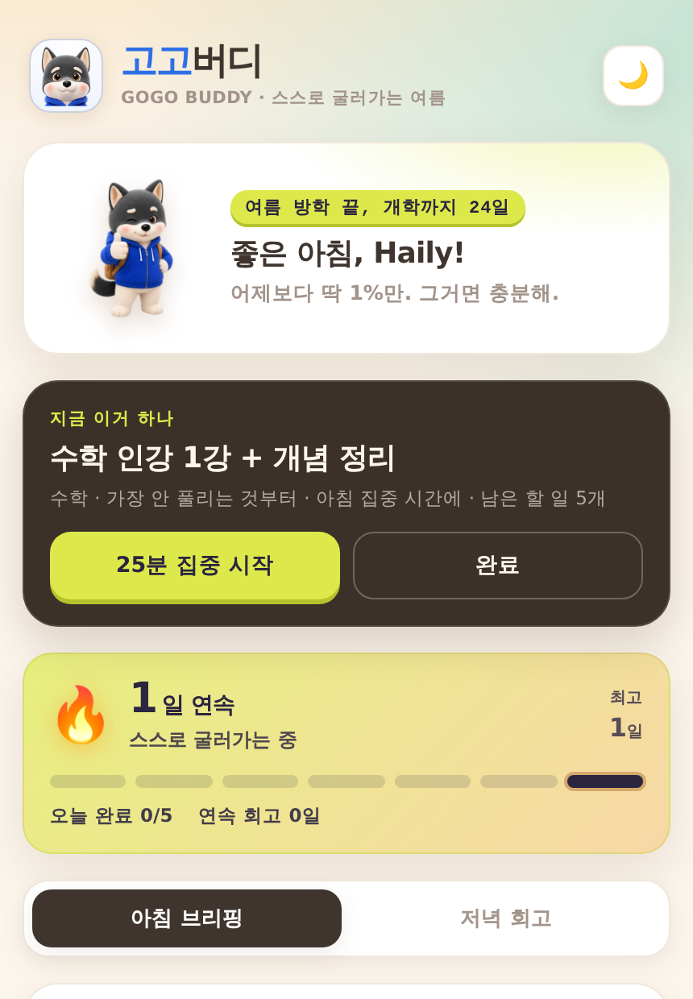
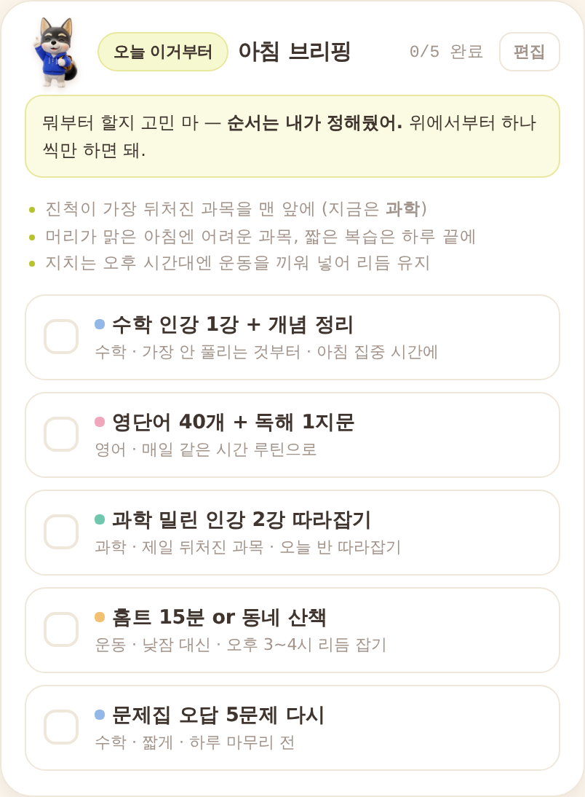
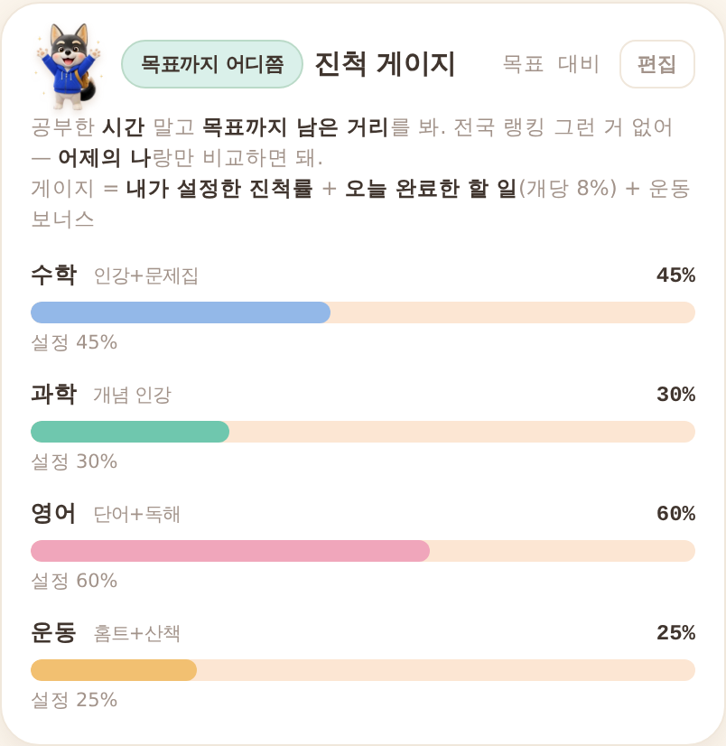
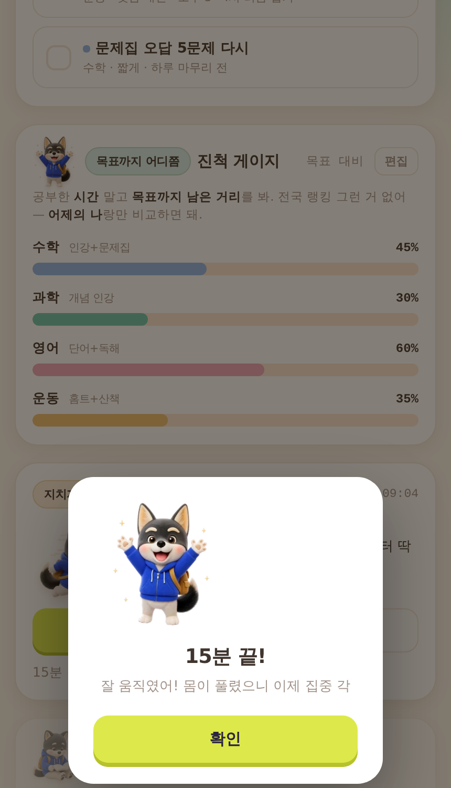
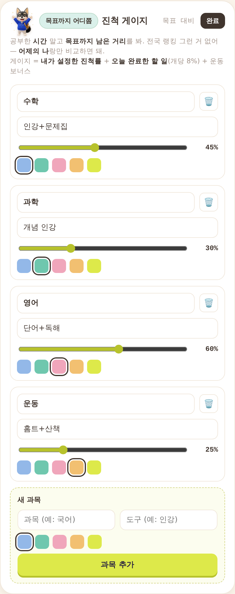
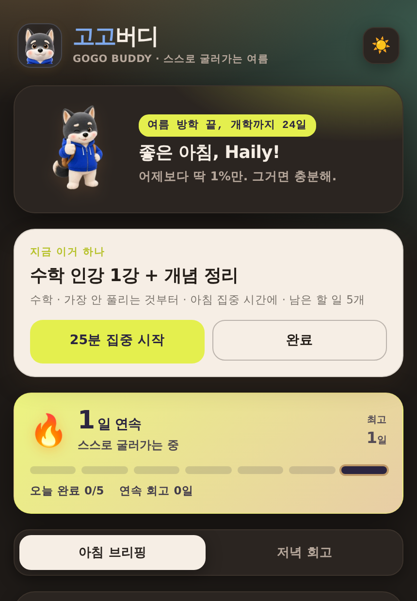

# 4주차 — 기획·구현 → 검증 → 기록 🧪

> 고2 막내의 학원·과외 없이 처음 혼자 보내는 여름방학. 그 한 사람을 위한 MVP를 만들고, 실제로 써보게 했다.

---

## 🎯 과제 1. PRD 기획 및 구현

- **주요 가치:** 무자비한 학원·과외 스케줄이 사라진 이번 여름방학, 고2 Haily가 **스스로 주도권을 쥐고** 인강·문제집으로 혼자 계획을 세우고 **지치지 않고** 실천하게 한다.
- **페르소나:** 고2 Haily. 나이·직업이 아니라 **"외부 스케줄이 사라진 첫 자기주도 방학"** 이라는 상황으로 좁혔다.
  > 실제로 뱉은 말: *"이번 방학이 중요한 건 알겠는데, 나 혼자 뭐를 어떻게 하는 게 최적인지 잘 모르겠어."*
- **소구 방식:** *"아침에 열면 오늘 뭐부터 할지 알려주고, 안 지치게 페이스 잡아주고, 목표까지 어디 왔는지 보여주는 버디."*
  매일 열고 싶도록 실제 반려견을 각색한 마스코트 **HooChoo**를 만들어 앱 전체의 얼굴로 삼았다.
- **구현한 것:**
  - 실행 링크(공개): **https://sparkling-arithmetic-fd1b51.netlify.app**
  - 소스: `haily-vacation-buddy.html` (HTML 파일 하나로 완결 — 이미지·소리까지 내장해 링크 하나로 배포)
  - 핵심 화면: 지금 할 일 / 아침 브리핑 / 진척 게이지 / 리듬 넛지(타이머·알람) / 저녁 회고 3줄
  - 할 일·과목·진척률을 직접 편집하고 브라우저에 저장 — Haily가 **자기 계획을 직접 넣는** 구조

### 📸 실행 화면

| 상단: 지금 할 일 · 습관 스트릭 | 아침 브리핑 · 일정 규칙 | 진척 게이지 · 산출 근거 |
|---|---|---|
|  |  |  |

| 리듬 넛지 알람 | 편집 모드 | 다크 모드 |
|---|---|---|
|  |  |  |

---

### 📄 PRD 6칸

**① 문제 정의**
고2 Haily가 학원·과외 없이 혼자 설계해야 하는 첫 여름방학에 — ⑴ 매일 미션은 세우지만 **전체 목표 대비 지금 어디쯤인지**가 안 보이고, ⑵ **아침에 뭐부터** 할지 못 정하고, ⑶ 지치면 낮잠 → 밤샘으로 리듬이 깨진다.
*지금까지의 대체재:* 학원·과외 스케줄이 대신 하루를 굴려줬다. 이번 방학엔 그게 사라졌다.

**② 주요 페르소나**
성실하고 중요성도 알지만, **관리자 없이 스스로 학습을 설계·실행해본 경험이 없는** 고2. (위 실제 발언 참조)

**③ 주요 가치 · 소구 방식** ⭐
외부 스케줄이 없어도 스스로 굴러가게 — 우선순위를 대신 정해주고, 목표 대비 위치를 보여주고, 지치지 않게 리듬을 잡아준다.

**④ 핵심 기능** (③을 지탱하는 것만)
1. **지금 이거 하나** — 미완료 1순위를 최상단에 크게 + 25분 집중 타이머
2. **아침 브리핑** — 오늘 순서를 먼저 제안하고, 그 배치 규칙까지 설명
3. **진척 게이지** — 시간이 아니라 *목표까지 남은 거리* + 산출 근거 표기
4. **리듬 넛지** — 15분 움직이기 / 10분 쉬기 타이머와 알람으로 낮잠·밤샘 차단
5. **저녁 회고 3줄** — 학원이 대신 닫아주던 하루를 스스로 닫게

*넣고 싶었지만 뺀 것:* 학습 콘텐츠·문제풀이, 정교한 캘린더, 부모 모니터링 대시보드

**⑤ 성공 기준** (행동으로)
- 아침에 스스로 앱을 여는 날이 **주 5일 이상**
- 저녁 회고를 **3일 연속 이상** 이어서 씀
- *"내가 목표 대비 어디쯤인지 이제 알겠다"* 는 말이 나옴
- 낮잠→밤샘 패턴이 주 단위로 줄어듦

**⑥ 만들지 않을 것**
- 인강·문제집 자체 제작 ❌ (이미 가진 도구를 **굴려주기만** 한다)
- 부모·관리자 감시 화면 ❌ ("스스로"의 반대)
- 성적 예측·입시 컨설팅 ❌ / 여러 학생용 범용 서비스 ❌

---

### 🔍 차별화 — 기존 서비스가 놓친 자리

| 갈래 | 대표 서비스 | 한계 | 고고버디 |
|---|---|---|---|
| 관리형 학습 | 밀당PT | 사람 매니저 의존 — 비싸고 방학 뒤엔 못 굴러감 | 사람 없이 스스로 굴러가는 근육을 키움 |
| 공부시간 측정 | 열품타 | 공부한 **시간**과 전국 랭킹 → 비교 불안 | **목표까지 남은 거리**, 랭킹 없이 어제의 나와만 |
| 캐릭터 습관앱 | Finch·Habitica | 귀엽지만 학습 특화 아님 | 학습+리듬+운동을 한 흐름으로 |
| AI 문제풀이 | 콴다·산타 | 콘텐츠를 또 얹어 선택 피로 | 콘텐츠는 안 주고 **실행만** 굴려줌 |

**한 문장:** *밀당PT의 관리력을 사람 없이, 열품타의 기록을 랭킹 없이, Finch의 귀여움을 학습 자기주도에 붙인 것.*

---

## 🗣 과제 2. 유저 피드백 받기

### ① 실제 유저 2명 (배포 링크로 직접 사용 후)

**Haily (고2, 타깃 본인)**
- "미리 내일 계획 짜는 거나, 오늘의 계획을 저녁에 확인하는 거 다 좋고 너무 좋아."
- "마스코트 HooChoo가 실제 모습보다 귀엽게 만들어져서 정감 있어 좋아."
- "맨 하단 **'이 앱이 일부러 안 하는 것'** 카드가 무엇보다 가장 마음에 들어."

**고2 A (또래)**
- "경쟁이나 감시 없이 스스로 공부하도록 돕는다는 점이 좋음."
- "근데 아직은 학습 관리 시스템이라기보다 **철학을 설명하는 프로토타입** 같음."
- "**바로 시작할 수 있는 다음 미션**을 가장 눈에 띄게, **진행률과 일정 생성 방식**도 더 명확하게."

### ② 가상 페르소나 (`virtual-customer-feedback` 스킬)

실제 인터뷰 **전에** 두 그룹을 돌려 예측치로 삼았다.
- **고2 4명**(현실 근거로 구성): "결국 안 열어봄"(리텐션 회의), "진척 게이지 자기입력이 귀찮다", "아침에 뭐부터 정해주는 건 진짜 필요하다"
- **부모 4명**(게이트키퍼): "부모가 아무것도 못 보면 애가 진짜 하는지 어떻게 알아요", "고2인데 너무 귀여워서 장난감 같다"

### ③ 피드백에서 알게 된 것

**예측 vs 실제**

| 가상 예측 | 실제 결과 | |
|---|---|---|
| 캐릭터는 여학생에게 호의적 | "HooChoo 정감 있어 좋다" | ✅ |
| "아침에 뭐부터"가 핵심 훅 | "다음 미션을 가장 눈에 띄게" | ✅ |
| 진척 게이지 신뢰·입력 문제 | "진행률 방식을 더 명확하게" | ✅ |
| 부모: 감시 없는 게 불안 | Haily: **가장 마음에 드는 기능** | ❌ 정반대 |

1. **가장 큰 배움 — 누구에게 묻느냐가 결론을 바꾼다.** 부모 패널만 봤다면 '감시 없음'을 약화시켰을 것이다. 정작 사용자는 그 지점을 최고로 꼽았다.
2. **PRD ⑥ '만들지 않을 것'이 최대 강점이 됐다.** 범위를 좁힌 결정이 그대로 제품력이 됐다.
3. **가치 설명이 실행 유도보다 앞서 있었다.** 좋은 철학도 "지금 뭘 하면 되는지"를 가리면 도구가 아니다.

### ④ 피드백 반영 (실제 재구현)

| 지적 | 반영 |
|---|---|
| 다음 미션이 안 보임 | **"지금 이거 하나" 카드를 최상단에** — 미완료 1순위 + `25분 집중 시작`·`완료` 버튼 |
| 진행률이 불투명 | 게이지마다 **산출 근거 표기** (`설정 45% · 오늘 완료 2개 +16%`) |
| 일정 생성 방식이 불명확 | 아침 브리핑에 **배치 규칙 3줄** 명시 |
| — | 다크모드 대비 수정, 상단 정보 구조 4블록 → 3블록으로 정리 |

**아직 검증 못 한 것:** 실사용 지속성(리텐션). 방학 동안 실제로 며칠 이어서 여는지는 앞으로 확인해야 한다.

---

## 📣 과제 3. SNS 기록 남기기

- **SNS 인증 링크:** (네이버 블로그) https://blog.naver.com/gypsy93/224357267915

- **소회:**

> 고2 막내의 한마디 *"나 혼자 뭘 어떻게 해야 최적인지 모르겠어"* 에서 시작했다.
>
> PRD를 쓰며 가장 크게 배운 건 **'무엇을 만들까'보다 '무엇을 안 만들까'가 더 어렵고 중요하다**는 것이었다. 인강도, 문제은행도, 부모가 지켜보는 화면도 다 빼고 딱 하나 — **"부모·학원·과외 없이 스스로 굴러가게"** 만 남겼다. 그런데 실제로 써본 조카가 가장 마음에 든다고 꼽은 게 바로 그 **'일부러 안 하는 것'** 카드였다. 좁히는 결정이 곧 제품력이 된다는 걸 눈으로 확인했다.
>
> 검증에선 반전도 있었다. 가상 부모들은 "부모가 아무것도 못 보면 불안하다"고 했지만, 정작 사용자는 그 지점을 최고로 좋아했다. **좋은 가치도 누구의 눈으로 보느냐에 따라 정반대가 된다.**
>
> 그리고 또래 학생의 "아직은 학습 관리 시스템이라기보다 철학 설명서 같다"는 말이 가장 아팠고 가장 유용했다. 그 한마디로 첫 화면을 갈아엎었다.
>
> AI와 함께면 기획자 혼자서도 기획 → 구현 → 배포 → 검증 → 재구현까지 한 사이클을 돌 수 있다. 다음은 방학이 끝날 때까지 조카가 실제로 며칠이나 이어서 여는지 지켜보는 일이다.
