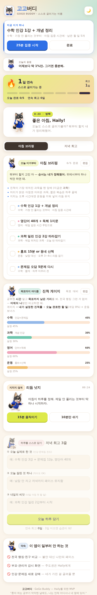

# 4주차 — 기획·구현 → 검증 → 기록 🧪

> 과제를 진행하며 과정과 결과를 기록해주세요. (다 못 채워도 OK, 한 것 위주로!)

## 🎯 과제 1. PRD 기획 및 구현
> 주요 가치 · 페르소나 · 소구 방식을 담은 PRD → 구현까지

- **주요 가치:** 무자비한 학원 스케줄이 사라진 이번 여름방학, 고2 Haily가 **스스로 주도권을 쥐고** — 인강·문제집으로 혼자 계획을 세우고, **지치지 않고** 꾸준히 실천하게 한다. ("스스로 굴러가게")
- **페르소나:** 고2 Haily. 성실하고 이번 방학의 중요성은 알지만, **관리자(학원·과외) 없이 스스로 학습을 설계·실행해본 경험이 없음.** 나이·직업이 아니라 *"외부 스케줄이 사라진 첫 자기주도 방학"* 이라는 **상황**으로 좁힘.
  - 실제로 뱉은 말: *"이번 방학이 중요한 건 알겠는데, 나 혼자 뭐를 어떻게 하는 게 최적인지 잘 모르겠어."*
- **소구 방식:** *"아침에 열면 오늘 뭐부터 할지 알려주고, 안 지치게 페이스 잡아주고, 목표까지 어디 왔는지 보여주는 버디."* — 여고생이 매일 열고 싶도록 **반려견을 모델로 한 오리지널 마스코트 + 따뜻한 파스텔 감성** UI. 앱 이름은 **고고버디(GoGo Buddy)** — "스스로 굴러가게"를 경쾌한 버디로.
- **구현한 것 (링크·스크린샷 — 이미지는 `이미지첨부/` 폴더에):**
  - 프로토타입: `haily-vacation-buddy.html` (이 폴더 안, 자체 완결형 웹앱 — 앱명 **고고버디**)
  - 4대 핵심 기능(아침 브리핑 / 진척 게이지 / 리듬 넛지 / 저녁 회고 3줄)을 담은 챗·카드 인터페이스
  - **마스코트 'HooChoo'**: 실제 반려견(허스키) 사진을 레퍼런스로 생성형 이미지 AI(STIC 프롬프트)로 제작한 오리지널 캐릭터. **9가지 포즈**(인사·가리키기·만세·달리기·졸림·기본·기지개·공부·엄지척)를 메뉴별로 배치해 화면에 같은 포즈가 중복되지 않게 했고, 시간대·완료 여부에 따라 자동 전환
  - **브랜드**: 캐릭터 후드티 색을 브랜드 컬러(#2E6FE6)로 삼아 워드마크·로고를 정리하고, 정면 얼굴 전용 로고 마크를 별도 제작해 헤더·파비콘에 적용
  - **편집 기능**: 아침 브리핑 할 일 추가·수정·삭제, 진척 게이지 과목·도구·색상·진척률(슬라이더) 직접 편집, 브라우저에 저장(새로고침 유지) → Haily가 자기 계획을 직접 넣는 자기주도 흐름
  - **살아있는 화면**: 히어로 마스코트의 둥실 애니메이션, 리듬 넛지 버디의 달리기 애니메이션, 스트릭 불꽃의 flicker 효과 / 최상단 **습관 스트릭 카드뉴스**(연속 사용일·7일 점 스트립·최고기록) / 접속마다 바뀌는 **응원 글귀 배너**
  - **리듬 넛지 타이머·알람**: 15분 움직이기 / 10분 쉬기 카운트다운이 실제로 돌아가고, 시간이 되면 마스코트가 등장하는 화면 알람 + 소리(Web Audio 차임) + 진동으로 깨워줌 (새로고침해도 이어짐)
  - **실행 링크(공개):** https://sparkling-arithmetic-fd1b51.netlify.app

  **🔄 실제 유저 피드백 반영 (과제 2 → 재구현)**
  - **(A) "지금 이거 하나" 카드를 최상단에** — 미완료 1순위 할 일을 크게 노출하고 `25분 집중 시작`(포모도로 타이머)·`완료` 버튼을 붙였다. "바로 시작할 다음 미션이 안 보인다"는 지적에 대한 직접 대응.
  - **(B) 진척 게이지 산출 근거 노출** — 각 게이지 아래에 `설정 45% · 오늘 완료 2개 +16% · 운동 보너스 +10%`처럼 계산 내역을 표기하고, 상단에 공식을 한 줄로 명시.
  - **(C) 일정 생성 규칙 명시** — 아침 브리핑에 배치 원리 3줄(뒤처진 과목 먼저 / 아침엔 어려운 과목 / 오후엔 운동)을 추가.
  - **(다크모드 가독성)** D-day 배지와 주요 버튼의 글자색을 배경별로 분리해 대비 확보.

**📸 실행 화면**

| 상단: "지금 이거 하나" + 습관 스트릭 | 아침 브리핑 + 일정 생성 규칙 | 진척 게이지 + 산출 근거 |
|---|---|---|
|  |  |  |

| 리듬 넛지 알람 | 편집 모드 | 다크 모드 |
|---|---|---|
|  |  |  |

---

### 📄 PRD 본문 — 6칸

#### ① 문제 정의
- **누가·언제·상황:** 고2 Haily가, 처음으로 **학원·과외 같은 외부 스케줄 없이 오롯이 혼자** 설계해야 하는 이번 여름방학에 —
  - 매일 미션은 세우지만 **전체 목표 대비 지금 어디쯤인지**가 안 보인다 (메타인지·시간관리 부재)
  - **아침에 뭐부터** 할지 못 정한다
  - 지치면 낮잠 → 밤샘으로 **바이오리듬이 깨지고 시간이 샌다**
- **지금 버티는 법(대체재):** 그동안은 **학원/과외 스케줄이 대신 하루를 굴려줬다.** 이번 방학엔 그게 사라져 대체재가 없어진 상태 = 문제가 정면으로 드러남.

#### ② 주요 페르소나
- **고2 Haily** — 성실하고 중요성은 인지하지만, 스스로 학습을 설계·실행해본 경험이 없는 **첫 자기주도 방학**의 학생.
- **실제로 뱉은 문장:** *"이번 방학이 중요한 건 알겠는데, 나 혼자 뭐를 어떻게 하는 게 최적인지 잘 모르겠어."*

#### ③ 주요 가치 · 소구 방식 ⭐
- **이 프로덕트가 지키는 것 한 줄:** 외부 스케줄이 없어도 Haily가 스스로 굴러가게 — 매일 우선순위를 스스로 정하고, 목표 대비 자기 위치를 알고, **지치지 않고** 실천하게 한다.
- **페르소나 언어로:** *"혼자여도 오늘 뭐부터 할지 알려주고, 안 지치게 페이스 잡아주고, 목표까지 어디 왔는지 보여주는 짝꿍."*

#### ④ 핵심 기능 (③을 지탱하는 것만)
1. **아침 브리핑** — 전체 목표 + 남은 방학 일수 기준으로 "오늘 이거부터" 우선순위 제안 (수·과·영·운동 배분)
2. **진척 게이지** — 과목별 목표 대비 현재 위치를 한눈에 → *문제의 핵심(메타인지)을 정면으로 해소*
3. **리듬 넛지** — 정해진 시간에 "지금 쉴까 / 몸 움직일까?"를 물어 낮잠·밤샘을 막고, **운동을 얹어** 페이스를 지킴 → *"지치지 않고 실천"의 엔진*
4. **저녁 회고 3줄** — 오늘 인강/문제집 진도 체크 + 내일 씨앗 → 예전엔 학원이 하루를 닫아줬지만 이제 **스스로 하루를 닫는 정리 시간**을 만들어줌
- **넣고 싶었지만 뺀 것:** 상세 학습 콘텐츠·문제풀이, 정교한 캘린더 앱, 부모 모니터링 대시보드

#### ⑤ 성공 기준 ("좋아요" 말고 행동으로)
- 방학 중 **아침 브리핑을 스스로 여는 날이 주 5일 이상**
- **저녁 회고를 3일 연속 이상** 이어서 씀 (흐지부지 안 됨)
- Haily가 *"내가 목표 대비 어디쯤인지 이제 알겠다"* 고 말함 (문제 해소 신호)
- **낮잠→밤샘 패턴이 주 단위로 줄어듦**

#### ⑥ 만들지 않을 것 (이번 범위 밖)
- 학습 콘텐츠·인강·문제은행 자체 제작 ❌ — 인강·문제집은 Haily가 이미 가진 도구, 서비스는 **대체하지 않고 굴려주기만** 함
- 부모/관리자용 감시 대시보드 ❌ ("스스로"의 반대)
- 성적 예측·입시 컨설팅 ❌
- 여러 학생용 범용 서비스 ❌ (Haily 한 명에 집중)

**구현 형태:** 자체 완결형 웹앱(HTML) 프로토타입 **고고버디(GoGo Buddy)** — 여고생이 매일 열고 싶은 귀여운 파스텔 UI, 반려견 기반 오리지널 마스코트가 메뉴마다 다른 포즈로 반응. (마스코트 9종과 로고를 파일에 내장해 링크 하나로 배포)

---

### 🔍 레퍼런스 상용 서비스 & 차별화 포인트

유사 서비스는 크게 4갈래로 나뉘는데, 우리 서비스는 그 **사이의 빈틈**에 위치한다.

| 갈래 | 대표 서비스 | 하는 것 |
|---|---|---|
| A. 관리형 학습 (사람 매니저) | **밀당PT**(메가스터디) | 인강 + 전담 선생님이 1:1로 매일 계획·진도·복습 관리. *"계획 수립·실천이 어려운 학생"* 겨냥 → **문제의식 동일** |
| B. 공부시간·플래너 | **열품타**(열정품은타이머) | 과목별 공부시간 측정 + 전국 실시간 랭킹 + 스터디그룹 |
| C. 귀여운 캐릭터 습관·셀프케어 | **Finch**, **Habitica** | 반려동물/RPG 캐릭터를 키우며 루틴 형성. 톤은 가깝지만 **범용**(학습 특화 아님) |
| D. AI 문제풀이·튜터 | **콴다(QANDA)**, **산타(뤼이드)** | AI가 문제 풀이·콘텐츠 제공 → 우리가 ⑥에서 *일부러 뺀* 영역 |

**우리만의 차별화(wedge) — 각 서비스가 놓친 자리:**

| 차별점 | 우리 서비스 | 기존 한계 |
|---|---|---|
| ① 사람 없이 스스로 | 마스코트 짝꿍이 넛지, 자기주도 근육을 키움 (저비용·비의존) | 밀당PT는 사람 매니저 의존 (비싸고 방학 뒤 못 굴러감) |
| ② 콘텐츠 대신 '굴리기' | 인강·문제집(이미 가진 것)을 대체 않고 실행만 도움 | 콴다·인강앱은 콘텐츠를 또 얹어 선택 피로↑ |
| ③ 시간이 아니라 '목표 대비 위치' | 진척 게이지로 "내가 어디쯤" = 메타인지 정면 해소 | 열품타는 공부한 **시간**만 보여줌 |
| ④ 학습+리듬+운동 한 흐름 | 낮잠·밤샘 방지 넛지 + 운동을 얹어 지치지 않게 | 공부앱은 공부만, Finch는 학습 특화 아님 |
| ⑤ 결정을 대신 내려줌 | 아침 브리핑이 "오늘 이거부터"를 먼저 제안 | 대부분 플래너는 "네가 입력해라"(빈 화면) |
| ⑥ 비교 없는 나만의 페이스 | 랭킹 없음, 어제의 나와만 비교 | 열품타 전국 랭킹은 비교 불안·번아웃 유발 |

**한 문장:** *밀당PT의 관리력을 **사람 없이**, 열품타의 기록을 **랭킹 없이 목표 대비 위치로**, Finch의 귀여움을 **학습 자기주도에** 붙인 것 — 콘텐츠는 안 주고 실행만 굴려준다.*

특히 ①·⑤가 Haily의 실제 말(*"나 혼자 뭐를 어떻게 하는 게 최적인지 모르겠어"*)에 정확히 대응한다. 밀당PT는 그걸 **사람**으로 풀지만, 우리는 그 역할을 **스스로 할 수 있게** 만드는 게 본질적 차이.

> 프로토타입 반영: 아침 브리핑 코치 멘트(순서를 대신 정함), 진척 게이지 문구(시간 아닌 남은 거리·어제의 나와 비교), "이 앱이 일부러 안 하는 것" 카드로 ①③⑤⑥을 화면에 명시.
> *(초기엔 상단에 포지셔닝 배지 3종을 뒀으나, 사용자에게 쓸모없는 마케팅 문구라 판단해 제거 — 차별화는 앱 안에서 사용자 언어로만 전달하고, 포지셔닝 설명은 이 문서에 남김.)*

*(참고 출처: 밀당PT `mildang.kr/service`, 열품타 나무위키, Finch `whistleout.com` 리뷰)*

---

## 🗣 과제 2. 유저 피드백 받기
> 실제 2명 이상 + 플러스 알파로 가상 페르소나

- **실제 유저 피드백 (2명) — 실제 고2 학생 2명에게 배포 링크를 보내고 직접 써보게 한 뒤 받은 코멘트**

  **① Haily (고2, 타깃 페르소나 본인)**
  - "미리 내일 계획 짜는 거나, 오늘의 계획을 저녁에 확인하는 거 다 좋고 너무 좋아."
  - "마스코트 HooChoo가 실제 모습보다 귀엽게 만들어져서 정감 있어 좋아."
  - "맨 하단의 **'이 앱이 일부러 안 하는 것'** 카드가 무엇보다 가장 마음에 들어."

  **② 고2 A (또래 학생)**
  - "경쟁이나 감시 없이 스스로 공부하도록 돕는다는 점이 좋음."
  - "근데 아직은 실제 학습 관리 시스템이라기보다 **철학을 설명하는 프로토타입** 같음."
  - "사용자가 **바로 시작할 수 있는 구체적인 다음 미션**을 가장 눈에 띄게 보여주고, **진행률과 일정 생성 방식**도 더 명확하게 설명하면 좋을 것 같음."

  **📌 실제 피드백에서 알게 된 것**
  1. **[검증됨] '안 하는 것' 선언이 최대 강점** — Haily가 꼽은 1순위. PRD ⑥(만들지 않을 것)이 단순한 범위 제한이 아니라 **사용자가 가장 좋아하는 기능**이 됐다. 좁히는 결정이 곧 제품력이었다는 증거.
  2. **[검증됨] 하루를 여닫는 루틴에 니즈 있음** — "내일 계획 + 저녁 확인"을 가장 먼저 언급. 아침 브리핑·저녁 회고 구조가 맞았다.
  3. **[검증됨] 마스코트는 실물보다 귀엽게가 정답** — 실제 반려견을 각색한 캐릭터가 정서적 애착을 만들었다.
  4. **[개선 필요·최우선] 다음 행동이 눈에 안 띈다** — "지금 뭘 하면 되는지"가 화면에서 즉시 안 잡힘. 가치 설명(문구·카드)이 실행 유도보다 앞서 있다는 뜻.
  5. **[개선 필요] 진행률·일정 생성 로직이 불투명** — 게이지 숫자가 어디서 왔는지, 오늘 할 일이 어떻게 정해졌는지 설명이 없다. 신뢰의 문제.

  **➡️ 다음 액션 (우선순위순)**
  - (A) **"지금 이거 하나" 블록을 최상단으로** — 오늘 할 일 중 미완료 1순위를 크게 노출 + 바로 시작 버튼. 카드·문구보다 위에.
  - (B) **진행률 산출 근거 노출** — "인강 3강 중 2강 = 60%"처럼 계산 근거를 게이지에 함께 표기.
  - (C) **일정 생성 규칙 한 줄 설명** — "가장 뒤처진 과목 → 아침 집중 시간, 지치는 오후 → 운동" 같은 배치 원리를 브리핑에 명시.
  - (D) 가치 설명 카드는 유지하되 **위치를 아래로** — Haily가 가장 좋아한 요소이므로 삭제는 안 함.

  #### 🔮 [사전 예측] 가상 고2 페르소나 시뮬레이션 (`virtual-customer-feedback` ① 패널 인터뷰)
  > 실제 사람 아님 — 데이터 팩에 10대가 없어 **현실 근거로 구성한 고2 페르소나** 4명. 실제 인터뷰 **전에** 돌려서 예측치로 삼았고, 아래에서 실제 결과와 대조했다.

  | 페르소나 (구성) | 첫 반응 | 대표 '안 쓸 이유' 2가지 | 그럼에도 쓴다면 |
  |---|---|---|---|
  | **지우** 고2·미루기형 | "오 귀엽다" | ①"이런 거 깔아도 결국 나 안 열어봐" ②"진척 게이지 내가 입력하는 거면 귀찮아서 안 함" | "아침에 뭐부터 할지 딱 정해주는 건 진짜 좋아 — 나 그걸 제일 못 정해" |
  | **서연** 고2·성실/열품타 헤비 | "난 이미 내 플래너 있는데" | ①"열품타·구글캘린더 쓰는데 또 앱을 깔아?" ②"우선순위는 내가 정하고 싶지, 앱이 정한 걸 왜 믿어" | "방학처럼 루틴 깨질 때 리듬 넛지(쉬고 움직이기)는 써볼 만" |
  | **민준** 고2 남·유튜브/게임에 시간 샘 | "타이머 있는 건 괜찮네" | ①"캐릭터가 좀 여자애들용 느낌, 유치함" ②"타이머는 그냥 폰 기본 타이머로 되잖아" | "낮잠·밤샘 막아주는 리듬 알림은 나한테 필요할 듯" |
  | **예린** 고3(인접)·입시 코앞 | "고2 때 있었으면" | ①"고3엔 너무 가벼워 보임, 성적 연동이 없음" ②"결국 실천은 내 의지 문제라 앱으로 될까" | "목표 대비 남은 거리 보여주는 건 불안 관리에 도움" |

  **📊 요약 — 알게 된 것 (가상)**
  1. **[공통 거절] 리텐션 회의 + 앱 피로** — "결국 안 열어봄"(지우), "이미 열품타 씀"(서연). → **첫 훅**과 **습관 유지 장치**가 승부처.
  2. **[공통 거절] 자기입력 귀찮음** — 진척 게이지를 손으로 채우게 하면 이탈. → **진척 자동화**(인강 시청·체크 최소 입력) 필요.
  3. **[가장 강한 니즈] "아침에 뭐부터"** — 미루기형 지우가 정확히 반응. **아침 브리핑 = 핵심 훅.**
  4. **[갈린 반응 → 타깃 좁히기]** 성실·자기시스템 보유형(서연)은 니즈 낮음 / **자기주도 약한 고2**(지우)가 진짜 타깃. 우리 페르소나 Haily가 여기 해당 → 방향 일치.
  5. **[귀여움]** 여학생 호의적, 남학생(민준)은 유치하게 느낌 → 타깃이 **여고생**이라 문제없음(오히려 강점).
  - **다음 액션(가상 기준):** (A) 리텐션(스트릭·알림) 강화 — 이미 스트릭 카드 반영, (B) 진척 자동화로 자기입력 최소화, (C) 아침 브리핑을 가장 강한 첫 화면 훅으로.
  ##### 🎯 예측 vs 실제 — 대조 결과
  | 가상 예측 | 실제 결과 | 판정 |
  |---|---|---|
  | 귀여운 캐릭터는 여학생에게 호의적 | Haily "HooChoo 정감 있어 좋다" | ✅ 적중 |
  | "아침에 뭐부터"가 가장 강한 훅 | A "구체적인 다음 미션을 가장 눈에 띄게" | ✅ 적중 (더 강한 노출 요구) |
  | 진척 게이지 자기입력·신뢰 문제 | A "진행률 방식을 더 명확하게" | ✅ 적중 |
  | 최대 거절 이유 = "결국 안 열어봄"(리텐션 회의) | 두 명 모두 언급 없음. 대신 "실행 유도 부족" 지적 | ⚠️ 빗나감 — 실사용 지속성은 아직 미검증 |
  | (부모 패널) "부모가 못 보는 게 불안" | Haily는 그 점을 **가장 마음에 드는 기능**으로 꼽음 | ❌ 정반대 |

  **가장 큰 배움:** 같은 기능(부모 감시 없음)이 **게이트키퍼에겐 불안, 사용자에겐 최애 기능**이었다. 가상 부모 패널만 봤다면 이 기능을 약화시켰을 것이다. **누구에게 묻느냐가 결론을 바꾼다**는 것을 실제 대조로 확인했다.

- **가상 페르소나 피드백 (`virtual-customer-feedback` 스킬, ① 패널 인터뷰):**
  - 데이터 팩(성인 30명)에 고2가 없어, **게이트키퍼(부모) 패널**로 진행 — 세그먼트 B 부모 3명 + 인접 D 1명 (고2 또래 자녀를 둔 나이대로 캐스팅).
  - 만난 가상 고객: 김정하(49·주부), 박호철(44·보험상담), 김상제(42·사무보조), 김남희(53·IT 전문가).

  | 페르소나 | 첫 반응 | 대표 '안 쓸 이유' |
  |---|---|---|
  | 김정하 49 | "취지는 좋네요" | "부모가 아무것도 못 보면 애가 진짜 하는지 어떻게 알아요" / "고2인데 너무 귀여워서 장난감 같다" |
  | 박호철 44 | "잔소리 안 하고 알아서면 솔깃" | "이미 타이머 앱 몇 개 깔림, 또 깐다고 다를까" / "계획은 원래 세움, 문제는 실천" |
  | 김상제 42 | "저한테도 필요한데요" | "이거 유료면 바로 접음" / "저도 3일이면 안 하는데 애라고 다를까" |
  | 김남희 53 | "그냥 알림 앱 아니에요?" | "앱이 정한 우선순위를 왜 믿나" / "자기보고 체크는 못 믿는다" |

- **피드백에서 알게 된 것:**
  1. **[최우선] "부모가 아무것도 못 본다"는 게이트키퍼 불안** — 우리 PRD ⑥(부모 감시 없음·주도권은 자녀)이 *구매·허락 결정자*의 수용을 막는 지점. 핵심 긴장.
  2. **진척 게이지의 자기보고 신뢰 문제** — "대충 체크하면 숫자만 오른다"(김남희).
  3. **귀여움 ↔ 입시 진지함 신뢰 갭** — "고2인데 장난감 같다"(김정하).
  4. **갈린 반응** — 교육열·자기주도 지향 부모(김정하·박호철)는 취지 공감("애가 스스로 들고 오면 OK") vs 회의론·비용민감(김남희·김상제)은 가두리망 밖일 수 있음.
  - **다음 액션:** (A) '부모 배제'는 유지하되 *자녀가 원할 때만 스스로 공유하는 주간 카드* 절충안 검토(감시 아님, 주도권 유지), (B) 진척 게이지에 가벼운 실행 증거 보강.
  - ⚠️ **가정 검증 필요:** Haily 부모님은 정말 '안 봐도' 괜찮은지 / Haily는 부모 공유를 싫어하는지 → 실제 인터뷰로 확인.

> 🧪 가상 피드백은 실제 검증의 전 단계임 — 진짜 답은 Haily 본인 + 실제 부모의 반응에 있음.

## 📣 과제 3. SNS 기록 남기기
> 기획 · 구현 · 피드백의 전 과정과 소회를 기록으로

- **기록 내용 (소회):**

> **"고2 조카의 한마디에서 서비스가 시작됐다"**
>
> 이번 방학, 고2 Haily가 학원 없이 혼자 보내야 한다며 이렇게 말했다.
> *"이번 방학이 중요한 건 알겠는데, 나 혼자 뭐를 어떻게 하는 게 최적인지 잘 모르겠어."*
>
> 이 한 문장을 붙잡고 4주차 과제로 **PRD**를 썼다. PRD를 쓰며 가장 크게 배운 건 **'무엇을 만들까'보다 '무엇을 안 만들까'가 더 어렵고 중요하다**는 것. 인강도, 문제은행도, 부모 감시 대시보드도 다 빼고 — 딱 하나, **"부모·학원 없이 스스로 굴러가게"** 만 남겼다.
>
> 그렇게 나온 게 **고고버디(GoGo Buddy)** 🌱 — 아침엔 "오늘 이거부터"를 대신 정해주고, 진척을 '시간'이 아니라 '목표까지 남은 거리'로 보여주고, 지치지 않게 리듬 타이머로 깨워주는 학습 버디. Claude Code로 기획부터 구현까지 **혼자서** 만들었고, 실제로 폰에서 열리는 링크까지 배포했다.
>
> 검증 단계에선 뜻밖의 통찰이 나왔다. 가상 '부모' 페르소나에게 물어보니 하나같이 *"부모가 아무것도 못 보면 애가 진짜 하는지 어떻게 알아요?"* 라고 했다. 내가 지키려던 **'스스로'** 라는 가치가, 정작 **허락하는 사람(부모)** 에겐 불안이 될 수 있다는 것. 좋은 가치도 **다른 이해관계자의 눈**으로 다시 봐야 한다는 걸 배웠다.
>
> 가장 큰 소회 — **좁히면 오히려 손에 잡히는 게 나온다.** 그리고 AI와 함께면, 기획자 혼자서도 "진짜 쓸 수 있는 서비스"까지 갈 수 있다. 🚀
>
> #스폰지클럽 #클로드코드 #PRD #바이브코딩 #고고버디 #자기주도학습

- **SNS 인증 링크:** (네이버 블로그) https://blog.naver.com/gypsy93/224357267915
