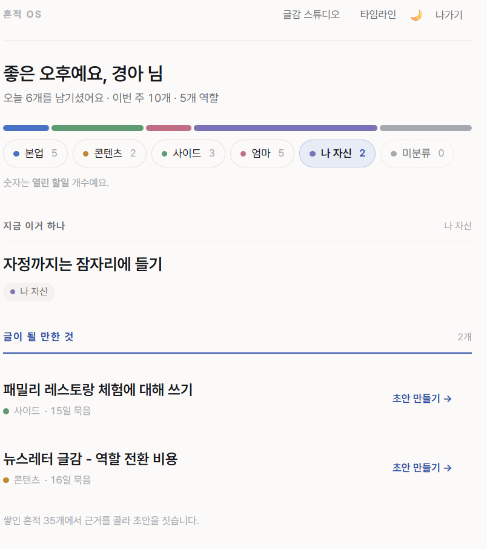
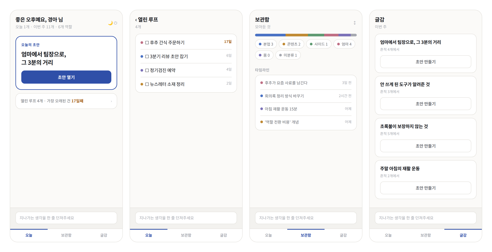
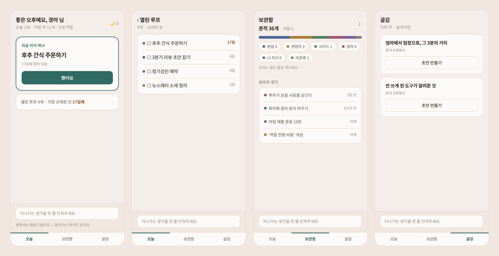
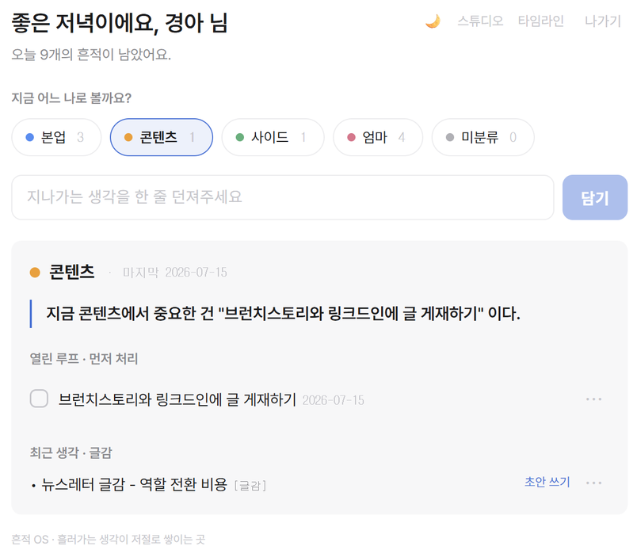
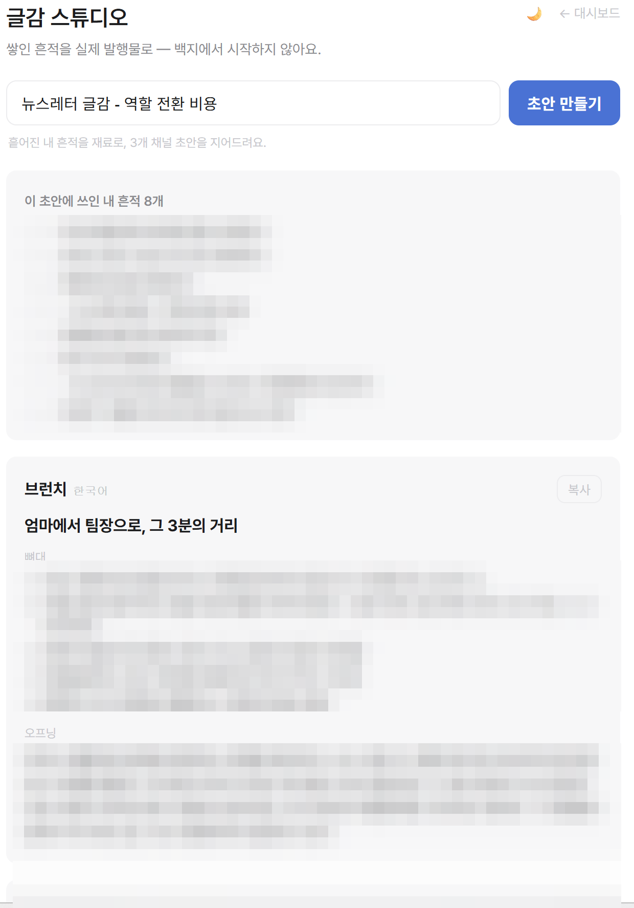
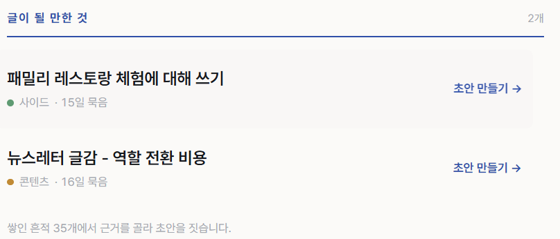
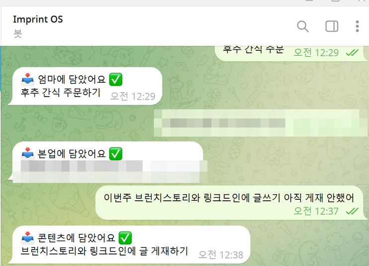
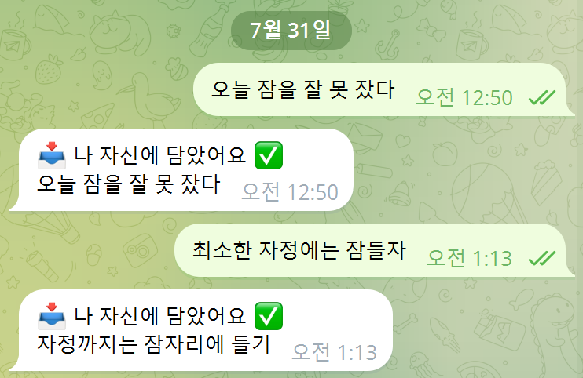
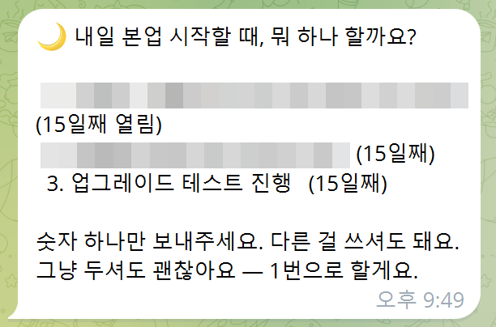
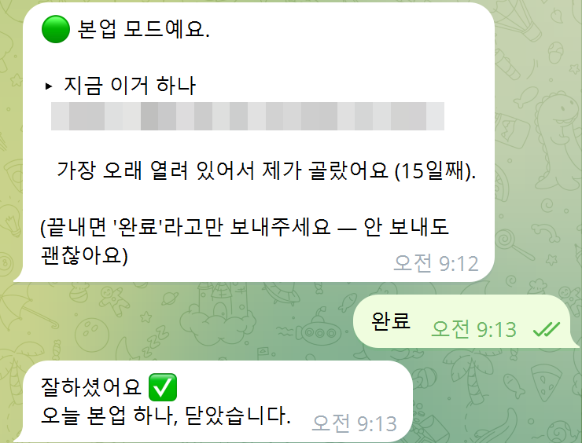

# 5주차 — 마지막 과제 🏁

> 이번 기수의 마지막 과제예요. 과정과 소회를 기록해주세요. (다 못 채워도 OK!)

## 🎯 과제 1. 구현, 그 다음의 것

> 만드는 건 끝났는데 — 그 다음이 진짜 시작이에요

- **지금 걸려 있는 고민 하나:**

  **만들어서 배포까지 다 했는데, 정작 내가 안 쓰게 됐다.**

  흔적 OS는 3주차에 실제 서비스로 배포했다(`imprint-os-app.vercel.app`). 텔레그램에 한 줄 던지면 Claude가 분류하고 DB에 쌓고 대시보드에서 복원해주는, 기획한 루프가 전부 도는 상태였다. 그런데 몇 주 지나니 던지지도, 꺼내보지도 않게 됐다.

  처음엔 "기능이 부족한가" 싶어 뭘 더 붙일지 생각했다. **그러다 멈췄다.** 3주차에 하루 만에 기능 3개를 붙였는데 사용률이 0으로 간 걸 이미 겪었기 때문이다.

- **그게 왜 고민인지 (무엇이 걸리는지):**

  **안 쓴다는 사실이, 제품 전체가 서 있던 전제를 흔드는 증거일 수 있다는 것.**

  흔적 OS의 핵심 가치는 2주차부터 *"역할 전환 비용 제거"* 였다. 하루에 본업·콘텐츠·사이드·엄마를 오가는데, 역할을 넘어갈 때마다 머릿속을 재부팅하는 비용이 크다 — 그걸 없애주는 시스템.

  개념은 그럴듯했고 나도 이 언어가 마음에 들었다. **그런데 그게 진짜 아픈 문제였다면, 도구가 좀 불편해도 썼어야 하지 않나?**

  기능을 더 붙이는 건 이 질문을 피하는 방법이었다. 여기서 답을 안 내면 v2를 만들어도 같은 자리에서 또 멈출 것 같았다.

- **어떻게 풀어볼 생각인지:**

  **말이 아니라 행동 기록으로 검증했다.** PM 프레임워크(Jobs-to-be-Done)를 가져와, *"이 문제를 위해 나는 실제로 무엇을 고용했고 무엇을 해고했나"* 를 제출물과 캡처 데이터에서 전수로 훑었다.

  결과가 예상 밖이었다.

  | | 도구가 없거나 불편했을 때 내가 실제로 한 일 |
  |---|---|
  | **A. 역할 전환 비용 제거** | 복원 기능이 불편해지자 → **대체재를 하나도 안 쓰고 그냥 없이 살았다.** 4주차 실사용 검증 주간엔 **언급조차 하지 않았다** |
  | **B. 재료를 형식으로 옮기기** | v1.0을 "완주했다"고 선언한 뒤에도 **글감 스튜디오를 자발적으로 더 만들었고**, 유일하게 계속 쓴다 |

  결정적인 증거 셋이 성격은 다른데 같은 곳을 가리켰다.

  **① 제품을 짓기도 전에 답을 골라놨었다.** 7월 10일 유닛 과제에서 내가 고른 OS 유형이 **`기록 자산화형 — 여러가지 흩어진 기록들을 자산으로 만드는 OS`** 였다. 그게 B다. 그래놓고 2주차 설계에서 A로 갈아탔다.

  **② 내 시스템이 A를 "소재"로 분류해놨다.** 캡처 데이터에 `'역할 전환 비용' 개념 → 뉴스레터 소재 · [글감]` 이라고 저장돼 있었다. 그것도 2주차와 3주차에 **두 번**. A가 진짜 pain이었다면 `본업`의 **열린 루프**(=풀어야 할 것)에 있어야 했는데, 두 번 다 `콘텐츠`의 **글감**(=쓸 것)으로 갔다. 그리고 글감 스튜디오가 만든 첫 초안 제목이 *"엄마에서 팀장으로, 그 3분의 거리"* 였다 — **A는 이미 B의 재료였다.**

  **③ 시간이 붙었을 때 무엇을 골랐나.** 4주차에 내가 직접 적어둔 문장이다:

  > *"모바일 수기 입력이 익숙해 출퇴근 셔틀버스·점심시간에 가장 많이 썼고, **정작 퇴근 후 PC 앞에서는 흔적을 남기기보다 글쓰기 자체에 시간을 썼다**"*

  앉아서 뭔가 할 시간이 생겼을 때, 나는 **수집이 아니라 변환을 했다.** 도구 품질과 무관한 순수한 선호였다.

  그리고 이 판정을 **한 번 더 뒤집어봤다.** 증거로 쓰던 것 중 **계보가 다른 것들을 전부 빼고** 다시 돌렸다.

  **판정은 안 바뀌었고, 근거 등급은 오히려 올라갔다** — 남은 것이 전부 *말*이 아니라 **흔적 OS를 쓰며 내가 실제로 한 행동**이었기 때문이다. 대신 그 위에 세웠던 결론 몇 개는 스스로 철회했다. **증거를 빼고도 결론이 그대로면, 그건 증거로 세운 결론이 아니었다는 뜻이다.**

  → **본캐를 B로 바꿨다.** A는 버리지 않고 *"재료가 마르지 않게 하는 수집기"* 로 격하했다. 역할 태깅이 있어야 초안에 근거를 댈 수 있어서, 없애면 해자가 같이 무너지기 때문이다.

  ### 🔁 축을 바로잡고도 남은 질문 — "왜 열지 않게 되는가"

  본캐를 B로 바꾸고 나서도 하나가 안 풀렸다. **글감 스튜디오를 화면 한가운데로 올렸는데도, 내가 대시보드를 열지 않았다.**

  처음엔 이걸 UI 문제로 보지 않았다. 우선순위 목록에서 UI를 *"수집 인프라 개선"* 으로 분류해 뒤로 미뤄뒀다. **그 분류가 틀렸다.**

  > **UI는 수집도 출력도 아니라, 본체에 도달하는 경로다.**
  > 내가 정한 게이트 지표 중 하나가 *"스튜디오에 몇 번 들어갔나"* 인데, 그 진입을 결정하는 건 기능이 아니라 **배치**다. 기능은 이미 다 있었다. 안 눌린 것뿐이다.

  같은 걸 이미 배운 적이 있었다. 4주차에 만든 별개 제품에서 받은 피드백 상당수가 *"계속 쓰고 싶게 만드는 건 UI/UX"* 였는데, **정작 내 제품에는 그 교훈을 적용하지 않고 있었다.**

  → 그래서 **8/16까지 화면을 다시 짜기로 했다.** 기능은 하나도 안 늘린다. 배치만 바꾼다. (결과는 과제 2 ④에)

- **필요한 게 있다면 무엇인지:**

  1. **4주간의 실측.** 이번엔 측정을 기능으로 만들었다. 7/10에 "캡처 건수 실측"을 계획해놓고 실행하지 않았는데, 그래서 v1의 실패를 오래 직시하지 못했다. **수동 측정은 안 하게 된다**는 걸 배웠으므로, 주간 리포트가 지표를 자동으로 찍게 만들었다. 게이트 지표 6개 중 5개 자동, 수동은 1개뿐이다.
  2. **확장군 인터뷰 대상자 5명.** 다만 이건 **내가 4주 리텐션을 통과한 뒤**의 일이다. 그 전엔 아무것도 만들지 않기로 했다.

---

## 🏁 과제 2. 구현 마무리 + 실제 유저 피드백 받기

> 시작할 때 "이번엔 이건 꼭 만들겠다" 했던 것 — 지금 어디까지 왔나요?

- **최종 완성한 것 (지금 어디까지):**

  **📌 이번 개편의 기준은 하나였다 — "내 하루에 얹히는가."**

  v1은 기능이 부족해서 죽은 게 아니라 **내 하루에 자리가 없어서** 죽었다. 그래서 이번엔 *무엇을 더 만들지* 가 아니라 **내 삶의 어느 자리에 놓을지**를 먼저 정하고, 그 자리에 맞는 것만 만들었다. 아래 다섯은 전부 그 결정의 결과다.

  **① 🌙 저녁 승인 / 🟢 아침 배달 — 배포 완료·가동 중**

  하루 2터치, 전환 1개만 다루는 최소 루프.
  - 🌙 21:30 저녁 승인 — 후보 3개(가장 오래 열린 순) → 숫자 하나 답장. 무응답이면 1번 자동
  - 🟢 09:00 아침 배달 — 확정된 하나를 되돌려준다. **버튼 없음, 읽으면 끝**
  - 자동 선택이면 *"제가 골랐어요 (15일째)"* 라고 정직하게 밝힌다
  - 후보가 없으면 아무것도 안 보낸다

  **② ⭐ 본체 연결 — 리포트에서 초안까지 한 번의 탭**

  v1은 글감을 **목록**으로 주고 끝냈다. 목록은 재료지 완제품이 아니고, 그래서 꺼내볼 이유가 없어졌다. 이번엔 주간 리포트의 글감마다 `초안 만들기` 링크를 붙였고, 그 링크를 눌렀는지가 그대로 지표가 된다.

  **③ 📏 측정 자동화 · `나 자신` 역할**

  - 주간 회고 말미에 지표가 자동으로 붙는다
  - `나 자신` 역할 추가 — 2주차 분류 테스트에서 `아침 재활 운동 15분`이 **미분류**로 떨어졌었다. 기존 4역할이 **전부 "남에게 무언가를 하는" 역할**이라 내 자리가 없었다
  - 대시보드에서 **글감 스튜디오가 구석의 13px 링크**였던 걸 화면 한가운데로 올렸다. **제품이 파는 것이 화면에서 제일 안 보이고 있었다**

  **④ 🎨 화면을 다시 짰다 — 기능은 하나도 안 늘리고**

  원칙 하나로 정리했다.

  > ### 한 화면 = 한 가지 일

  **[1단계 · 현행] 대시보드 한 화면에 11가지가 쌓여 있다**

  

  글감 스튜디오는 위 ③에서 화면 한가운데로 올렸다. 그건 고쳤는데, 이번엔 **가운데가 너무 붐볐다.** 열면 통계·칩·할일·글감·타임라인이 한꺼번에 나오고, 나는 매번 *"그래서 지금 뭘 하지"* 를 스스로 정해야 했다. **열 때마다 결정을 요구하는 화면은 안 열게 된다.**

  **[2단계 · 1차 시안] 4개 화면으로 쪼갰다**

  

  구조 문제는 이걸로 풀렸다. 그런데 시안을 놓고 보니 **내용에서 다섯 군데가 틀려 있었다.**

  | 1차 시안 | 무엇이 문제였나 |
  |---|---|
  | 오늘 화면에 `초안 열기` | 이미 만들어둔 **`지금 이거 하나`** 카드를 시안이 빠뜨렸다. 문서만 보고 그렸고 **배포된 화면을 안 봤다** |
  | 역할 이름 `몸` | 실제로는 **`나 자신`**. 2주차에 이름을 바꿔놓고 시안에 반영이 안 됐다 |
  | 보관함에 개수 없음 | 훑는 화면인데 **총량이 없으면 훑을 기준이 없다** |
  | 글감 후보 4개 | 셋을 넘으면 고르는 일이 된다. **완제품을 준다더니 또 선택을 넘겼다** |
  | 던지는 곳 안내 없음 | 밖에서 텔레그램으로 넣는다는 걸 **화면이 한 번도 말해주지 않았다** |

  **[3단계 · 확정] 다섯 군데를 고치고, 색을 따뜻하게 바꿨다**

  

  화면별로 하나씩만 시킨다. **오늘** — 지금 이거 하나. **열린 루프** — 오래된 순으로만, 오래된 건 경고색으로(숨기지 않는다). **보관함** — 훑기만 하고 아무 결정도 안 한다. **글감** — 후보는 둘까지.

  색은 회청색에서 **따뜻한 흙빛**으로 바꿨다. 여러 색을 늘린 게 아니라 액센트 하나만 청록으로 옮기고 나머지를 낮췄다. 하루에 여러 번 여는 화면이라 **눈에 덜 걸리는 쪽**이 오래 간다고 봤다.

  > 🔎 2·3단계는 **시안**이다. 실제 데이터가 아니라 예시로 채웠고, 구현은 8/3~8/16이다. 굳이 이렇게 적는 이유는 아래 「가장 크게 배운 것」에 나온다 — 시안의 가짜 데이터를 믿었다가 이미 한 번 당했다.

  **기능은 하나도 버리지 않았다.** 대시보드에 있던 11가지가 어디로 갔는지 전부 대응표로 확인했다.

  | 지금 (한 화면) | 새 자리 |
  |---|---|
  | 인사 + 오늘/이번 주 개수 | 오늘 — 맨 위 (작게) |
  | 역할 분포 막대 | 보관함 — 맨 위 |
  | 역할 칩 | 보관함 — 필터 |
  | 안내 문구 (`숫자는 열린 할일 개수예요`) | 보관함 — 막대 아래 |
  | **지금 이거 하나** | 오늘 — 화면의 주인공 |
  | 열린 루프 (체크로 완료) | 오늘 — 한 줄 요약 → 눌러서 전용 화면 |
  | 글이 될 만한 것 + 초안 만들기 | 글감 — 독립 화면 |
  | "○○의 생각" | 보관함 — 역할 선택 시 |
  | 타임라인 | 보관함 — 정렬 방식 |
  | 빠른 캡처 바 | 모든 화면 아래 고정 (유지) |
  | 다크모드 · 나가기 | 오늘 — 상단 우측 (유지) |

  **⑤ 무엇을 안 할지 정한 것** — 좁히는 결정이 곧 제품력이다

  - **8/16 이후로는 아무것도 만들지 않는다.** 8/3~8/16 화면 재배치가 마지막 개발이고, 8/17~9/13은 측정만 한다
  - 제품 범위를 **오히려 좁혔다** — 근거가 사라진 확장 계획들을 잘라냈다. 남은 건 *"글 쓰는 사람을 위한 좁고 깊은 도구"* 하나다
  - **판정일을 8/31에서 9/13으로 되돌렸다.** 개발이 앞당겨져 한 번 당겼었는데, **화면을 바꾸면 사용 행동도 같이 바뀌어 측정이 오염된다.** *"안 쓰게 된 이유"* 를 알아내려고 만든 4주인데 그 답을 못 얻게 되므로, **개발이 끝난 뒤 다시 4주**로 잡았다. 8/16까지 쌓이는 데이터는 `개발 중` 플래그를 달아 판정에서 뺀다
  - 남은 질문은 하나뿐이다 — **이게 정말 내 삶에 얹히는가**

  ```
  8/03 ~ 8/16   화면 재배치 (마지막 개발)
  ─────── 여기서부터 아무것도 만들지 않는다 ───────
  8/17 ~ 9/13   4주 측정 · 무개발
  9/13          🚦 판정
  ```

- **🚀 실제 배포 URL:** https://imprint-os-app.vercel.app _(비밀번호 보호 · 개인용)_

- **결과물 (링크·스크린샷):**

  - 기획 문서(JTBD 검증 · 페르소나 · 포지셔닝 · 경쟁조사 · 측정설계)와 코드는 개인 저장소에서 관리한다. **판정을 뒤집은 근거는 위 과제 1에 그대로 옮겨 적었다**
  - 3주차 실동작 화면은 [3주차 제출 폴더](../3주차%20과제%20제출%20폴더/)에 있다
  **① 대시보드 — 제품이 파는 것을 화면 한가운데로**

  | 3주차 (before) | 지금 (after) |
  |---|---|
  |  |  |

  글감 스튜디오가 **우상단 회색 링크**였던 것이 상단 메뉴로 올라왔고, `나 자신` 역할이 생겼다. 역할 칩이 5개 → 6개.

  **② 리포트 → 초안, 한 번의 탭**

  | v1 — 스튜디오를 열고 주제를 직접 입력 (before) | 지금 — 리포트의 글감마다 `초안 만들기` (after) |
  |---|---|
  |  |  |

  **③ `나 자신` 역할 — 2주차에 미분류로 떨어졌던 축**

  | 3주차 — 4역할 (before) | 지금 — `나 자신` 추가 (after) |
  |---|---|
  |  |  |

  **④ 하루 2터치 — 신규 기능이라 before가 없다**

  | 🌙 21:30 저녁 승인 | 🟢 09:00 아침 배달 |
  |---|---|
  |  |  |

  후보는 **가장 오래 열린 순** 3개, 숫자 하나로 답장. 무응답이면 1번 자동이고 *"가장 오래 열려 있어서 제가 골랐어요 (15일째)"* 라고 밝힌다. 아침엔 버튼이 없다 — 읽으면 끝.

  **⑤ 화면 재배치 — 위 ④에 3단계로 붙였다 (아직 시안)**

  현행 [`01-대시보드-after.png`](이미지첨부/01-대시보드-after.png) → 1차 시안 [`06-화면재설계-1차시안.png`](이미지첨부/06-화면재설계-1차시안.png) → 확정 [`07-화면재설계-확정.png`](이미지첨부/07-화면재설계-확정.png). **06·07은 구현 전 시안이고, 구현은 8/3~8/16이다.**

  > 🔒 캡처 일부는 **사내 프로젝트명·가족 정보를 모자이크 처리**했다. 처리 내역은 [`이미지첨부/README.md`](./이미지첨부/README.md)에 적어뒀다.

  **실가동 확인 (7/31 새벽):** 텔레그램에 `오늘 잠을 잘 못 잤다` → **`📥 나 자신에 담았어요 ✅`**
  이 한 줄이 DB 제약·분류 경계·webhook·저장·답장 전 구간을 한 번에 통과시켰다.

- **받은 유저 피드백:**

  **정직하게 적자면 — 이번 주 새로 받은 외부 유저 피드백은 없다.** 아직 나 혼자 쓰는 제품이고, 확장군 인터뷰는 내가 4주를 넘긴 뒤로 미뤄뒀다.

  대신 이번에 발견한 게 있다. **가장 냉정한 피드백은 내 행동 기록이었다.**

  말로 물으면 나는 *"역할 전환이 제일 힘들어요"* 라고 답한다. 실제로 그렇게 믿었고 2주차 인사이트에 그렇게 썼다. 그런데 **행동은 정반대를 말하고 있었다** — 그걸 위해 만든 기능은 안 쓰고, 앉을 시간이 나면 글을 썼다.

  > **"안 쓴다"는 것도 피드백이다. 그것도 가장 정직한 종류의.**

  **무엇을 묻느냐(말 vs 행동)가 결론을 바꾼다.** 나에게 물어도 마찬가지였다.

  그리고 이번 주에 받은 가장 아픈 피드백은 **코드가 준 것**이었다. 아래에 적었다.

---

## 📣 과제 3. SNS에 남기기

> 구현했던 것들 + 그 다음 단계에 대한 생각

- **구현했던 것들 (무엇을 / 어떻게 굴러가는지 / 뭐가 달라졌는지):**

  ```
  텔레그램에 한 줄 던지기
        ↓  (AI가 역할별로 분류해서 쌓음)
  밤 9시 반  "내일 뭐 하나 할까요?"  →  숫자 하나 답장
        ↓
  아침 9시   "지금 이거 하나"  →  읽으면 끝, 버튼 없음
        ↓
  일요일     주간 회고 + "이번 주 글이 될 만한 것"
        ↓        └→ [초안 만들기] 한 번의 탭
  글감 스튜디오  →  브런치·링크드인·블로그 초안 (근거가 붙어서)
  ```

  **뭐가 달라졌나:** 제품의 본캐가 *"역할 전환 비용을 없애준다"* 에서 **"내가 이미 가진 것을, 밖에 내놓을 수 있는 형태로 바꿔준다"** 로 바뀌었다. 소구 문장은 바꾸지 않았다 — **"흘려보낸 한 주가, 글 한 편이 됩니다."**

  재미있는 건, 이 문장이 예전 PRD에 이미 적혀 있었다는 것이다. 파는 문장은 진작에 맞는 말을 하고 있었는데, 설계 축만 딴 데를 보고 있었다. **체감할 수 없는 걸 가치라고 부르고 있었던 것 자체가 축이 틀렸다는 신호였다.**

  ### 🔴 그리고 이번 주에 가장 크게 배운 것

  나는 위에, 그리고 이 제출문의 첫 판본에 **"모킹 테스트 33개 통과 🟢 PASS"** 라고 자랑스럽게 적었다.

  **배포 직전에, 그 코드가 존재하지도 않는 DB 구조를 보고 있다는 걸 발견했다.**

  | 코드가 가정한 것 | 실제 DB |
  |---|---|
  | `traces` 테이블 | `entries` |
  | `text` 컬럼 | `clean_text` |
  | `done` (참/거짓) | `status` (`open`/`done`/`archived`) |
  | `id` = 숫자 | `id` = UUID |

  다섯 군데가 어긋나 있었다. 그대로 올렸으면 **첫 알림에서 전부 죽었을 것이다.**

  테스트 33개가 전부 초록불이었던 이유는 간단했다. **DB를 가짜로 바꿔치기해서 테스트했기 때문이다.** 가짜 DB는 내가 시킨 대로 답하니까, "내 로직이 맞나"는 검증되지만 **"내 가정이 맞나"는 검증되지 않는다.**

  > **초록불은 "코드가 맞다"가 아니라 "내가 상상한 세계 안에서 코드가 맞다"였다.**

  이게 5주차 주제(*구현, 그 다음의 것*)에 그대로 겹친다고 느꼈다. 배포가 끝이 아닌 것처럼, **테스트 통과도 끝이 아니었다.** 둘 다 "내가 만든 것이 진짜 세계와 만났는가"를 아직 묻지 않은 상태였다.

  **그리고 이 착각은 한 번으로 끝나지 않았다.** 화면을 다시 짜는 동안 같은 모양이 네 번 더 나왔다.

  | 무엇을 봤나 | 무엇이라고 결론지었나 | 실제 |
  |---|---|---|
  | 테스트 33개 (가짜 DB) | 코드가 맞다 | **내가 상상한 DB 구조 안에서만** 맞았다 |
  | 시안의 예시 데이터 | 화면이 잘 나온다 | 역할이 하나뿐이면 비율 막대가 **단색**이 된다. 실제 데이터에서 구멍 3개 |
  | 기획 문서 | `지금 이거 하나` 카드는 아직 없다 | **이미 배포돼 있었다.** 화면 한 장을 안 봤다 |
  | 코드 속 문자열 | 이 변수는 쓰이고 있다 | 그 파일이 **어디에도 연결되지 않은 죽은 코드**였다 |
  | 내가 쓴 인수인계 문서 | `status` 값을 한글로 적어뒀다 | 실제는 `open`/`done`/`archived`. **위 표에서 한 번 데고도 그 옆 칸을 또 틀렸다** |

  다섯 다 원인이 같다. **자료에 있는 것을 현실에 있는 것으로 봤다.** 테스트·시안·문서·코드는 전부 현실의 *대리물*인데, 나는 그걸 현실이라고 읽었다.

  마지막 것이 제일 무서웠다. **틀려도 에러가 안 나기 때문이다.** `status`를 한글 값으로 조회하면 예외 없이 **0건**이 돌아온다. 화면을 쪼개면서 이 값으로 필터를 만들 참이었으니, 그대로 갔으면 *"할 일이 하나도 없는 앱"* 이 됐을 것이고 아마 한참 뒤에야 알아챘을 것이다.

  > **"있다 / 없다"는 자료가 아니라 실행 결과로 확인한다.**
  > 코드는 화면에 붙어 있는지를 보고, 제품은 배포본을 열어서 본다.

  규칙으로 적어두는 것과 지키는 것이 다른 일이라는 것도 이번에 알았다. **저 규칙을 문서에 적어둔 직후에 같은 실수가 또 나왔다.**

- **다음 단계 생각 (뭘 더 하고 싶은지 / 남은 것 / 어디로):**

  **8/16까지 화면을 다시 짜고, 그 다음 4주는 아무것도 안 만든다.** 쓰기만 하고 지표만 쌓는다. **판정일은 9/13**, 판정표는 이미 확정해뒀다 — 그날 해석 논쟁이 생기지 않도록.

  **가장 중요한 지표 하나:** *4주 안에 실제 글 1편을 발행했는가.* 그리고 그때 **초안을 얼마나 고쳐 썼는지**를 함께 기록한다. 거의 다 갈아엎었다면 "완제품을 준다"는 약속이 거짓이라는 뜻이니까.

  **못 넘긴다면, 아마 이 이유일 것이다.** 4주차에 내가 이미 진단해뒀다 — *"텔레그램과 아직 친하지 않아, 기억할 메모는 습관적으로 카톡 '나에게 보내기'로 갔다."*

  그래서 원래 계획은 **이미 쓰는 채널(카카오톡)에 얹히는 것**이었다. **그런데 이번에 실현 가능성을 먼저 확인했더니, 하려던 것 중 셋이 불가능했다.**

  | 하려던 것 | 확인 결과 | 그래서 어떻게 바꿨나 |
  |---|---|---|
  | 카카오톡으로 던지기 | 카카오는 **보내는 API만 있고 받는 API가 없다** | 채널을 옮기는 대신, **텔레그램을 더 가깝게 두는 방법**을 찾는다 |
  | 로컬 PC를 전용 서버로 | 텔레그램은 **폴링과 웹훅이 배타적**이라, 로컬로 옮기면 지금 서버가 죽고 PC가 꺼지면 브리핑도 멈춘다 | 원본을 로컬에 두는 건 **수신 위치가 아니라 저장 위치**로 달성한다 |
  | 발행 후 성과 자동 수집 | 네이버도 브런치도 **성과를 내려받는 공식 API가 없다** | 자동화 대신 **"3단어로 줄이기"**. 수동 측정은 안 하게 된다는 걸 이미 겪었다 |

  **만들기 전에 확인한 게 이번 주에 제일 잘한 일 같다.** 만들고 나서 알았으면 몇 주를 버렸을 것이다.

  **게이트 통과 후:**
  - **원본은 로컬(Obsidian), 정돈된 결과만 클라우드**로 나누는 2원 구조 — 이번 주에 정식 결정했다. 재밌는 건 이게 철학이 아니라 **스키마 덕분에 가능했다**는 점이다. DB가 처음부터 `원문`과 `정돈본`을 나눠 갖고 있었고 글감 스튜디오는 정돈본만 읽고 있었다. 그래서 원문을 클라우드에서 빼도 *"내 기록에서 나왔다"* 는 근거 표시가 그대로 산다
  - 입력 채널 확대 — 메모 앱. 단 **상시 녹음은 만들지 않는다.** 삶 전체를 캡처하려던 제품(Rewind·Limitless)이 전부 죽은 이유가 제3자 동의 문제였다
  - 나 아닌 사람 5명 인터뷰

  **가장 크게 남은 질문:** 이게 나 아닌 사람에게도 통하는가. 그건 내가 먼저 4주를 넘긴 다음에 물을 일이다.

---

## 🍊 5주를 돌아보며

시작할 때 나는 *"흘러가는 일상이 저절로 쌓이는 OS"* 를 만들고 싶다고 적었다. 그건 만들었다. 배포도 했고 실제로 돌아간다.

그런데 이번 주에 알게 된 건, **내가 그걸 왜 원했는지를 내가 잘못 알고 있었다**는 것이었다. 7월 10일에 내가 고른 유형은 이미 `기록 자산화형`이었다. **답을 골라놓고 만들면서 다른 길로 갔던 셈이다.**

가장 크게 남은 건 이거다 — **만든 것을 지키려 하면 배우지 못한다.** 이번 주에 한 일의 절반은 지난 4주간 쓴 문서에서 틀린 전제를 걷어내는 일이었고, 그 과정에서 애써 세운 결론 몇 개를 스스로 철회했다. 아깝지 않았다. **틀린 축 위에 잘 쌓는 것보다, 축을 옮기고 다시 쌓는 게 빨랐다.** 축을 바로잡고 나니 무엇을 만들지가 저절로 정해졌고, 그제야 이 도구가 내 하루 안에 자리를 잡았다.

그리고 하나 더 — **"안 쓰이는 순간"이 가장 좋은 자료였다.** 7월 10일 유닛에 *"각자의 OS가 안 쓰이는 순간을 공유하고 싶다"* 고 적었는데, 정작 내 것이 안 쓰이게 됐을 땐 한동안 들여다보지 못했다. 이번 주에 그 기록들을 다시 읽으면서 판정이 뒤집혔다. **잘 된 사례보다 안 된 사례가 훨씬 많은 걸 말해줬다.**

크루 여러분께 배운 게 많았습니다. 감사합니다 🙏

- **SNS 인증 링크:** `[여기에 링크]`
